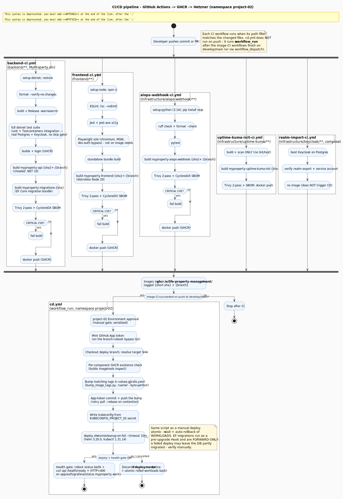

# CI/CD pipeline

**Eight GitHub Actions workflows**: seven CI workflows and one CD workflow that deploys to the Hetzner `project-02` namespace. Of the CI workflows, four produce a deployable image (`backend-ci`, `frontend-ci`, `aiops-webhook-ci`, `uptime-kuma-init-ci`) and trigger CD; the other three (`realm-import-ci`, `n8n-ci`, `security-ci`) build no image and do not trigger CD. Container images push to **GHCR** (`ghcr.io/life-property-management/*`), each dual-tagged `{short-sha}` (immutable) + `{branch}` (moving). CD is **push-based** — it fires after the image-CI workflows finish, resolves which images exist at that SHA, bumps the matching tags in `values-gjirafa.yaml`, and runs `deploy.sh --atomic`.

> **Sources:** [`diagrams/cicd.puml`](./diagrams/cicd.puml). Authoritative workflow YAML in [`.github/workflows/`](../../.github/workflows/); the full operational narrative (gating, rollback, guardrails) is [`docs/operations/ci-cd.md`](../operations/ci-cd.md). Prod topology is in [`deployment-prod.md`](./deployment-prod.md); the platform move off DOKS is [ADR-0009](./adr/0009-hetzner-project-02-over-doks.md).

## Workflows at a glance

| Workflow | Trigger | What it does | Image produced |
|---|---|---|---|
| [`backend-ci.yml`](../../.github/workflows/backend-ci.yml) | push / PR on `backend/**`, `MyProperty.sln` | restore → `format --verify` → build (Release, `-warnaserror`) → **full `dotnet test` suite (unit + Testcontainers integration)** → docker build → Trivy (2-pass) → SBOM → push | `myproperty-api` + `myproperty-migrations` |
| [`frontend-ci.yml`](../../.github/workflows/frontend-ci.yml) | push / PR on `frontend/**` | `npm ci` → ESLint → `tsc --noEmit` → Jest + jest-axe → Playwright e2e → standalone bundle build → docker build → Trivy → SBOM → push | `myproperty-frontend` |
| [`aiops-webhook-ci.yml`](../../.github/workflows/aiops-webhook-ci.yml) | push / PR on `infrastructure/aiops-webhook/**` | pip install → ruff check + format → pytest → docker build → Trivy → SBOM → push | `myproperty-aiops-webhook` |
| [`uptime-kuma-init-ci.yml`](../../.github/workflows/uptime-kuma-init-ci.yml) | push / PR on `infrastructure/uptime-kuma/**` | **build + scan only** (no lint/test) — the seed sidecar is `seed.py` + `monitors.json` | `myproperty-uptime-kuma-init` |
| [`realm-import-ci.yml`](../../.github/workflows/realm-import-ci.yml) | push / PR on `infrastructure/keycloak/**`, `docker-compose.yml` | Keycloak realm-export **smoke test** — boots Keycloak on Postgres, verifies the service account | **none** (no deployable image) |
| [`n8n-ci.yml`](../../.github/workflows/n8n-ci.yml) | push / PR on `infrastructure/n8n/**` | **workflow-structure guard** — validate the `tenant-inquiry.json` import seed is valid JSON → pytest structure tests | **none** (no image; does **not** trigger CD) |
| [`security-ci.yml`](../../.github/workflows/security-ci.yml) | push / PR on `develop`/`main`, weekly `schedule` (Mon 06:00 UTC), `workflow_dispatch` | source-side security gates — gitleaks + git-secrets (secrets, full history) → Lighthouse CI (Best-Practices/perf, frontend changes) → OWASP ZAP baseline DAST (scheduled/manual) | **none** (no image; does **not** trigger CD) |
| [`cd.yml`](../../.github/workflows/cd.yml) | `workflow_run` of the four image-CI workflows on `develop`/`main`, + `workflow_dispatch` | resolve per-component tags → bump `values-gjirafa.yaml` → `deploy.sh --atomic` → health gate → Discord on failure | — |

The backend test step runs `dotnet test MyProperty.sln` with **no** category/trait `--filter`, no `.runsettings`, and the Testcontainers-backed integration tests (`MyProperty.Tests/Integration/`, real Postgres + Keycloak) carry no skip gate — so the **full suite (unit + integration) runs in CI**, pulling the container images on the runner. See [`docs/operations/ci-cd.md`](../operations/ci-cd.md#integration-tests-in-ci).

## Image tag strategy

Each image is pushed with two tags:

- `:{short-sha}` — immutable; this is what production references.
- `:{branch}` — moving (`:develop`, `:main`, `:my-feature`) for human inspection.

The registry holds five images: `myproperty-api`, `myproperty-migrations` (built together with the API at one SHA — pushed from within `backend-ci`, but **not** independently Trivy-scanned or SBOM'd), `myproperty-frontend`, `myproperty-aiops-webhook`, and `myproperty-uptime-kuma-init`.

## Security gates

Every image-build job runs a **two-pass** Trivy scan (hardened in M4.8 from a single non-blocking pass):

1. **SARIF report (non-blocking):** severities `CRITICAL,HIGH`, `exit-code 0` — uploaded to the GitHub Security tab so both levels stay visible.
2. **Quality gate (blocking):** `CRITICAL` only, `exit-code 1` — a fresh unsuppressed CRITICAL fails the build.

Both passes honour `ignore-unfixed: true` (and `.trivyignore` — except the `uptime-kuma-init` image job, which omits the ignore-file reference). CRITICAL-only blocking keeps the pipeline green against the steady stream of non-applicable HIGH advisories in the .NET/npm trees while still catching the genuinely actionable ones. Plus per-image: **CycloneDX SBOM** (uploaded, 90-day retention) and **digest-pinned base images** (`@sha256:`).

## CD specifics — push-based, namespace-scoped

The old DOKS `cd.yml` (`doctl` + one global `github.sha` tag for every component) was **removed**. Pull-based GitOps (ArgoCD/Flux) is impossible here — it needs cluster-scoped CRDs/controllers and our service account is **namespace-admin only** — so CD is a GitHub Actions job authenticating with the `project-02` kubeconfig stored as an Environment secret. The current flow:

1. **Trigger & gate.** Runs on `workflow_run` after any of the four image-CI workflows (`Backend CI`, `Frontend CI`, `AIOps Webhook CI`, `Uptime Kuma Init CI`) succeeds on a **push** to `develop`/`main`, or on manual `workflow_dispatch`. (`Realm Import Smoke` is excluded — it builds no image.) Behind the protected **`project-02` Environment** (manual approval) and **serialized** (`concurrency: deploy-project-02`, never cancelled) so the namespace sees one deploy at a time. Both branches deploy to the same namespace → last-deploy-wins.
2. **Per-component tag resolution.** Because CI tags each image per-component, the job checks GHCR (`docker buildx imagetools inspect`) for `…/<image>:<short-sha>` and bumps only the keys whose image exists — `myproperty-api` bumps both `backend.image.tag` and `migration.image.tag`; the others bump their own key. Missing components keep their pinned tag.
3. **Format-preserving bump.** `infrastructure/gjirafa/bump_image_tags.py` (ruamel.yaml) edits `values-gjirafa.yaml` as a **byte-perfect one-line diff** (not `yq`, which reserialises the file). A **GitHub App token** authors and pushes the bump commit (`Deploy(cd): bump […] image tag(s) to <sha>…`) — the App is on the branch-ruleset bypass list, which the default `GITHUB_TOKEN` cannot be.
4. **Deploy.** Writes the kubeconfig from the `KUBECONFIG_PROJECT_02` secret, then runs `infrastructure/gjirafa/deploy.sh --atomic --cleanup-on-fail --timeout 10m` — the *same* script as a manual deploy (`--atomic` adds `--wait` → readiness gating + workload auto-rollback). Helm is pinned to **3.20.0** (setup-helm@v5 defaults to Helm 4, which changes `--atomic`/`--wait`), kubectl to **1.31.14** (cluster version).
5. **Health gate.** `kubectl rollout status` on backend + frontend, `curl` of `https://api.myproperty.works/api/v1/health/ready` (expects 200), and an HTTP `<400` check on `app./auth./grafana./status.myproperty.works`.
6. **Failure path.** On failure *or* cancellation the job posts to a dedicated Discord **#deployments** webhook (separate from the in-cluster `#alerts`/`#uptime` channels). `--atomic` has already rolled the **workloads** back — but ⚠️ **EF schema migrations are forward-only**, so a failed deploy may leave the DB partly migrated; verify manually.

> ⚠️ The operations doc notes this pipeline as *wired + statically validated*; the `Deploy(cd): bump …` commits on `develop` show the tag-bump half firing in practice. Treat [`docs/operations/ci-cd.md`](../operations/ci-cd.md#continuous-deployment-cdyml) as the live source of truth for its maturity.

## Guardrails

- **Deploy-only** — CD never wipes or auto-provisions data stores; the two-phase wipe stays a manual runbook.
- **Secrets are manual** K8s Secrets (`infrastructure/gjirafa/secrets.sh`) — no ESO (cluster-scoped).
- **Realm-only changes** (`helm/.../realm-export.template.json`) build no image, so they don't trigger CD; they ride a component deploy or a manual run.

## What this pipeline does *not* do (yet)

- **No promotion gate** between `develop` and `main` — both deploy to `project-02`. Multi-environment promotion is post-M5 (tracked in [`deployment-roadmap.md`](../operations/deployment-roadmap.md)).
- **No canary / blue-green** — rolling update + `--atomic`; rollback is `git revert` of the bump (CD redeploys the prior image) or `helm rollback`.
- **No integration/e2e gate on the image build** — backend integration tests gate the `build-and-test` job (which the image jobs `need:`), but the `frontend-image` job omits Playwright from its `needs:`.
