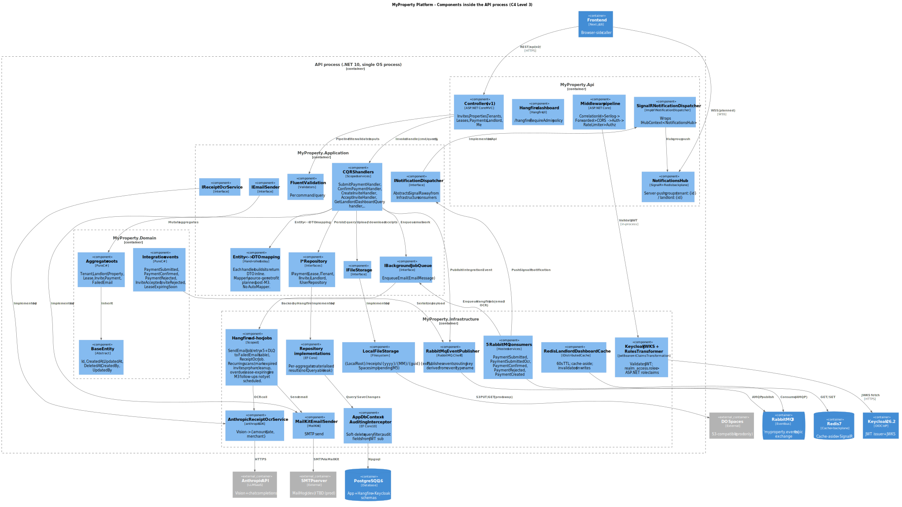

# L3 — Components (inside the API process)

Drills into the **API process** container from [L2](./containers.md) — the single .NET 10 host that runs REST controllers, the SignalR `NotificationsHub`, and the Hangfire job server. The four sub-boundaries match the four .NET projects that make up the Clean Architecture solution.



> **Source:** [`diagrams/components.puml`](./diagrams/components.puml).

## Reading the diagram

Each sub-boundary is a separate .NET project (assembly). They follow a one-direction dependency rule that is enforced by project references — never violated:

```
Api ──► Application ──► Domain
 │                       ▲
 └─► Infrastructure ─────┘
            │
            └─► Application (only for the interfaces — never the other way)
```

Concretely:

- **Domain** depends on **nothing**.
- **Application** depends on **Domain only**. No EF Core, no ASP.NET, no external libraries.
- **Infrastructure** depends on **Application** (for the interfaces it implements) + **Domain** (for entities).
- **Api** depends on **Application** + **Infrastructure**.

Application's interfaces — `IPaymentRepository`, `INotificationDispatcher`, `IEmailSender`, `IReceiptOcrService`, `IFileStorage`, `IBackgroundJobQueue`, `ICurrentUserContext`, `IFeatureFlags` — are the **ports**; Infrastructure's `PaymentRepository`, `SignalRNotificationDispatcher`, `MailKitEmailSender`, `AnthropicReceiptOcrService`, `LocalFileStorage`, `CurrentUserContext`, `UnleashFeatureFlags`, and Hangfire backing are the **adapters**. Handlers in Application never know which adapter is wired in.

## Components per project

### `MyProperty.Api` — host + transport surface

| Component | Tech | What it does |
|---|---|---|
| Controllers (v1) | ASP.NET Core MVC, `Asp.Versioning` | AuthController, InvitesController, PropertiesController, LeasesController, PaymentsController, LandlordController, AdminController, MeController — thin: deserialise → call handler → return result. No business logic. (There is **no** `TenantsController` — landlord-facing tenant views are served by `LandlordController`; `AdminController` backs the stakeholder dashboard; `AuthController` exposes landlord self-registration.) |
| `NotificationsHub` | SignalR + Redis backplane | Server-push only. Auto-groups connections into `tenant:{userId}` or `landlord:{userId}` on connect. JWT-authenticated via `?access_token=` for the WebSocket handshake. |
| Middleware pipeline | ASP.NET Core | CorrelationId → Serilog request logging → ForwardedHeaders → CORS allowlist → JwtBearer auth → RateLimiter (`anon-invite` per-IP 30/min + `authenticated` per-user 120/min) → Authorization policies. |
| Hangfire dashboard | Hangfire UI | Mounted at `/hangfire`, gated by `RequireAdmin` policy. |
| `SignalRNotificationDispatcher` | Implements `INotificationDispatcher` | Lives in Api so Infrastructure's RabbitMQ consumers stay free of an Api project reference. Wraps `IHubContext<NotificationsHub>`. |

### `MyProperty.Application` — use cases + ports

| Component | Tech | What it does |
|---|---|---|
| CQRS handlers | Scoped services | One handler per command/query. SubmitPaymentHandler, ConfirmPaymentHandler, RejectPaymentHandler, CreateInviteHandler, AcceptInviteHandler, RejectInviteHandler, CreatePropertyHandler, GetLandlordDashboardQuery handler, etc. Controllers call handlers directly — no MediatR. |
| FluentValidation validators | FluentValidation 12 | One validator per command/query. Handlers call `validator.EnsureValidAsync(...)`, which throws the app `ValidationException`; the global `IExceptionHandler` (`GlobalExceptionHandler`) maps it to 400 `ValidationProblemDetails`. |
| Entity ↔ DTO mapping | Hand-rolled in handlers today | Each handler constructs its return DTO inline. **No AutoMapper.** A Mapperly source-generator retrofit is documented in `backend/CLAUDE.md` as a post-M3 follow-up. |
| `I*Repository` interfaces | Abstractions | `IPaymentRepository`, `ILeaseRepository`, `IInviteRepository`, `IUserRepository`, `IPropertyRepository`. Methods are use-case-named, not CRUD primitives. Return materialised results, never `IQueryable`. |
| `INotificationDispatcher` | Abstraction | Push to SignalR groups without depending on `IHubContext`. |
| `IEmailSender` | Abstraction | Send email. |
| `IReceiptOcrService` | Abstraction | OCR a receipt image → {amount, date, merchant}. |
| `IFileStorage` | Abstraction | Upload / download / delete. **No** `GetSignedUrlAsync` until a cloud impl appears. |
| `IBackgroundJobQueue` | Abstraction | `EnqueueEmail(EmailMessage)` / `EnqueueReceiptOcr(paymentId)` — handlers + consumers enqueue via this; tests record without hitting Hangfire. |
| `ICurrentUserContext` | Abstraction | Resolves the authenticated caller (Keycloak `sub` → `User`) centrally. `GetUserAsync` throws `ForbiddenException` if unauthenticated/unknown; `GetOrSyncUserAsync` provisions from the `ClaimsPrincipal`. Replaced the sub→`User` lookup copy-pasted across the payment handlers (M5 cleanup, PR #151). |
| `IFeatureFlags` | Abstraction | `IsEnabledAsync(flag, defaultValue, ct)`. Safe-by-default — returns the supplied default if the flag is unknown or the provider is unreachable. Keeps `Application` free of the Unleash SDK (same rule as `IBackgroundJobQueue`). |

### `MyProperty.Domain` — pure C#

| Component | Tech | What it does |
|---|---|---|
| `BaseEntity` | Abstract class | `Id`, `CreatedAt`, `UpdatedAt`, `DeletedAt`, `CreatedBy`, `UpdatedBy`. Audit fields are populated by the `AuditingInterceptor`, never by handlers. Soft-deleted rows are filtered out by a global EF Core query filter. |
| Aggregate roots | Pure C# entities | User, Property, Lease, Invite, Payment, FailedEmail. (Single `User` aggregate — there is no Tenant/Landlord entity; the Tenant-vs-Landlord distinction is the Keycloak realm role.) `Payment` is anemic (public setters); its `Outstanding → Pending → Confirmed/Rejected` transitions are enforced in the command handlers (e.g., `ConfirmPaymentHandler` requires status `Pending` before setting `Confirmed`), not on the entity. `Lease.Terminate()` is the one genuine entity-level state method. |
| Integration events | Pure C# records | `PaymentSubmittedEvent`, `PaymentConfirmedEvent`, `PaymentRejectedEvent`, `PaymentCreatedEvent`. Carry minimal payloads (IDs + a few timestamps). *Invite + Lease events are planned (see [`events.md`](./events.md) → "What's not yet wired") but not yet emitted.* |

### `MyProperty.Infrastructure` — adapters

| Component | Tech | What it does |
|---|---|---|
| `AppDbContext` + `AuditingInterceptor` | EF Core 10, Npgsql | The only DbContext. Configurations live in `Configurations/<Entity>Configuration.cs` using `IEntityTypeConfiguration<T>`. Interceptor reads the current user via `ICurrentUser` (sourced from the HTTP context upstream) to set audit fields. |
| Repositories | EF Core 10 | One per aggregate. `PaymentRepository`, `LeaseRepository`, `InviteRepository`, `UserRepository`, `PropertyRepository`. **No** generic `IRepository<T>` base. |
| `RabbitMqEventPublisher` | RabbitMQ.Client 7 | Publishes any `IIntegrationEvent` to the `myproperty.events` topic exchange. Routing key derived from event type name (`PaymentConfirmedEvent` → `payment.confirmed`). |
| 5 RabbitMQ consumers | Hosted services | `PaymentSubmittedConsumer`, `PaymentSubmittedOcrConsumer`, `PaymentConfirmedConsumer`, `PaymentRejectedConsumer`, `PaymentCreatedConsumer`. Translate events into side effects (Hangfire enqueue + SignalR push). No business logic. The OCR consumer checks the `payments.ocr-autoextract` feature flag before enqueueing `ReceiptOcrJob`. |
| Hangfire jobs | Scoped services | Two ad-hoc jobs (`SendEmailJob` — 5 retries, exponential backoff, DLQ to `FailedEmails` on exhaustion — and `ReceiptOcrJob`) plus **three recurring scans now scheduled** in `Program.cs` via `RecurringJob.AddOrUpdate`: `MarkExpiredInvitesJob` (hourly, `0 * * * *`), `OrphanCleanupJob` (daily 03:00 UTC, `0 3 * * *`, hard-deletes Expired invites older than 30 days), and `LeaseExpiringSoonJob` (daily 08:00 UTC, `0 8 * * *` — publishes no integration event / SignalR push). One further scan (mark overdue payments) remains a `backend/CLAUDE.md` follow-up. |
| `AnthropicReceiptOcrService` | Anthropic Messages API over a hand-rolled `HttpClient` (no .NET SDK), model pinned via `Anthropic:Model` (default `claude-sonnet-4-5-20250929`) | Sends receipt image to Claude vision → parses JSON response. The `ReceiptOcrJob` then writes the results to discrete columns `OcrAmount` / `OcrDate` / `OcrMerchant` / `OcrRawResponse` / `OcrProcessedAt` (there is no `Payment.OcrResults` property). |
| `MailKitEmailSender` | MailKit 4 | SMTP send. |
| `LocalFileStorage` | Filesystem | Stores at `{LocalRoot}/receipts/{yyyy}/{MM}/{guid}{ext}` on a PVC (dev + prod). Path-traversal rejected at resolve time. A cloud impl (`SpacesFileStorage`) remains a follow-up — it was tied to the now-retired DO Spaces ([ADR-0009](./adr/0009-hetzner-project-02-over-doks.md)); same interface when it lands. |
| `RedisLandlordDashboardCache` | `IDistributedCache` over StackExchange.Redis | Cache-aside on `GetLandlordDashboardQuery`. 60s TTL. Invalidated on writes (payment submitted / confirmed / rejected). |
| Keycloak JWKS + `KeycloakRolesTransformer` | `JwtBearer` + `IClaimsTransformation` | Validates JWTs against Keycloak's JWKS endpoint. Maps `realm_access.roles` → ASP.NET role claims so `[Authorize(Roles = "...")]` works. |
| `CurrentUserContext` | Implements `ICurrentUserContext` (in `Identity/`) | Wraps `ICurrentUser` (the `ClaimsPrincipal`) + `IUserRepository` to resolve or sync the caller's `User` from the Keycloak `sub`. |
| `UnleashFeatureFlags` / `NullFeatureFlags` | Implements `IFeatureFlags` (`Unleash.Client` SDK) | `UnleashFeatureFlags` evaluates against a background-polled in-memory snapshot (no per-call I/O); `NullFeatureFlags` is the no-op fallback that `AddFeatureFlags` registers when no Unleash token is configured. See [ADR-0010](./adr/0010-unleash-for-feature-flags.md). |

## Notable choices (cross-referenced)

| Choice | Where justified |
|---|---|
| Clean Architecture with strict 4-project layering | [`backend/CLAUDE.md`](../../backend/CLAUDE.md) → Solution Layout |
| **No MediatR** (handlers called directly from controllers) | [`backend/CLAUDE.md`](../../backend/CLAUDE.md) → CQRS section |
| **No AutoMapper** (hand-rolled mapping today; Mapperly source-gen is the planned retrofit) | [`backend/CLAUDE.md`](../../backend/CLAUDE.md) → Mapping section |
| **No MassTransit** (direct `RabbitMQ.Client`) | [ADR-0002](./adr/0002-rabbitmq-over-kafka.md) |
| **No generic `IRepository<T>`** | [`backend/CLAUDE.md`](../../backend/CLAUDE.md) → Repositories section |
| **`SignalRNotificationDispatcher` lives in `Api`** | Keeps Infrastructure's RabbitMQ consumers free of an Api reference; see [`backend/CLAUDE.md`](../../backend/CLAUDE.md) → Push mechanics |
| **No `GetSignedUrlAsync` on `IFileStorage`** | [`backend/CLAUDE.md`](../../backend/CLAUDE.md) → File Storage |
| **Self-hosted Unleash feature flags** (receipt-OCR kill-switch) | [ADR-0010](./adr/0010-unleash-for-feature-flags.md) |
| **`ICurrentUserContext`** centralises the Keycloak `sub` → `User` lookup | M5 backend cleanup (PR #151) |

## Out of scope at this level

- **Frontend internals** (component tree, hooks, query keys) — frontend is a black box at L3. See `frontend/CLAUDE.md`.
- **Keycloak internals** — black box at L3.
- **Recurring job schedules + retry policies** — covered in detail in [`events.md`](./events.md) and `backend/CLAUDE.md` → Background Jobs.
- **The exact set of integration events + routing keys** — see [`events.md`](./events.md).
- **End-to-end request flow** — see [`data-flow.md`](./data-flow.md).
