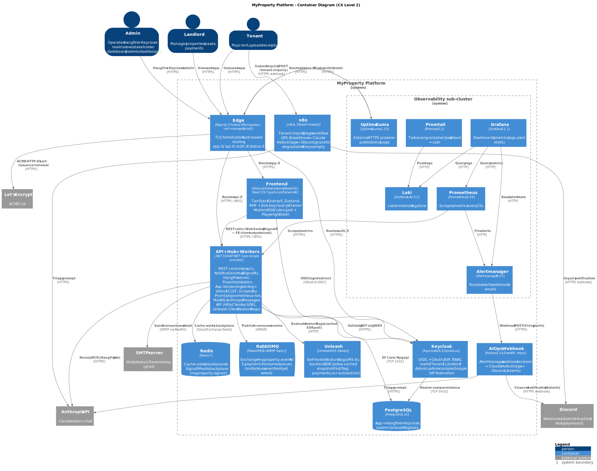

# L2 — Containers

Decomposes *MyProperty Platform* (the single box at [L1](./context.md)) into the runtime processes and data stores that actually run when the platform is deployed. "Container" here is the C4 sense — a separately deployable runtime, not a Docker container (though most of these *do* ship as Docker containers).

> **Source:** [`diagrams/containers.puml`](./diagrams/containers.puml) — re-render with `scripts/render-architecture-diagrams.ps1`.

## Reading the diagram

The diagram describes the **production-realistic** runtime. Environment-specific deltas (MailHog, the `proxy` compose profile, init containers) live in [`deployment-dev.md`](./deployment-dev.md) and [`deployment-prod.md`](./deployment-prod.md). The C4 inner boundary *Observability sub-cluster* is a visual grouping, not a separate process boundary — those six containers are independent services that happen to share a concern.

**Three things worth flagging:**

1. **The "API + Hub + Workers" container is a single .NET process.** REST controllers, the SignalR `NotificationsHub`, and the Hangfire job server all run in the same `MyProperty.Api` host. They're shown as one container, not three, because they share lifecycle, deployment, and OS process — which is C4's definition of a container.
2. **The SignalR client on the Frontend is not wired yet.** The hub exists server-side at `/hubs/notifications` and the Redis backplane is configured, but `@microsoft/signalr` is not in `frontend/package.json`. The Frontend ↔ API edge is labelled accordingly. See `backend/CLAUDE.md` → SignalR → Frontend contract for the planned wiring.
3. **The receipt OCR substitutes for the M3.10 RAG/pgvector deliverable.** Reasoning is in [ADR-0005](./adr/0005-anthropic-over-openai.md) and the narrative ([`technology-decisions.md`](./technology-decisions.md)).

## Containers — application tier

| Container | Tech / Version | Purpose | Why this choice |
|---|---|---|---|
| **Edge** | Nginx 1.27-alpine (dev) / K8s Ingress + cert-manager (prod) | TLS termination, host-based routing for `app.X`, `api.X`, `auth.X`, `status.X` | Industry standard; cert-manager + Let's Encrypt automates renewal in K8s. Nginx in dev mirrors the prod surface for end-to-end testing. |
| **Frontend** | Next.js 16 (Node 20 distroless), React 19, TypeScript strict, Tailwind 4 | SSR + RSC web app, serves the SPA shell | App Router + RSC + ecosystem maturity — see [ADR-0006](./adr/0006-nextjs-app-router-over-remix.md). |
| **API + Hub + Workers** | .NET 10 ASP.NET Core (chiseled Ubuntu 24.04 distroless), EF Core 10, FluentValidation 12, Asp.Versioning 10, Serilog → Loki, prometheus-net 8, Hangfire 1.8, SignalR + Redis backplane, MailKit 4, Anthropic SDK | REST API (`/api/v1/*`), real-time hub (`/hubs/notifications`), Hangfire job server, Hangfire dashboard (`/hangfire`, Admin-gated) | Clean Architecture in one process keeps deploy simple at MVP scale; ADRs cover the substantive picks. |
| **AIOps Webhook** | Python 3.14-slim (non-root), FastAPI, anthropic SDK, slack-sdk | Receives Alertmanager firing alerts → triages via Claude Haiku → posts to Slack | Light, single-purpose, isolates the AI dependency from the API process. Graceful degradation if the AI key or Slack URL is missing. |
| **Keycloak** | Keycloak 26.2 (Quarkus distribution, quay.io image) | Self-hosted OIDC + OAuth2 IdP, RBAC realm (Tenant / Landlord / Admin), Google IdP federation | M3.2 requirement; self-hosted avoids per-MAU pricing — [ADR-0001](./adr/0001-keycloak-over-custom-auth.md). |

## Containers — data + brokers

| Container | Tech / Version | Purpose | Why this choice |
|---|---|---|---|
| **PostgreSQL** | PostgreSQL 16-alpine (dev) / DO Managed PostgreSQL 16 (prod) | App schema (EF Core), Hangfire jobs schema, Keycloak realm schema | Single managed RDBMS for three schemas avoids 3 separate stateful services. Postgres is the M3.3 requirement. |
| **Redis** | Redis 7-alpine | Cache-aside (landlord dashboard) + SignalR Redis backplane (`myproperty.signalr` channel prefix) | Two needs (M3.5 + M3.6 backplane), one service. StackExchange.Redis is the canonical .NET client. |
| **RabbitMQ** | RabbitMQ 3 with management plugin | Topic exchange `myproperty.events` + per-consumer queues (`payment.*`, `invite.*`, `lease.*`) | AMQP topic semantics fit our event pub/sub; simpler ops than Kafka — [ADR-0002](./adr/0002-rabbitmq-over-kafka.md). |

## Containers — observability sub-cluster

| Container | Tech / Version | Purpose | Why this choice |
|---|---|---|---|
| **Prometheus** | Prometheus 2.55 | Scrapes `/metrics` (15s interval); fires alert rules | Industry default for time-series metrics; first-class kube-prometheus-stack Helm dep. |
| **Alertmanager** | Alertmanager 0.27 | Routes Prometheus alerts to webhook + email | Pairs with Prometheus; native to kube-prometheus-stack. |
| **Loki** | Grafana Loki 3.2 | Label-indexed log aggregator | Lower resource footprint than Elasticsearch — [ADR-0007](./adr/0007-loki-over-elk.md). |
| **Promtail** | Promtail 3.2 (DaemonSet in prod) | Tails every container/pod stdout → pushes to Loki | Bundled with Loki; replaces per-container log shippers. |
| **Grafana** | Grafana 11.1 | Unified dashboards for metrics + logs + alerts | One UI over both Prometheus and Loki; provisioned with API metrics + API logs dashboards out of the box. |
| **Uptime Kuma** | Uptime Kuma 1.23 | External HTTPS probes + public status page (`status.X`) | Self-hosted, lightweight, single binary; M4.6 requirement. |

## Containers — out of scope at this level

| Concern | Where it's documented |
|---|---|
| Local dev SMTP (MailHog) | [`deployment-dev.md`](./deployment-dev.md) |
| One-shot init containers (keycloak-realm-init, backend-storage-init, uptime-kuma-init) | [`deployment-dev.md`](./deployment-dev.md) / [`deployment-prod.md`](./deployment-prod.md) |
| Backend Clean Architecture (Api / Application / Domain / Infrastructure layering inside the API container) | [`components.md`](./components.md) |
| K8s primitives (Deployments, Services, Ingress, ConfigMaps, ServiceMonitors, NetworkPolicies, External Secrets) | [`deployment-prod.md`](./deployment-prod.md) |
| CI/CD pipeline (GitHub Actions, GHCR, Trivy, SBOM, helm upgrade, Discord notifications) | [`cicd.md`](./cicd.md) |
| Runtime sequences (REST request lifecycle, RabbitMQ event → SignalR push, receipt OCR flow) | [`data-flow.md`](./data-flow.md) |

## External systems (recap from L1)

Shown at L2 for completeness but already justified at L1:

| External | Used by | Edge label |
|---|---|---|
| Anthropic API | API (receipt OCR), AIOps Webhook (alert triage) | HTTPS |
| DigitalOcean Spaces (prod) | API (receipt PUT/GET) | HTTPS / S3 |
| Slack | AIOps Webhook | HTTPS webhook |
| Let's Encrypt | Edge (cert renewal) | HTTPS / ACME |
| SMTP server (MailHog dev / TBD prod) | API (Hangfire `SendEmailJob` via MailKit) | SMTP |
