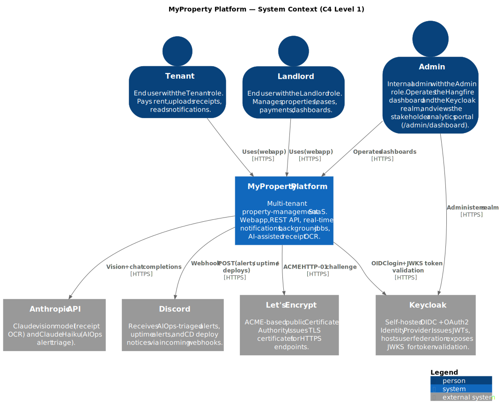

# L1 — System Context

This is the highest-level view of MyProperty Platform: who uses it, what external systems it depends on, and which protocols cross the system boundary. The system itself is treated as a single box here; it is decomposed in the [L2 Container view](./containers.md).

> **Source:** [`diagrams/context.puml`](./diagrams/context.puml) — re-render with `scripts/render-architecture-diagrams.ps1`.

## At a glance

- **Actors:** *Tenant* and *Landlord* are end users (different roles, different portals: `/tenant/dashboard` vs `/dashboard`). *Admin* is an internal operator with access to the Hangfire dashboard, the Keycloak realm console, and the stakeholder analytics portal (`/admin/dashboard`).
- **System boundary:** Everything inside *MyProperty Platform* is the subject of this documentation set; it is broken open in the container view.
- **External systems:** four — the identity provider (Keycloak), an AI API (Anthropic), a notification destination (Discord), and a certificate authority (Let's Encrypt). *(Earlier revisions listed DigitalOcean Spaces for receipt storage; it went away with the move off DOKS — receipts now live on a local/PVC volume. See [ADR-0009](./adr/0009-hetzner-project-02-over-doks.md).)*
- **Transport:** every cross-boundary edge runs over **HTTPS / TLS 1.2+**; authentication-bearing edges additionally carry **OIDC** (login) or **JWT** (subsequent API calls validated against Keycloak's JWKS).
- **Frontend surface (recap):** the landlord portal (`/dashboard`) now spans properties, tenants, leases, payments, and invites (list + detail/CRUD); the tenant portal (`/tenant/dashboard`) covers rent + receipt submission; the admin portal (`/admin/dashboard`) is a platform-wide stakeholder analytics dashboard (KPIs + trend charts); auth is an end-to-end Keycloak flow — hosted login, landlord self-signup, and anonymous invite acceptance. Frontend internals stay out of scope here (see L2/L3).

## Technology labels & justification

Every box visible in the L1 diagram appears in this table. Internal-only technologies (Postgres, Redis, RabbitMQ, .NET, Next.js, …) appear at L2 and below.

| Box | Type | Version / variant | Purpose | Why this choice (alternative considered) |
|---|---|---|---|---|
| MyProperty Platform | Software System (under design) | — | The system this document set describes | — |
| Tenant | Person | Customer role | End user paying rent and uploading receipts | — |
| Landlord | Person | Customer role | End user managing properties, leases, payments | — |
| Admin | Person | Internal-operator role | Operates Hangfire + Keycloak realm; views the stakeholder analytics dashboard (`/admin/dashboard`) | — |
| **Keycloak** | External Software System | 26.2 (Quarkus distribution) | Self-hosted OIDC/OAuth2 Identity Provider | OIDC + SSO + RBAC are M3.2 hard requirements. Self-host avoids the per-MAU pricing of Auth0/Okta. See [ADR-0001](./adr/0001-keycloak-over-custom-auth.md). |
| **Anthropic API** | External SaaS | `claude-sonnet-4-x` (receipt OCR) + `claude-haiku-4-5-20251001` (AIOps triage) | LLM provider — receipt OCR (M3.10) and Alertmanager triage (DO-12) | Best vision quality at the receipt price point + cheapest triage tier from the same vendor. See [ADR-0005](./adr/0005-anthropic-over-openai.md). |
| **Discord** | External SaaS | Incoming Webhooks | Destination for AIOps-triaged alerts (`#alerts`), Uptime-Kuma alerts (`#uptime`), and CD deploy notices (`#deployments`) | Already the team's chat tool; webhook integration is one HTTP POST. Replaced Slack during M5. |
| **Let's Encrypt** | External Certificate Authority | ACME v2, HTTP-01 challenge | Free, automatable TLS certificate issuance | Free, automatable, supported by Certbot (dev profile) and cert-manager (prod). |

## Edges & protocols

| From → To | Protocol | Carries | Why this edge exists |
|---|---|---|---|
| Tenant / Landlord → MyProperty | HTTPS | Browser ↔ web app + REST | Primary user surface |
| Admin → MyProperty | HTTPS | Hangfire UI (`/hangfire`) | Operator surface (Admin-policy-gated) |
| Admin → Keycloak | HTTPS | Keycloak admin console | User / role / realm administration |
| MyProperty → Keycloak | HTTPS | OIDC discovery + JWKS fetch | Validates JWTs signed by the IdP |
| MyProperty → Anthropic | HTTPS | Vision + chat completions | Receipt OCR + AIOps triage |
| MyProperty → Discord | HTTPS | Webhook POST | Alert / uptime / deploy delivery |
| MyProperty → Let's Encrypt | HTTPS (ACME) | HTTP-01 challenge + cert issuance | TLS renewal (Certbot / cert-manager) |

## What is intentionally **not** at L1

- **Internal services** (PostgreSQL, Redis, RabbitMQ, the SignalR hub, the AIOps webhook, the observability stack) — they live *inside* MyProperty Platform and appear at [L2 Container](./containers.md).
- **CI / CD** (GitHub Actions, GHCR, Discord notifications, Trivy) — those are build-time, not run-time. They appear in [`cicd.md`](./cicd.md).
- **SMTP / email delivery** (Mailpit, with Resend as the cluster relay) — supporting infrastructure, not a top-level actor at this level; documented in [`deployment-dev.md`](./deployment-dev.md) (local catcher) and [`../operations/email-smtp.md`](../operations/email-smtp.md) (cluster catcher + Resend relay).
- **RAG / pgvector** — the M3.10 AI requirement was satisfied by *receipt OCR via Anthropic vision* rather than by a RAG endpoint. The reasoning is captured in [`technology-decisions.md`](./technology-decisions.md) and [ADR-0005](./adr/0005-anthropic-over-openai.md).
