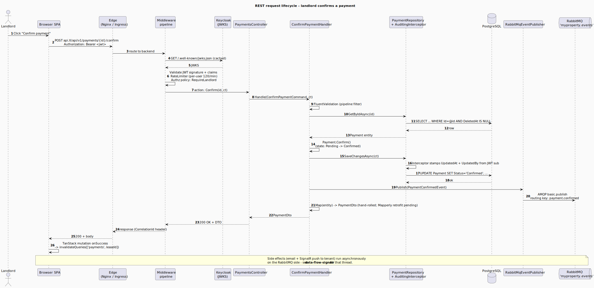
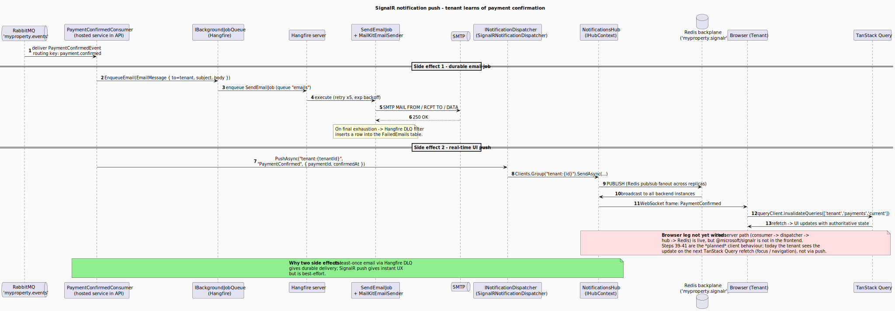
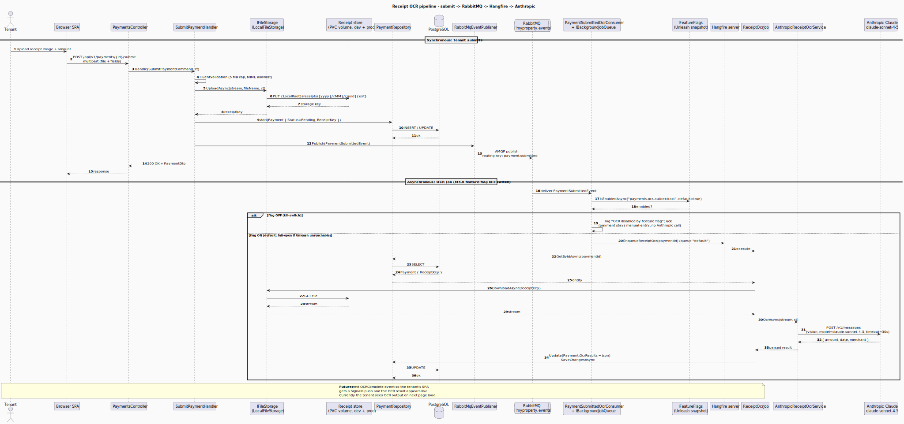

# Runtime data flow

The static views (L1/L2/L3, deployment) tell you what runs where. These sequence diagrams tell you what happens **over time** for three flows that exercise most of the moving parts: a synchronous REST request, an asynchronous notification push, and the OCR pipeline that crosses both worlds.

> All three sequences are partial — they cover the **happy path** plus a few of the most important branch points (validation, JWT expiry, Hangfire DLQ, OCR fallbacks). Edge cases live in the code, not the diagram.

## 1. Synchronous REST request — "landlord confirms a payment"

The canonical write path: Browser → Edge → middleware chain → controller → handler → repository → Postgres, plus a publish to RabbitMQ. The HTTP response returns the moment the DB transaction commits; side effects (email, real-time push) fan out via the next two flows.

> Source: [`diagrams/data-flow-rest.puml`](./diagrams/data-flow-rest.puml).

**Why the publish is in the handler, not the controller:** keeping the publish inside the unit of work means the event is published *after* the row is committed — so consumers can safely look up the payment by ID without race conditions against the writer. The handler still publishes after `SaveChangesAsync`, not inside the same transaction, which means the publish is at-least-once but not transactional — acceptable here because consumers are idempotent. (Outbox pattern is a follow-up if exactly-once semantics ever matter.)

**Middleware order matters.** `CorrelationId` must come before `Serilog` so every log line carries the same `CorrelationId`. `Auth` must come before `Authz` and `RateLimiter` — anonymous traffic must be filtered before per-user limits apply. The order in `Program.cs` matches this diagram exactly; see [L3 → middleware pipeline](./components.md#mypropertyapi--host--transport-surface).

## 2. Asynchronous notification — "tenant learns of payment confirmation"

The second half of the same business action. The handler from Flow 1 returned 200 OK to the landlord; meanwhile, the `PaymentConfirmedConsumer` (a hosted service inside the same API process, but on RabbitMQ's delivery thread) fires *two* side effects in parallel: a Hangfire-backed email job, and a SignalR push to the tenant's browser.

> Source: [`diagrams/data-flow-signalr.puml`](./diagrams/data-flow-signalr.puml).

**Two delivery channels, two reliability profiles:**

- **Email** is *durable* — Hangfire persists the job in Postgres, retries with exponential backoff up to 5 times, and writes a `FailedEmails` row on terminal failure. Operators can replay from that table.
- **SignalR push** is *best-effort* — the tenant's browser may not be connected. That's deliberate: TanStack Query is the source of truth, the push is a *signal to refetch*, never canonical state. If the push is lost, the next page navigation fetches authoritative data.

**Why a Redis backplane:** the `myproperty.signalr` channel prefix lets every backend replica fan out to clients connected to *any* replica, without consumers needing to know which one. Production runs 1 replica today (because of the ReadWriteOnce PVC for receipt storage), but the backplane is wired so scaling out is just `replicas: N` in `values.yaml` — no code change.

**SignalR client status:** the frontend has **not yet** wired `@microsoft/signalr`. The hub, the backplane, and this whole consumer path all work; what's missing is the browser-side connection that would consume the WebSocket frames. Until then, the tenant sees confirmed payments via natural TanStack Query refetches (window focus, manual refresh, navigation).

## 3. Receipt OCR pipeline — "submit → RabbitMQ → Hangfire → Anthropic"

The full lifecycle of a receipt: synchronous upload + multipart parse + storage, followed by an asynchronous OCR job that hits Claude vision and writes structured fields back to the payment row.

> Source: [`diagrams/data-flow-ocr.puml`](./diagrams/data-flow-ocr.puml).

**Two-step asynchrony, single multipart request:** the tenant's submit POST is single-step (the multipart endpoint takes file + fields together) — but the OCR is decoupled via RabbitMQ → Hangfire so the upload response isn't blocked on a 30-second Claude call. This means the OCR result lands a few seconds *after* the synchronous response.

**File storage abstraction earns its keep:** `IFileStorage` lets the dev `LocalFileStorage` (writes to a Docker named volume) and the planned prod `SpacesFileStorage` (writes to DigitalOcean Spaces via S3 PUT) be swapped without changing handler or job code. Same `UploadAsync` / `DownloadAsync` surface, different adapter. See [L3 → `IFileStorage`](./components.md#mypropertyapplication--use-cases--ports).

**Failure modes that *are* handled in code (not the diagram):**

- Claude returns malformed JSON → caller surfaces an empty OCR result; tenant can correct manually.
- Anthropic timeout (>30s) → Hangfire retries.
- Receipt file > 5 MB → 400 validation error from FluentValidation before the upload ever starts.
- Receipt MIME outside the allowlist → 400 validation error.
- Path-traversal in storage key → rejected by `LocalFileStorage` resolver.

## What ties these three together

These flows are not three different systems — they're three views of the same handler-and-consumer plumbing. The pattern is:

1. **HTTP request** mutates state synchronously inside one unit of work.
2. **Event publish** is the last step inside the handler, after the DB commit.
3. **Consumers** (RabbitMQ hosted services) react to events with side effects: durable retryable work goes to Hangfire; instant UX feedback goes to SignalR.

Every business action that has user-visible side effects follows this shape — payment submit / confirm / reject, invite accept / reject, lease expiring scan. The set of events + routing keys is enumerated in [`events.md`](./events.md).
