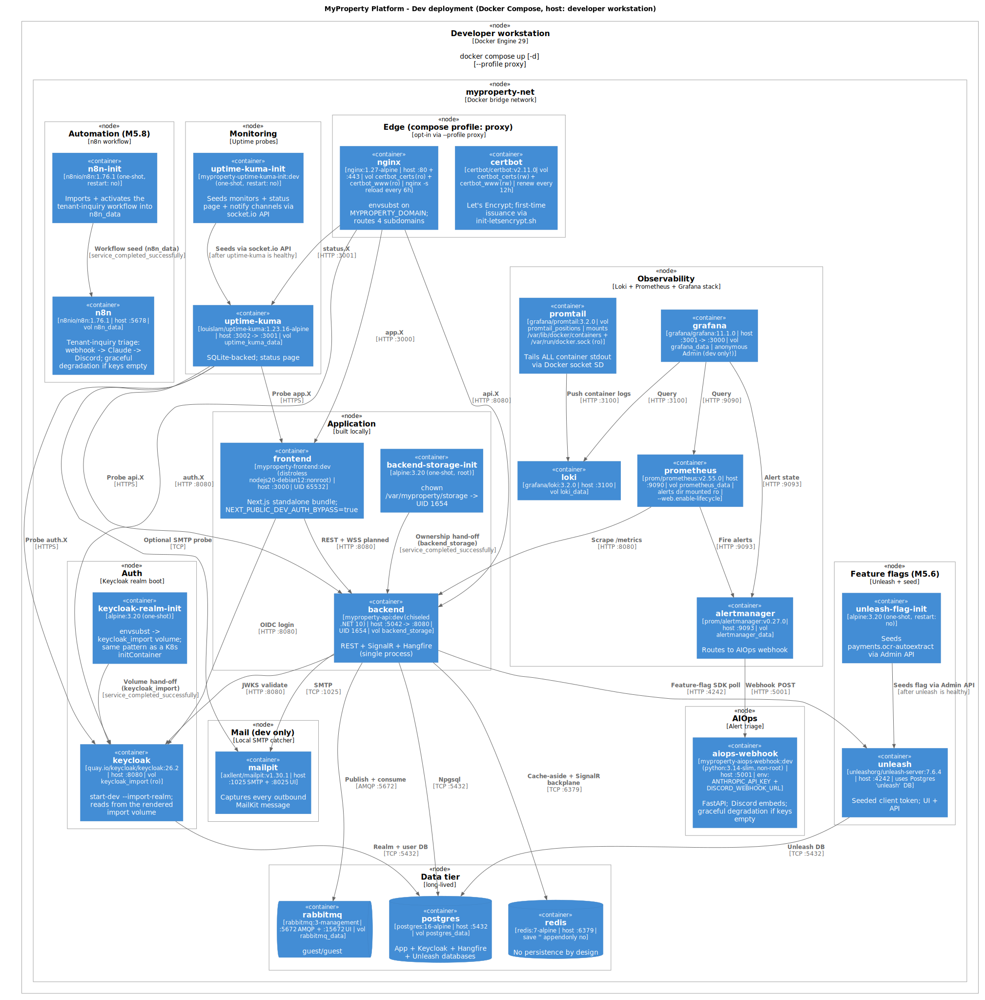

# Deployment — Dev (Docker Compose)

The local development stack. One `docker compose up` brings up 19 services on a single bridge network (`myproperty-net`); two more come up when you opt into the `--profile proxy` flag for the Nginx + Certbot edge.



> **Source:** [`diagrams/deployment-dev.puml`](./diagrams/deployment-dev.puml). The authoritative service list lives in [`docker-compose.yml`](../../docker-compose.yml).

## What you get from `docker compose up`

A complete, production-shaped stack on the local machine — every dependency the API talks to in production runs here as the same image (Postgres, Redis, RabbitMQ, Keycloak, Unleash, Loki/Promtail/Prometheus/Grafana/Alertmanager) or a drop-in dev substitute (MailHog for SMTP). Receipt storage uses the local-volume `LocalFileStorage` in dev *and* prod.

## Service inventory

21 services total, 19 default + 2 behind the `proxy` profile. Init containers are one-shots that exit after they've prepared a volume or seeded a peer.

### Default profile (19 services)

| # | Service | Image | Host port(s) | Volume(s) | Role |
|---|---|---|---|---|---|
| 1 | `postgres` | `postgres:16-alpine` | 5432 | `postgres_data`, `init.sql` (RO bind) | App + Keycloak + Hangfire + Unleash databases |
| 2 | `keycloak-realm-init` | `alpine:3.20` (one-shot) | — | `keycloak_import` (RW) | `envsubst` realm template → import volume |
| 3 | `keycloak` | `quay.io/keycloak/keycloak:26.2` | 8080 | `keycloak_import` (RO) | OIDC IdP + admin console |
| 4 | `backend-storage-init` | `alpine:3.20` (one-shot, UID 0) | — | `backend_storage` (RW) | `chown` to UID 1654 for non-root backend |
| 5 | `redis` | `redis:7-alpine` | 6379 | — | Cache + SignalR backplane (no persistence) |
| 6 | `rabbitmq` | `rabbitmq:3-management` | 5672 (AMQP), 15672 (UI) | `rabbitmq_data` | Event bus |
| 7 | `mailhog` | `mailhog/mailhog:latest` | 1025 (SMTP), 8025 (UI) | — | **Dev-only** SMTP catcher |
| 8 | `backend` | `myproperty-api:dev` (chiseled .NET 10) | 5042 → 8080 | `backend_storage` | API + Hub + Hangfire (UID 1654) |
| 9 | `frontend` | `myproperty-frontend:dev` (distroless `nodejs20-debian12:nonroot`) | 3000 | — | Next.js standalone (UID 65532) |
| 10 | `loki` | `grafana/loki:3.2.0` | 3100 | `loki_data` | Log store |
| 11 | `promtail` | `grafana/promtail:3.2.0` | — | `promtail_positions` + Docker socket + `/var/lib/docker/containers` (RO) | Tails **every** container's stdout via Docker SD |
| 12 | `prometheus` | `prom/prometheus:v2.55.0` | 9090 | `prometheus_data`, `prometheus.yml` + `alerts/` (RO) | Metrics + alert rules; `--web.enable-lifecycle` for hot reload |
| 13 | `alertmanager` | `prom/alertmanager:v0.27.0` | 9093 | `alertmanager_data`, `alertmanager.yml` (RO) | Alert routing |
| 14 | `aiops-webhook` | `myproperty-aiops-webhook:dev` (python:3.14-slim, non-root) | 5001 | — | Alertmanager → Claude Haiku → Discord (`#alerts`) |
| 15 | `grafana` | `grafana/grafana:11.1.0` | 3001 → 3000 | `grafana_data`, provisioning dir (RO) | Dashboards (anonymous Admin — **dev only**) |
| 16 | `uptime-kuma` | `louislam/uptime-kuma:1.23.16-alpine` | 3002 → 3001 | `uptime_kuma_data` | External HTTPS probes + status page |
| 17 | `uptime-kuma-init` | `myproperty-uptime-kuma-init:dev` (custom) | — | — | One-shot socket.io seed of monitors + notify channels |
| 18 | `unleash` | `unleashorg/unleash-server:7.6.4` | 4242 | — (uses Postgres `unleash` DB) | **Feature flags (M5.6)** — UI + API at `:4242`; seeds a fixed client token |
| 19 | `unleash-flag-init` | `alpine:3.20` (one-shot) | — | `seed-flags.sh` (RO bind) | Seeds + enables `payments.ocr-autoextract` via the Unleash Admin API |

### `proxy` profile (2 extras — opt-in via `docker compose --profile proxy up`)

| # | Service | Image | Host port(s) | Volume(s) | Role |
|---|---|---|---|---|---|
| 20 | `nginx` | `nginx:1.27-alpine` | 80, 443 | `certbot_certs` (RO), `certbot_www` (RO), templated config (RO) | Routes 4 subdomains, reloads every 6 h |
| 21 | `certbot` | `certbot/certbot:v2.11.0` | — | `certbot_certs` (RW), `certbot_www` (RW) | `certbot renew` every 12 h |

## Volumes (12 named volumes)

| Volume | Used by | Purpose |
|---|---|---|
| `postgres_data` | postgres | Database files |
| `keycloak_import` | keycloak-realm-init (RW), keycloak (RO) | Rendered realm export |
| `backend_storage` | backend-storage-init (RW), backend (RW) | Uploaded receipts |
| `rabbitmq_data` | rabbitmq | Message + state persistence |
| `loki_data` | loki | Index + chunks |
| `promtail_positions` | promtail | Last-shipped offsets per log file |
| `prometheus_data` | prometheus | TSDB |
| `alertmanager_data` | alertmanager | Silences |
| `grafana_data` | grafana | Dashboards + state |
| `uptime_kuma_data` | uptime-kuma | SQLite DB |
| `certbot_certs` | nginx (RO), certbot (RW) | TLS material |
| `certbot_www` | nginx (RO), certbot (RW) | ACME HTTP-01 challenge webroot |

## Init-container pattern

Four services use the *one-shot init container* pattern — a sidecar that prepares a named volume or seeds a peer, then exits. Volume-prep ones gate the dependent service via `depends_on: condition: service_completed_successfully`; seed ones just run once the peer is healthy. This pattern maps 1:1 to a Kubernetes `initContainer` / post-install hook (see [`deployment-prod.md`](./deployment-prod.md)):

| Init | Prepares / seeds | Gates |
|---|---|---|
| `keycloak-realm-init` | `keycloak_import` (renders realm template via `envsubst`) | `keycloak` startup |
| `backend-storage-init` | `backend_storage` (chowns to UID 1654 for chiseled backend) | `backend` startup |
| `uptime-kuma-init` | Seeds monitors + notification channels via Kuma's socket.io API | (No gate; runs after `uptime-kuma` is healthy) |
| `unleash-flag-init` | Seeds + enables `payments.ocr-autoextract` via the Unleash Admin API | (No gate; runs after `unleash` is healthy) |

## Healthcheck conventions

Every long-lived service has a `healthcheck`. Two notable wrinkles:

1. **Keycloak 26** ships no `curl` (UBI Micro base). The healthcheck compiles and runs a one-shot Java HTTP probe against `/realms/MyProperty/.well-known/openid-configuration` — so it only passes once realm import has completed.
2. **The chiseled backend and distroless frontend ship no shell.** The backend skips a `HEALTHCHECK` in compose (Docker treats `running` as OK; K8s probes the `/api/v1/health/{live,ready}` endpoints directly). The frontend uses a bundled `healthcheck.mjs` invoked via the distroless `node` binary.

## What this stack does *not* match production on

These deltas are intentional — they're justified in [`deployment-prod.md`](./deployment-prod.md):

| Concern | Dev | Prod |
|---|---|---|
| SMTP | `mailhog` (catcher; emails visible at `:8025`) | TBD external provider |
| Object storage | `backend_storage` volume (`LocalFileStorage`) | **Same** — `LocalFileStorage` on a Longhorn PVC (a Spaces/S3 adapter is a follow-up) |
| Edge / TLS | Nginx + Certbot in `proxy` profile (opt-in) | ingress-nginx + namespaced cert-manager `Issuer` + Let's Encrypt (always-on) |
| Postgres | Local container | Self-hosted StatefulSet on Longhorn (same `postgres:16` image) |
| Grafana auth | Anonymous Admin | OIDC-backed |
| Service-discovery | `myproperty-net` Docker bridge (one network) | K8s ClusterIP services + NetworkPolicies |
| Image tagging | `:dev` | `:{short-sha}` + `:{branch}` (CI-pushed) |

## How to run

```bash
# Default stack (19 services)
docker compose up -d

# Add Nginx + Certbot edge (21 services)
docker compose --profile proxy up -d

# Tail everything via Loki
open http://localhost:3001     # Grafana → Explore → Loki
```

External UIs at a glance:

| Surface | URL |
|---|---|
| Frontend | http://localhost:3000 |
| API + Hangfire dashboard | http://localhost:5042/swagger · http://localhost:5042/hangfire |
| Keycloak admin console | http://localhost:8080 |
| RabbitMQ management | http://localhost:15672 (guest / guest) |
| MailHog | http://localhost:8025 |
| Prometheus | http://localhost:9090 |
| Alertmanager | http://localhost:9093 |
| Grafana | http://localhost:3001 |
| Uptime Kuma + status page | http://localhost:3002 |
| Unleash (feature flags) | http://localhost:4242 |
