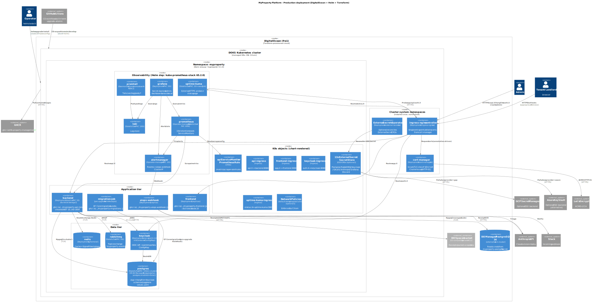

# Deployment — Production (shared Hetzner cluster, namespace `project-02`)

Production runs in **one namespace (`project-02`) on a shared Hetzner Kubernetes cluster** that Gjirafa operates. We hold **namespace-admin** RBAC — no cluster-scoped permissions — and that single constraint shapes everything below. **Helm** deploys the `myproperty` chart into the namespace; there is **no Terraform** (a borrowed namespace has no infrastructure to provision) and there are **no cluster-scoped controllers we install ourselves** (no operators, no `ClusterIssuer`, no External Secrets Operator, no GitOps controller). This is the M5 "de-DOKS" target — see [ADR-0009](./adr/0009-hetzner-project-02-over-doks.md) for why we moved off DigitalOcean.

> **Sources:**
> - Application + observability + data: [`helm/myproperty/`](../../helm/myproperty/) (`templates/` + `values.yaml`), prod overlay [`helm/myproperty/values-gjirafa.yaml`](../../helm/myproperty/values-gjirafa.yaml).
> - Deploy + secret bootstrap: [`infrastructure/gjirafa/`](../../infrastructure/gjirafa/) (`deploy.sh`, `secrets.sh`, `bump_image_tags.py`).
> - CD glue: [`.github/workflows/cd.yml`](../../.github/workflows/cd.yml) — narrated in [`cicd.md`](./cicd.md).
> - Operations runbooks: [`docs/operations/k8s-deployment.md`](../operations/k8s-deployment.md), [`docs/operations/ci-cd.md`](../operations/ci-cd.md), deferred work in [`docs/operations/deployment-roadmap.md`](../operations/deployment-roadmap.md).

## How prod differs from the old DOKS model

If you read the older revision of this doc (DOKS + Terraform + managed services), here is what changed and why — the constraint is **namespace-admin only**:

| Old (DOKS, [ADR-0004](./adr/0004-doks-over-gke-eks.md), superseded) | Now (Hetzner `project-02`, [ADR-0009](./adr/0009-hetzner-project-02-over-doks.md)) |
|---|---|
| Terraform provisions cluster + managed Postgres + Spaces | **No Terraform.** Chart + `values-gjirafa.yaml` + `secrets.sh` are the whole deployable surface |
| DO Managed PostgreSQL (`postgres.enabled=false`) | **Self-hosted** `postgres-statefulset` (`postgres.enabled: true`) |
| DO Spaces bucket for receipts | No object store yet — `LocalFileStorage` on a PVC (Spaces swap still a follow-up) |
| `kube-prometheus-stack` Helm dep + Prometheus Operator + `ServiceMonitor`/`PrometheusRule` CRDs | **Self-contained** Prometheus/Alertmanager/Grafana manifests; scrape + rules wired directly (no operator, no CRDs) |
| Promtail DaemonSet with cluster-wide RBAC | Promtail under a **namespaced `Role`**, tailing only `project-02` pods |
| cert-manager `ClusterIssuer` (cluster-scoped) | cert-manager **namespaced `Issuer`** against the cluster's shared cert-manager |
| External Secrets Operator (GCP/Azure) | **Manual K8s Secrets** via `secrets.sh` |
| Cilium CNI | **Calico** CNI (also enforces `NetworkPolicy`) |
| `do-block-storage` StorageClass | **`longhorn`** StorageClass |
| `doctl kubeconfig save` → `helm upgrade` | kubeconfig from an Environment secret → `deploy.sh --atomic` (see [`cicd.md`](./cicd.md)) |

## What the Helm chart deploys

Chart [`helm/myproperty/`](../../helm/myproperty/). The `kube-prometheus-stack` dependency was **removed**; the chart now renders all of observability itself. The prod overlay [`values-gjirafa.yaml`](../../helm/myproperty/values-gjirafa.yaml) sets the hosts (`*.myproperty.works`), `storageClassName: longhorn` on every PVC, `postgres.enabled: true`, `unleash.enabled: true`, the TLS `Issuer` config, and `networkPolicies.enabled: true`.

### Application tier

| K8s object | Image | Replicas / storage | Notes |
|---|---|---|---|
| `backend-deployment` | `ghcr.io/life-property-management/myproperty-api:{sha}` (chiseled .NET 10, UID 1654) | 1 replica, PVC (`longhorn`) | Single replica — `ReadWriteOnce` PVC backs `LocalFileStorage` for receipts. Spaces swap is a follow-up. |
| `frontend-deployment` | `ghcr.io/.../myproperty-frontend:{sha}` (distroless Node 20; image default `nonroot` UID 65532, pod `securityContext` overrides to UID 1000) | 2 replicas, no PVC | |
| `aiops-webhook-deployment` | `ghcr.io/.../myproperty-aiops-webhook:{sha}` (Python 3.14-slim) | 1 replica | Alertmanager → Claude Haiku triage → **Discord** `#alerts`. |
| `migration-job` | `ghcr.io/.../myproperty-migrations:{sha}` | pre-upgrade Helm Hook | EF Core migration bundle; runs before `backend-deployment` rolls. **Forward-only** — see the rollback caveat below. |

### Data tier (all self-hosted in-namespace)

There is no managed-service path anymore — every stateful service runs in `project-02`, each PVC on the `longhorn` StorageClass.

| K8s object | Image | Notes |
|---|---|---|
| `postgres-statefulset` + `postgres-service` + `postgres-init-configmap` | `postgres:16-alpine` | Hosts the app, Hangfire, **Keycloak**, and **Unleash** schemas (the init script creates the `keycloak` + `unleash` databases). |
| `redis-deployment` + `redis-service` | `redis:7-alpine` | Cache-aside + SignalR backplane. |
| `rabbitmq-statefulset` + `rabbitmq-service` | `rabbitmq:3-management` | Topic exchange `myproperty.events`. |
| `keycloak-deployment` + `keycloak-service` + `keycloak-realm-configmap` | `quay.io/keycloak/keycloak:26.2` (+ `alpine:3.20` realm-init initContainer) | Realm imported from ConfigMap on first start only. |
| `unleash-deployment` + `unleash-service` | `unleashorg/unleash-server` (Node, UID 1000) | **Feature-flag server (M5.6)** — reuses the shared Postgres `unleash` DB; client token from the optional `myproperty-unleash` Secret. ClusterIP only, **not** exposed via ingress. See [ADR-0010](./adr/0010-unleash-for-feature-flags.md). |

### Observability tier (self-contained — no operator)

| K8s object | Storage | Notes |
|---|---|---|
| `prometheus` | PVC (`longhorn`) | StatefulSet (PVC-backed). Scrape config + alert rules wired directly in the chart — **no `ServiceMonitor`/`PrometheusRule` CRDs, no Prometheus Operator** (the SA can't install CRDs). |
| `alertmanager` | PVC (`longhorn`) | Routes all alerts to the `aiops-webhook` ClusterIP. |
| `grafana` | PVC (`longhorn`) | Admin secret-backed; dashboards + datasources provisioned from chart ConfigMaps (metrics + per-component log dashboards). Exposed at `grafana.myproperty.works`. |
| `loki` | PVC (`longhorn`) | Single-binary mode. |
| `promtail` (+ ServiceAccount + **`Role`**/RoleBinding) | none | One pod per node, but scoped by a **namespaced `Role`** to `project-02` pods only — no cluster-wide log access. |
| `uptime-kuma-statefulset` + post-upgrade seed hook | PVC (`longhorn`) | Status page at `status.myproperty.works`, seeded with 15 monitors by the `myproperty-uptime-kuma-init` image (built in CI). |

### Edge / routing

Five Ingress objects map subdomain → Service; all share the TLS host list so one cert covers them. ingress-nginx runs as a **hostNetwork DaemonSet** on the worker nodes (provided by the cluster operator).

| Ingress | Host | Backend |
|---|---|---|
| `frontend-ingress` | `app.myproperty.works` | `frontend` (port `http`) |
| `api-ingress` | `api.myproperty.works` | `backend` (port `http`) |
| `keycloak-ingress` | `auth.myproperty.works` | `keycloak` (port `http`) |
| `grafana-ingress` | `grafana.myproperty.works` | `grafana` (port `http`) |
| `uptime-kuma-ingress` | `status.myproperty.works` | `uptime-kuma` (port `http`) |

TLS certs are issued by the cluster's shared **cert-manager** via a **namespaced `Issuer`** (`letsencrypt-prod`, with a `letsencrypt-staging` issuer alongside) that the chart renders when `ingress.tls.createIssuers: true`. HTTP-01 challenge over the same ingress-nginx. We create only namespaced `Issuer`/`Certificate` resources — the cert-manager controller itself is cluster-scoped and operated by Gjirafa.

### Security

| Feature | Setting | What it does |
|---|---|---|
| **NetworkPolicies** | `networkPolicies.enabled: true` (on in prod) | Default-deny baseline + targeted allow rules between tiers, enforced by **Calico**. The data tier (postgres/redis/rabbitmq) is locked to component selectors. `nodeCIDRs: [192.168.0.0/16]` (the Calico pod CIDR) admits ingress traffic — ingress-nginx is hostNetwork and Calico rewrites cross-node source IPs into the pod CIDR. Validated on `project-02` 2026-06-01 (all ingress + 15 Kuma monitors green). |
| **Secrets** | `infrastructure/gjirafa/secrets.sh` | Idempotently creates all K8s Secrets in `project-02`. Generates stable random passwords once (Postgres, RabbitMQ, Keycloak admin + DB, Redis, API client secret, Grafana, Uptime-Kuma, the Unleash client token) and reads operator-supplied values (GHCR pull, Google OAuth, Anthropic key, Discord webhooks) from `.secrets.env`. **No External Secrets Operator** — it is cluster-scoped. |

## Deployment flow

The same `deploy.sh` script serves both manual and automated deploys; CD is push-based (full narration in [`cicd.md`](./cicd.md)):

1. `infrastructure/gjirafa/secrets.sh` is run once (or after a secret rotation) to create the namespace Secrets.
2. `infrastructure/gjirafa/deploy.sh [helm-flags…]` runs `helm upgrade --install myproperty ./helm/myproperty -n project-02 -f values-gjirafa.yaml "$@"` with the `project-02` kubeconfig.
3. The `migration-job` runs **pre-upgrade** as a Helm Hook; with `--atomic` a failed migration rolls the *workloads* back.
4. Automated CD (`cd.yml`) adds: an App-token-authored tag bump to `values-gjirafa.yaml`, then `deploy.sh --atomic --cleanup-on-fail --timeout 10m`, then a health gate (`kubectl rollout status` + `curl` of `api.myproperty.works/api/v1/health/ready` + HTTP `<400` on the other hosts), then a Discord `#deployments` notice on failure.

## Critical hardening details

- All workload images are **non-root** and **digest-pinned**. Backend UID 1654 (chiseled `$APP_UID`); frontend pod UID 1000 (image default `nonroot` is 65532, but the pod `securityContext` sets `runAsUser: 1000`); AIOps webhook a dedicated `aiops` user; Unleash the image's UID 1000 `node` user (`automountServiceAccountToken: false`).
- **Trivy** scans every image in CI; CRITICAL CVEs block the build, HIGH appear in the GitHub Security tab. **CycloneDX SBOMs** are uploaded per build (90-day retention). See [`cicd.md`](./cicd.md).
- **`deploy.sh --atomic`** rolls *workloads* back on a failed release. ⚠️ **EF schema migrations are forward-only** — `--atomic` does **not** un-apply them, so a failed deploy can leave the DB partly migrated; verify manually. To roll back a *successful* deploy, `git revert` the tag-bump commit (CD redeploys the prior image) or `helm rollback myproperty <REV>` as break-glass.
- **Helm release name = `myproperty`, namespace = `project-02`** — `kubectl -n project-02` and `helm -n project-02` both address the release.
- CD is **deploy-only**: it never wipes or auto-provisions data stores. The pre-upgrade migration hook aborts against a fresh store, so the two-phase wipe (`deploy.sh --no-hooks` → normal) stays a manual runbook ([`k8s-deployment.md`](../operations/k8s-deployment.md)).
