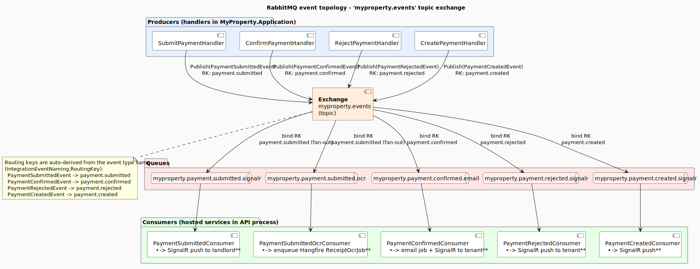

# RabbitMQ event topology

Single **topic exchange** (`myproperty.events`), four event types, five queues, five consumers. Routing keys are derived from the C# event type name (`IntegrationEventNaming.RoutingKey`) — change the class name, the binding follows automatically.

> **Source:** [`diagrams/events.puml`](./diagrams/events.puml). Authoritative consumer code: [`backend/MyProperty.Infrastructure/Messaging/Consumers/`](../../backend/MyProperty.Infrastructure/Messaging/Consumers/).

## Events, queues, consumers

| Event | Published by | Routing key | Queue | Consumer | Side effects |
|---|---|---|---|---|---|
| `PaymentSubmittedEvent` | `SubmitPaymentHandler` | `payment.submitted` | `myproperty.payment.submitted.signalr` | `PaymentSubmittedConsumer` | SignalR push to landlord |
| `PaymentSubmittedEvent` | (same publish; fan-out via second binding) | `payment.submitted` | `myproperty.payment.submitted.ocr` | `PaymentSubmittedOcrConsumer` | Enqueue Hangfire `ReceiptOcrJob` |
| `PaymentConfirmedEvent` | `ConfirmPaymentHandler` | `payment.confirmed` | `myproperty.payment.confirmed.email` | `PaymentConfirmedConsumer` | Email Hangfire job + SignalR push to tenant |
| `PaymentRejectedEvent` | `RejectPaymentHandler` | `payment.rejected` | `myproperty.payment.rejected.signalr` | `PaymentRejectedConsumer` | Email Hangfire job + SignalR push to tenant |
| `PaymentCreatedEvent` | `CreatePaymentHandler` | `payment.created` | `myproperty.payment.created.signalr` | `PaymentCreatedConsumer` | SignalR push |

**Two queues bound to one routing key** is the fan-out pattern for `payment.submitted`: a single publish dispatches to *both* the SignalR push and the OCR job, with independent ack semantics. If the OCR consumer is down, the SignalR push still happens; when OCR comes back up, RabbitMQ replays the queued messages.

## Conventions

- **Topic exchange** (`myproperty.events`) chosen over direct/fanout because routing keys carry domain semantics (`{aggregate}.{verb}`). Future cross-aggregate fan-outs can be added without changing existing bindings.
- **Routing key derivation:** `IntegrationEventNaming.RoutingKey(typeof(T))` strips the `Event` suffix and converts `PascalCase` to `dot.kebab.case`. `PaymentConfirmedEvent` → `payment.confirmed`.
- **Queue naming:** `myproperty.{aggregate}.{verb}.{purpose}` — `purpose` captures the side effect (`.email`, `.signalr`, `.ocr`) so a glance at the queue list reads as a TO-DO list of what fires when.
- **Consumers are infrastructure-only.** They translate events into Hangfire enqueues + `INotificationDispatcher` calls. **No business logic.** If a consumer needs to make a decision, it's a smell — re-publish a new event or push a command back through the API.
- **Idempotency.** Consumers ack only after the side effect succeeds (Hangfire enqueue or SignalR push). At-least-once delivery means consumers must tolerate duplicates — currently this is achieved because both side effects are themselves idempotent (Hangfire dedupes via job ID; SignalR pushes are pure signals → invalidate cache).
- **Publish-after-commit.** Handlers publish *after* `SaveChangesAsync` returns. The race window (commit succeeds, publish fails) is acceptable here — the outbox pattern is a follow-up if exactly-once semantics ever become a requirement.

## Library choice — `RabbitMQ.Client` (no MassTransit)

Directly using `RabbitMQ.Client 7` keeps the consumer surface minimal: 5 hosted services that each subclass a single `IntegrationEventConsumerBase` (queue declare → bind → consume → ack). MassTransit's sagas, scheduling, and middleware pipeline would dwarf the event volume here.

See [ADR-0002](./adr/0002-rabbitmq-over-kafka.md) for the broader RabbitMQ-vs-Kafka decision.

## What's *not* yet wired

Per [`backend/CLAUDE.md`](../../backend/CLAUDE.md) → Post-M3 follow-ups:

- **`InviteAccepted` / `InviteRejected` events.** Invite acceptance and rejection are handled synchronously by the API today; no event is published, so no SignalR push to landlords happens on accept/reject. Planned for M3.8 / M3.6 follow-up.
- **`LeaseExpiringSoon` events + recurring scan.** Neither is wired yet. The query `GetLeasesExpiringSoonQuery` returns the candidate leases on demand (landlord endpoint); a Hangfire recurring scan that would push `LeaseExpiringSoonEvent` to a SignalR group is documented as a follow-up. (Two *other* recurring scans **are** now scheduled — `MarkExpiredInvitesJob` hourly and `OrphanCleanupJob` daily 03:00 UTC — but they mutate invite state directly and publish **no** integration event, so they don't appear in the topology above; see [`components.md`](./components.md) → Infrastructure.)
- **No dead-letter exchange topology** for failed event handling. Consumer-side failures rely on Hangfire's `FailedEmails` DLQ for email jobs; OCR failures rely on Hangfire's job-retry policy. A queue-level DLX is a follow-up if non-job side effects start to need replay.
