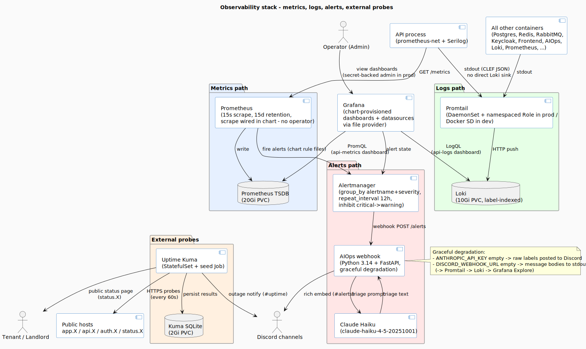

# Observability stack

Four independent paths share a Grafana UI: **metrics** (Prometheus), **logs** (Loki + Promtail), **alerts** (Alertmanager → AIOps webhook → Discord), and **external probes** (Uptime Kuma → public status page + notifications).

> **Prod runs namespace-scoped** (namespace `project-02` on a shared Hetzner cluster, [ADR-0009](./adr/0009-hetzner-project-02-over-doks.md)): the `kube-prometheus-stack` dependency was dropped and the whole stack is plain in-namespace manifests — **no Prometheus Operator, no `ServiceMonitor`/`PrometheusRule` CRDs, no cluster-wide RBAC** — because the service account is namespace-admin only.



> **Source:** [`diagrams/observability.puml`](./diagrams/observability.puml).

## Metrics path

| Step | Component | Detail |
|---|---|---|
| Emit | API process | `prometheus-net.AspNetCore` exposes `/metrics` (HTTP request duration, count, in-flight; .NET runtime counters; custom counters per domain) |
| Scrape | Prometheus | Every **15 s** (`scrape_interval`); scrape config is wired **directly in the chart** in both dev and prod — no Prometheus Operator / `ServiceMonitor` CRDs |
| Store | Prometheus TSDB | **20 Gi** PVC, **15 d** retention (`longhorn` `ReadWriteOnce` in prod) |
| Visualise | Grafana | Provisioned `api-metrics` dashboard (`grafana-dashboard-api-metrics-configmap`) — request latency, error rate, throughput, GC, working-set |

## Logs path

One uniform ingestion path: every container writes structured logs to stdout, and Promtail ships all of it to Loki.

| Source | How logs reach Loki |
|---|---|
| **API process** | Writes CLEF JSON to stdout via Serilog's console sink (`WriteTo.Console(new CompactJsonFormatter())`), enriched with `CorrelationId`, scopes, and exception chains. It **deliberately does NOT push to Loki directly** — no `Serilog.Sinks.Grafana.Loki`, no `LokiUrl`. Promtail tails its stdout exactly like every other container. |
| **All other containers** (Postgres, Redis, RabbitMQ, Keycloak, Frontend, AIOps webhook, Loki, Prometheus, …) | Promtail reads container stdout, ships to Loki |

A single ingestion path, uniform across every service, means Promtail is the one shipper and crash output is still captured. Promtail discovery differs by environment:

- **Dev:** Docker SD via `/var/run/docker.sock` (Docker socket SD). The compose service / project labels become Loki labels.
- **Prod:** Kubernetes DaemonSet with a ServiceAccount + **namespaced `Role`** (read `pods` **within `project-02` only** — no cluster-wide log access). One pod per node, tailing the namespace's pod logs.

Loki itself: **10 Gi** PVC, label-indexed (no full-text indexing → much lower resource footprint than Elasticsearch). See [ADR-0007](./adr/0007-loki-over-elk.md).

Grafana's `api-logs` dashboard (`grafana-dashboard-api-logs-configmap`) hits Loki via LogQL.

## Alerts path

Prometheus evaluates alert rules from chart-rendered rule files — **no `PrometheusRule` CRDs** (prod) — or `alerts/*.yml` (dev). Firing alerts → Alertmanager.

Alertmanager config (from `values.yaml`):

```yaml
route:
  receiver: 'aiops-webhook'
  group_by: ['alertname', 'severity']
  group_wait: 30s
  group_interval: 5m
  repeat_interval: 12h
  routes:
    - matchers: [severity = critical]   # explicit critical sub-route (same receiver)
      receiver: 'aiops-webhook'
inhibit_rules:
  - source_matchers: [severity = critical]
    target_matchers: [severity = warning]
    equal: ['alertname', 'service']
```

→ Routes everything to `aiops-webhook.project-02.svc.cluster.local:5001/alerts` with a 12 h repeat interval. Critical alerts inhibit warning alerts on the same `alertname` + `service`.

### AIOps webhook

The Python FastAPI service receives the Alertmanager POST, sends each firing alert to **Claude Haiku** for triage, and posts the result to a **Discord** channel (`#alerts`) as a rich embed. Resolved alerts skip the LLM and post a short resolution.

**Graceful degradation:**

| Env var missing | Behaviour |
|---|---|
| `ANTHROPIC_API_KEY` | Triage disabled; raw labels/annotations posted to Discord with a `"Triage disabled"` header |
| `DISCORD_WEBHOOK_URL` | Message bodies logged to stdout → Promtail → Loki → visible in Grafana Explore |
| both | Stdout-only with no Discord output (recoverable to logs) |

This deliberate fallback path is what made wiring "Webhook → LLM → Discord" deliverable without coupling to either provider — the demo works against a synthetic alert with a `curl`. (The notification target moved from Slack to Discord in M5; `main.py` now emits native Discord embeds via `httpx`.)

## External probes (Uptime Kuma)

Self-hosted lightweight uptime monitor with a public status page.

| Aspect | Detail |
|---|---|
| Probes | **15** internal service probes over http(s) (`frontend`, backend health endpoints (live/ready/diagnostics), `keycloak`, `postgres`, `redis`, `rabbitmq`, `loki`, `prometheus`, `alertmanager`, `aiops-webhook`, `grafana`, `unleash`, `mailpit`); 60 s default interval. Most are HTTP GET, but two — `postgres` and `redis` — are non-HTTP probe types (Postgres `SELECT 1` and a Redis PING) |
| Storage | SQLite on a **2 Gi** PVC (`uptime_kuma_data`) |
| UI | Internal admin UI (port 3001) + **public status page** at `status.X` (separate Ingress) |
| Notifications | One Discord channel (`#uptime` — a **separate** channel from AIOps's `#alerts`) + one email channel (configurable SMTP — defaults to dev placeholders) |
| Seeding | First-run Helm `Job` (`uptime-kuma-seed-job`) creates the admin user + monitors + notification channels + status page via Kuma's socket.io API |

## Grafana

| Surface | Provisioning |
|---|---|
| Datasources | Chart-provisioned ConfigMaps for Loki + Prometheus + Alertmanager (no `kube-prometheus-stack` — that dependency was dropped, [ADR-0009](./adr/0009-hetzner-project-02-over-doks.md)) |
| Dashboards | 9 dashboards: API metrics + API logs, plus per-component **log dashboards** (Postgres, Redis, RabbitMQ, Keycloak, Frontend, Mailpit) and a logs-overview (M5.4, #132). Bundled into a single ConfigMap that globs `files/dashboard-*.json`, mounted as a directory into Grafana and loaded by its file-based dashboard provider — no `grafana_dashboard` label |
| Auth | **Dev:** anonymous Admin (compose-only convenience). **Prod:** admin credentials from the `myproperty-grafana` Secret. |
| Persistence | 2 Gi PVC for state |

## Why this stack vs ELK

- **Loki + Promtail** uses label-based indexing rather than full-text. Lower CPU + memory footprint than Elasticsearch's JVM — important at MVP scale where the cluster is intentionally cost-bounded. The trade-off is that ad-hoc text search is slower; for *labelled* queries (`{container="myproperty-api"} | json | level="Error"`) the experience is comparable. See [ADR-0007](./adr/0007-loki-over-elk.md).
- **Grafana over Kibana** because we already need Grafana for Prometheus dashboards — one UI for both metrics and logs is a real win for triage.

## What this stack does *not* do

- **No distributed tracing** (Jaeger / Tempo). `CorrelationId` propagation is in place (Serilog middleware + Hangfire job arg), so traces can be reconstructed from logs in Grafana Explore — but there's no span-aware UI. Tempo is a sensible M6+ addition.
- **No long-term retention** of metrics beyond 15 days, or logs beyond Loki's default chunk lifetime. Retention shifts to object storage when data volume justifies it.
- **No SLO tooling** (Sloth, OpenSLO). Alert rules are absolute thresholds. SLOs are a deliberate post-M5 layer.
