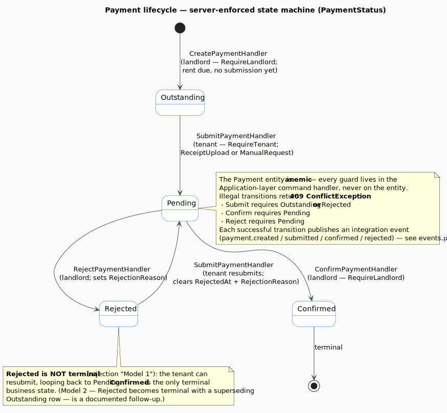
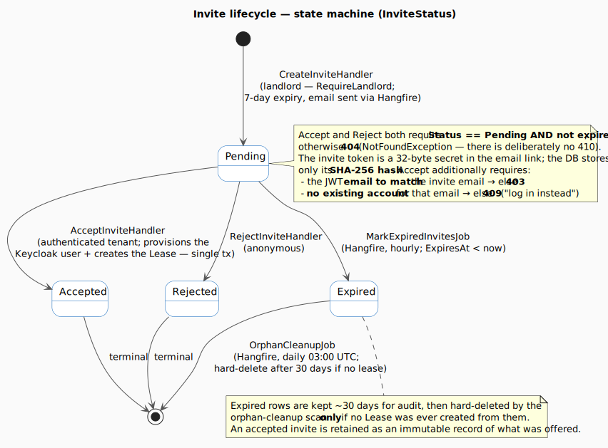

# Process Flows — every runtime & build-time flow in MyProperty

This document enumerates **every distinct flow of information** in the MyProperty platform — what
triggers it, the exact path the data takes, the guarantees and failure modes, and where the code
lives. It is the *behavioural* companion to the static views:

| If you want… | Read |
|---|---|
| What runs, where, and why (static structure) | [`containers.md`](./containers.md), [`components.md`](./components.md), [`deployment-prod.md`](./deployment-prod.md) |
| Three canonical sequences as rendered diagrams | [`data-flow.md`](./data-flow.md) |
| The event broker topology | [`events.md`](./events.md) |
| The observability stack | [`observability.md`](./observability.md) |
| The CI/CD pipeline | [`cicd.md`](./cicd.md) |
| **Every flow, end-to-end, with code-level detail** | **this document** |

> **Verified against source on 2026-06-09.** Where the running code disagrees with an older
> architecture doc, this document follows the **code** and flags the difference in
> [Appendix A](#appendix-a--reality-vs-the-older-docs). The "not-yet-wired" items are collected in
> [Appendix B](#appendix-b--documented-but-not-yet-wired).

---

## How to read this document

There are **28 flows**, grouped into five categories by *what sets them in motion*:

| Category | Flows | Driven by |
|---|---|---|
| **A. User-facing (synchronous)** | 1–7 | A human action; someone is waiting for a response |
| **B. Event-driven (async backbone)** | 8–12 | A domain event published to RabbitMQ |
| **C. Scheduled / background workers** | 13–16 | A timer or recurring schedule |
| **D. Observability & runtime control** | 17–20 | Continuous; the system watching itself |
| **E. CI/CD & infrastructure** | 21–28 | A git push, a deploy, or a certificate clock |

Every flow entry uses the same shape: **what it is** (plain English) → **trigger** → **step-by-step**
→ a small **ASCII diagram** where it helps → **guarantees / failure modes** → **where it lives** in
the code.

Before the flows, read [the building blocks](#the-building-blocks) once — they are the recurring
machinery (the middleware pipeline, RabbitMQ, Hangfire, SignalR, Keycloak, Unleash). Defining them
up front keeps each flow readable.

---

## The building blocks

These nine concepts appear over and over. Understand them once and every flow below reads cleanly.

### 1. The Edge (ingress)

The Edge is the single entry point for all external traffic. In development it is an **Nginx**
reverse proxy; in production it is **ingress-nginx**, which runs as a hostNetwork DaemonSet on the
Hetzner cluster, meaning it binds directly to the node's network interface on ports 80 and 443. No
other service exposes itself to the public internet — the frontend pod, the API pod, Keycloak: none
of them have public-facing addresses.

When a browser opens an HTTPS connection, ingress-nginx is the component that **terminates TLS**. It
unwraps the encrypted session using the Let's Encrypt certificate stored in a Kubernetes Secret. The
connection from the browser to the Edge is encrypted; the connection from the Edge to the backend
service pods travels over plain HTTP inside the cluster network.

Once it decrypts the request, ingress-nginx reads the `Host:` header and **routes by subdomain** to
the matching service, using five Ingress rules:

```
app.myproperty.works     → frontend-service:3000   (Next.js)
api.myproperty.works     → backend-service:8080     (.NET API)
auth.myproperty.works    → keycloak-service:8080    (Keycloak)
grafana.myproperty.works → grafana:3000
status.myproperty.works  → uptime-kuma-service:3001
```

The routing decision is based solely on the hostname. The Edge never inspects JWTs, cookies, or
request bodies.

### 2. Clean Architecture — ports & adapters

The backend is a single .NET process built from four projects that follow a strict one-way dependency
rule:

```
Api ──► Application ──► Domain
 │                       ▲
 └─► Infrastructure ─────┘
```

- **Domain** holds the pure C# entities and the few entity-level state methods that exist (for
  example, `Lease.Terminate()`). Most entities — including `Payment` — are anemic, so their
  status-transition guards live in the Application-layer command handlers rather than on the
  entities. Domain depends on nothing else in the solution.
- **Application** holds the use-case handlers (CQRS commands and queries), DTOs, FluentValidation
  validators, and **interfaces** called *ports*: `IPaymentRepository`, `INotificationDispatcher`,
  `IEmailSender`, `IReceiptOcrService`, `IFileStorage`, `IBackgroundJobQueue`,
  `ICurrentUserContext`, `IFeatureFlags`. These interfaces declare *what* the application needs
  without specifying *how* it is provided.
- **Infrastructure** holds the **adapters** that implement those ports using real technology:
  `PaymentRepository` uses EF Core to query Postgres; `MailKitEmailSender` uses MailKit to deliver
  email; `AnthropicReceiptOcrService` calls the Anthropic API; `LocalFileStorage` writes files to a
  Kubernetes PVC; `UnleashFeatureFlags` polls Unleash; the RabbitMQ publisher and consumers handle
  messaging.
- **Api** holds the controllers, the SignalR hub, `Program.cs` (the composition root that wires
  everything together), and the middleware.

The payoff is that a handler in Application never knows which adapter is wired in. Tests substitute
real adapters with fakes — for example, `RecordingBackgroundJobQueue` replaces
`HangfireBackgroundJobQueue` in the integration test fixture so tests can assert which jobs were
enqueued without actually running Hangfire.

### 3. The middleware pipeline (the order is deliberate)

Every HTTP request that arrives at the API process runs through a fixed sequence of middleware
components before it reaches a controller. `Program.cs` registers them in this exact order, and the
order is load-bearing:

```
UseExceptionHandler            → catches unhandled exceptions → RFC-7807 ProblemDetails
UseStatusCodePages
CorrelationIdMiddleware        → assigns/reads X-Correlation-ID; every log line carries it
UseSerilogRequestLogging       → logs the request (Verbose for /metrics + /health to avoid spam)
UseForwardedHeaders            → trusts X-Forwarded-Proto/For from the ingress
UseHttpsRedirection            → (skipped in Development)
UseHttpMetrics                 → records Prometheus HTTP metrics (code, method, controller, action)
UseCors("MyPropertyDefault")   → strict origin allowlist (AllowCredentials → no wildcard)
UseAuthentication              → validates the JWT against Keycloak's JWKS
UseRateLimiter                 → 429 if over budget
UseAuthorization               → role/policy gate (default-deny fallback policy)
→ controller
```

The ordering matters for specific reasons: `CorrelationIdMiddleware` runs before
`UseSerilogRequestLogging` so that every log line emitted during the request already carries the
correlation ID. `UseForwardedHeaders` runs before anything that reads the client's IP address or
scheme, so the real client IP — not the ingress pod's cluster IP — is used for rate limiting.
`UseCors` runs before `UseAuthentication` so that preflight `OPTIONS` requests, which browsers send
without an `Authorization` header, receive the correct CORS headers instead of a 401.
`UseAuthentication` runs before `UseRateLimiter` so that the rate limiter can key on the
authenticated user identity (`sub` claim) rather than IP alone.

### 4. CQRS handlers (no MediatR)

Each use case is modelled as either a **command** (a write that changes state) or a **query** (a
read that returns data), each with its own dedicated handler class. Controllers invoke handlers
directly — there is no mediator object sitting between them. This means a controller imports its
handler, calls it, translates the result into an HTTP response, and returns. The handler owns all
business logic; the controller only translates HTTP into the command or query shape.

FluentValidation runs as a pipeline filter that executes before the handler receives control. When
validation fails, the filter short-circuits and returns `400 ValidationProblemDetails`, and the
handler never executes.

### 5. RabbitMQ — one topic exchange, fan-out by routing key

The backend uses a single **topic exchange** named `myproperty.events`. When a handler needs to
trigger asynchronous side effects, it publishes an integration event to this exchange *after* the
database transaction commits. The routing key is derived automatically from the event's class name
by stripping the `Event` suffix and converting from PascalCase to dot-separated lowercase:
`PaymentConfirmedEvent` becomes `payment.confirmed`.

**Consumers** are hosted services running inside the same API process. Each consumer declares its
own queue, binds that queue to the exchange with a routing-key pattern, and receives an independent
copy of every message whose routing key matches. When two queues are bound to the same routing key
— as happens with `payment.submitted` — RabbitMQ delivers the message to both queues
independently. Each consumer acknowledges only after its side effect is durably committed. Delivery
is **at-least-once**, so consumers must be idempotent.

### 6. Hangfire — durable background jobs

Hangfire provides retryable background work that survives process restarts. When a piece of work is
enqueued, Hangfire immediately writes a job record to the **Hangfire schema inside Postgres**. Even
if the API process restarts before the job executes, the job is not lost — when the process comes
back, Hangfire reads pending jobs from Postgres and resumes them.

The Hangfire job server runs inside the same API process as the handlers and consumers. Handlers and
consumers never reference Hangfire directly; they call the `IBackgroundJobQueue` port, which
`HangfireBackgroundJobQueue` implements. The ad-hoc jobs are `SendEmailJob` (triggered per email)
and `ReceiptOcrJob` (triggered per receipt submission). The recurring scans are
`MarkExpiredInvitesJob` (hourly) and `OrphanCleanupJob` (daily). Failed jobs are retried with
exponential backoff up to five times. The Hangfire dashboard at `/hangfire` is accessible only to
users who hold the `Admin` realm role, enforced by `AdminOnlyDashboardFilter`.

### 7. SignalR + Redis backplane — server→browser push

The API hosts a `NotificationsHub` at `/hubs/notifications`. This hub is **server-push only** — the
server sends messages to clients; clients do not invoke hub methods to trigger business logic.

When a client connects, the server reads the JWT from the `?access_token=` query parameter. This
query-parameter exception exists only for `/hubs/*` paths because the WebSocket upgrade handshake
cannot carry an `Authorization` header. The server then assigns the connection to a group keyed by
the user's identity — `tenant:{userId}` or `landlord:{userId}` — so notifications can target a
specific user without tracking individual connection IDs.

Because the API may run as multiple replicas, a **Redis backplane** is wired in with the channel
prefix `myproperty.signalr`. When any replica invokes `SendAsync` on a group, it publishes to
Redis. Every replica subscribes to that channel, receives the message, and delivers it to any
WebSocket connections it holds for that group. This means a user's notification reaches them
regardless of which replica their browser happens to be connected to.

⚠️ The browser-side client (`@microsoft/signalr`) is **not wired yet** — the entire server path
works, but until the frontend connects, users see updates only through TanStack Query refetches.

### 8. Keycloak — the identity provider

Keycloak is the self-hosted OIDC/OAuth2 server. The realm is `MyProperty`. The public client
`myproperty-frontend` handles the browser-side authorization code flow with PKCE S256. The
bearer-only client `myproperty-api` exists purely as an **audience** target — it is referenced in
the `aud` claim of every access token issued for this API.

The API validates every incoming JWT locally: it fetches Keycloak's **JWKS** (the public signing
keys) at startup, caches them, and verifies the JWT signature on every request. The API never makes
a per-request call to Keycloak. Validation rules enforced in `Program.cs`: `iss` must match the
browser-facing Keycloak authority URL; `aud` must contain `myproperty-api`; roles are extracted
from `realm_access.roles` and mapped to ASP.NET Core role claims by `KeycloakRolesTransformer`.
`DefaultInboundClaimTypeMap.Clear()` ensures JWT claim names are read as-is, in their short
original form, rather than being remapped to Microsoft's longer URN-style names.

### 9. Unleash — the runtime kill-switch

Unleash is the self-hosted feature-flag server. The backend's Unleash SDK starts a background
thread at application startup that polls the Unleash server on a fixed interval and stores the
current flag states **in memory**. When application code calls
`IFeatureFlags.IsEnabledAsync(flagName, defaultValue)`, the call reads the in-memory snapshot — no
network I/O occurs on the request path.

The `IFeatureFlags` port hides whether the real `UnleashFeatureFlags` adapter or the no-op
`NullFeatureFlags` fallback is wired. `NullFeatureFlags` is used when no Unleash token is
configured; it always returns the supplied default. If a flag name is unknown or the Unleash server
has never responded, the supplied default is returned. The first flag is
`payments.ocr-autoextract`, which defaults to **on** and is **fail-open** — an unreachable Unleash
server does not prevent OCR from running.

---

## Master map

| # | Flow | Category | Trigger | Chains into |
|---|---|---|---|---|
| 1 | Landlord self-registration | A | User submits signup | — (then Login) |
| 2 | Login (OIDC + PKCE) | A | User clicks sign-in | — |
| 3 | Logout (end-session) | A | User clicks sign out | — |
| 4 | Synchronous REST request | A | Any page/data action | — |
| 5 | Payment confirmation (write + event) | A | Landlord confirms | 8, 10 |
| 6 | Receipt submission + OCR | A | Tenant uploads receipt | 9, 10 |
| 7 | Tenant invite (create/preview/accept/reject) | A | Landlord invites; tenant responds | 8 |
| 8 | Email delivery (Hangfire) | B | A consumer enqueues email | — |
| 9 | Receipt OCR pipeline | B | `payment.submitted` (OCR queue) | — |
| 10 | Real-time notification (SignalR) | B | A consumer pushes | — |
| 11 | RabbitMQ event fan-out (the pattern) | B | Any event publish | 8, 9, 10 |
| 12 | n8n tenant-inquiry triage | B | HTTP webhook | — |
| 13 | Mark expired invites | C | Hangfire cron — hourly | — |
| 14 | Orphan cleanup | C | Hangfire cron — daily 03:00 UTC | — |
| 15 | North Star Metric worker | C | `BackgroundService` — every 60s | feeds 17 |
| 16 | Feature-flag polling | C | Unleash SDK background poll | gates 9 |
| 17 | Metrics → alert → AI triage → Discord | D | Continuous (15s scrape) | — |
| 18 | Log aggregation | D | Continuous (stdout) | — |
| 19 | Uptime monitoring | D | Continuous (60s probes) | — |
| 20 | Health probes (live/ready/diagnostics) | D | K8s + CD gate | gates 26 |
| 21 | Backend CI | E | Push to `backend/**` | 26 |
| 22 | Frontend CI | E | Push to `frontend/**` | 26 |
| 23 | AIOps webhook CI | E | Push to `infrastructure/aiops-webhook/**` | 26 |
| 24 | Uptime-Kuma-init CI | E | Push to `infrastructure/uptime-kuma/**` | 26 |
| 25 | Realm-import smoke test | E | Push to `infrastructure/keycloak/**` | — (no image) |
| 26 | CD pipeline (deploy) | E | Image-CI success on `develop`/`main` | 27, 28 |
| 27 | EF Core migrations | E | Every `helm upgrade` (pre-hook) | — |
| 28 | TLS certificate renewal | E | cert-manager near expiry | — |

**How the flows chain** (the dependency graph — flows aren't isolated):

```
   git push ──► CI (21–25) ──► CD (26) ──► migrations (27) ──► pods roll
                                  │
                                  └─► cert renewal (28, ongoing)

   user action ──► REST (4) ──► DB commit ──► publish event ──► RabbitMQ (11)
        │                                                          ├─► email job (8)
   confirm (5) ─┘                                                  ├─► OCR job (9) ◄─ flag (16)
   submit (6) ──────────────────────────────────────────────────► └─► SignalR push (10)

   API /metrics ──► Prometheus ──► Alertmanager ──► AIOps ──► Claude ──► Discord (17)
   every stdout  ──► Promtail ──► Loki ──► Grafana (18)
   external URLs ◄── Uptime Kuma probes ──► Discord + status page (19)
```

---

# Category A — User-facing flows (synchronous)

These are triggered by a human and return a response the user waits for.

---

## Flow 1 — Landlord self-registration (signup)

**What it is.** A new landlord creates an account with email and password. Landlords are the only
user type that self-register — tenants can only enter the system through a landlord-issued invite
(Flow 7). The registration must produce a Keycloak account with the `Landlord` realm role already
attached, because a browser cannot be trusted to grant itself a role. The backend performs this
server-side on the user's behalf.

**Trigger.** The user fills in the signup form and clicks "Register."

**Step-by-step.**

1. The browser sends a `POST` request to `/api/v1/auth/register`, carrying the user's email, display
   name, and password in the JSON body. The request travels through the public internet to the Edge,
   which terminates TLS and forwards the decrypted request to the API service.

2. The request runs the full middleware pipeline (building block 3). Because registration is a public
   endpoint with no `[Authorize]` attribute, the authentication middleware reads but does not require
   a JWT. The request reaches `AuthController`.

3. The controller deserialises the request body into a `RegisterLandlordCommand` and passes it
   directly to `RegisterLandlordHandler.HandleAsync()`.

4. FluentValidation fires as a pipeline filter before the handler executes. It verifies that the
   email is syntactically valid, the password meets minimum complexity requirements, and all required
   fields are present. If any check fails, the filter short-circuits and returns
   `400 ValidationProblemDetails` — the handler never runs.

5. `RegisterLandlordHandler` calls `IUserAccountProvisioner.CreateAsync()`. The port
   `IUserAccountProvisioner` is implemented in the Infrastructure layer by `KeycloakAdminClient`.

6. Before `KeycloakAdminClient` can talk to the Keycloak Admin REST API, it needs a service-account
   access token. It calls `IKeycloakAdminTokenCache.GetTokenAsync()`. The cache checks whether it
   holds a non-expired token for the `myproperty-api` service account; if the token is missing or
   expired, it requests a new one from Keycloak via the `client_credentials` OAuth 2.0 grant and
   stores it. This service account holds Admin-level privileges — creating users and assigning roles
   — that a regular user token does not carry.

7. Armed with that token, `KeycloakAdminClient` sends a `POST` to Keycloak's
   `/admin/realms/MyProperty/users` endpoint, creating the user account with the supplied email and
   password. Keycloak responds with the new user's ID.

8. `KeycloakAdminClient` sends a second request to
   `/admin/realms/MyProperty/users/{id}/role-mappings/realm`, assigning the `Landlord` realm role to
   the account. From this moment forward, every access token Keycloak issues for this user will carry
   `"Landlord"` inside the `realm_access.roles` claim.

9. The handler does **not** write to Postgres, and there is no `Landlord` entity — the role lives in
   Keycloak. `CreateAsync` returns `{ keycloakUserId, loginUrl }`; the application `User` row is
   created **lazily** on the user's first authenticated request (`GET /api/v1/me` →
   `GetOrSyncUserAsync`), not here.

10. The handler returns, the controller responds with `201 Created`, and the user can now log in
    (Flow 2).

```
Browser ─POST /auth/register─► Edge ─► [middleware] ─► AuthController ─► RegisterLandlordHandler
                                                                              │ (client-credentials token, cached)
                                                                              ├─► Keycloak Admin REST: POST /users
                                                                              ├─► Keycloak Admin REST: POST /role-mappings (Landlord)
                                                                              └─► (no DB write — User row is lazily created on first /me)
                                                                  201 { keycloakUserId, loginUrl } ◄──┘
```

**Guarantees / caveats.**
- Tenants have **no** public registration endpoint — by design. The only path into the system for a
  tenant is through the invite flow (Flow 7).
- **Residual gap:** A user who authenticates through Google for the first time bypasses this handler
  entirely. Keycloak creates their account via social-login brokering, but no `Landlord` entity is
  written to Postgres and no `Landlord` realm role is assigned, leaving the user without portal
  access. Google/IdP first-login provisioning is not yet wired. (Tracked in
  `deployment-roadmap.md`.)

**Where it lives.** `MyProperty.Application/Auth/Commands/RegisterLandlord/`,
`MyProperty.Infrastructure/Keycloak/KeycloakAdminClient.cs`.

---

## Flow 2 — Login (OIDC Authorization Code + PKCE)

**What it is.** The browser proves who the user is by redirecting through Keycloak's hosted login
page and returning with a signed access token. The access token never touches a cookie or
localStorage — keycloak-js holds it in JavaScript memory, where it cannot be read by other origins.

**Trigger.** The user clicks "Continue to sign-in."

**Step-by-step.**

1. The click handler invokes `login()` from `frontend/lib/auth/keycloak.ts`. Before initiating any
   redirect, `login()` first awaits `initKeycloak()`. `initKeycloak()` is idempotent — if the
   keycloak-js library instance is already initialised it returns immediately; if not, it calls
   `kc.init()` to prepare the OIDC client. This guard is necessary because calling `kc.login()` on
   an uninitialised instance throws. Once `initKeycloak()` resolves, `login()` calls
   `kc.login({ redirectUri: \`${origin}/login\` })`.

2. keycloak-js generates a random PKCE code verifier, hashes it with SHA-256 to produce a code
   challenge, embeds both the code challenge and a `state` nonce in an authorisation request URL, and
   redirects the browser to
   `auth.myproperty.works/realms/MyProperty/protocol/openid-connect/auth`. The browser leaves the
   frontend application and lands on Keycloak's hosted login page. keycloak-js stores the code
   verifier in the browser's session storage so it can retrieve it after the redirect completes.

3. The user enters credentials (email + password) or clicks "Continue with Google." Keycloak
   authenticates the user. On success, Keycloak generates a short-lived authorisation code and
   redirects the browser back to the redirect URI that was embedded in step 2 — specifically,
   `${origin}/login#state=…&code=…`. The authorisation code appears in the URL fragment.

4. The browser navigates to `/login`. The page component mounts and calls `initKeycloak()` again
   (idempotent — the second call returns immediately because the instance is already ready).
   keycloak-js detects the `code` and `state` values in the URL fragment, retrieves the code
   verifier from session storage, and sends a `POST` to Keycloak's token endpoint
   (`/realms/MyProperty/protocol/openid-connect/token`), exchanging the authorisation code and code
   verifier for an access token and a refresh token.

5. Keycloak's token endpoint validates the authorisation code, verifies the PKCE code challenge
   matches the stored verifier, and issues a signed JWT access token. keycloak-js receives the
   token, validates its signature against Keycloak's cached public keys, and confirms it is not
   expired.

6. keycloak-js invokes `setAuth(payload)`, passing the decoded token payload. `setAuth()` writes the
   user's `sub`, email, display name, and `realm_access.roles` array into the Zustand auth store
   (`useAuthStore`). From this point, every React component in the application reads the user's
   identity from the store.

7. The `/login` page calls `setAuthCookie()`, which writes the **sentinel cookie** `kc_token` with
   the value `"kc.authenticated"` and a `Max-Age` aligned to the access token's expiry. This cookie
   is **not** the JWT — it is purely a marker that a session exists. The Next.js Edge middleware
   checks only for the cookie's *presence* when deciding whether to redirect an unauthenticated
   visitor to `/login`. The real security enforcement lives in the API's JWT validation (building
   block 8).

8. The `/login` page reads the role from the Zustand store and routes the user: `Landlord` →
   `/dashboard`; `Tenant` → `/tenant/dashboard`; `Admin` → `/admin/dashboard` (the platform-wide
   stakeholder analytics portal).

9. On the destination page, the `KeycloakInit` client component mounts. It calls the already-cached
   `initKeycloak()` (returns immediately), confirms the session is still valid, and renders the
   page's children. If the session is invalid — for example, the user manipulated a cookie —
   `KeycloakInit` redirects back to `/login`.

**The three gating layers:**

```
1. Edge middleware (proxy.ts)  → coarse + fast. Presence of kc_token cookie only. Missing → 307 /login.
2. KeycloakInit (client)       → authoritative client-side gate. Awaits init; no session → redirect /login.
3. API JWT validation          → the REAL security boundary. Validates signature on EVERY request.
```

The cookie and the `KeycloakInit` check are UX conveniences that prevent unauthenticated users from
seeing a flash of protected UI before being redirected. They are not security boundaries. A forged
or stale sentinel cookie cannot grant access to data because layer 3 — the API's JWT signature
validation — still rejects any request that lacks a valid, non-expired, correctly-signed access
token.

**Token refresh.** keycloak-js registers an `onTokenExpired` callback. When the access token is
about to expire, keycloak-js calls `kc.updateToken()`, which exchanges the refresh token for a new
access token. On success, it calls `setAuthCookie()` again, extending the sentinel cookie's
`Max-Age`. The refresh happens silently without user interaction, so long as the refresh token has
not itself expired.

**Where it lives.** `frontend/lib/auth/keycloak.ts`, `frontend/proxy.ts`,
`frontend/app/(auth)/login/page.tsx`, the two `KeycloakInit.tsx` components,
`frontend/lib/store/auth/useAuthStore.ts`. Backend validation: `Program.cs` (`AddJwtBearer`) +
`KeycloakRolesTransformer`. Full reference: [`../operations/auth-flow.md`](../operations/auth-flow.md).

---

## Flow 3 — Logout (end-session)

**What it is.** Properly ending the session requires terminating it at Keycloak, not just clearing
local browser state. If only local state were cleared, Keycloak would still hold an active SSO
session — the next visit to the login page would silently re-authenticate the user without prompting
for credentials.

**Trigger.** The user clicks "Sign out."

**Step-by-step.**

1. The click handler invokes `signOut()` from `useAuth.ts`. `signOut()` calls `logout()` from
   `frontend/lib/auth/keycloak.ts`, passing `` `${origin}/logout` `` as the post-logout redirect
   URI. `logout()` immediately clears the Zustand auth store — setting the user identity to `null`
   so every React component that reads from the store stops rendering user-specific content — and
   removes the `kc_token` sentinel cookie from the browser. At this point, the Next.js Edge
   middleware will no longer find the cookie and will redirect any subsequent navigation attempt to
   `/login`.

2. `logout()` calls `kc.logout()` on the keycloak-js instance. keycloak-js constructs a request to
   Keycloak's **end-session endpoint**
   (`/realms/MyProperty/protocol/openid-connect/logout`), embedding the ID token as a hint and the
   post-logout redirect URI as the return destination, then redirects the browser to that URL.

3. Keycloak receives the end-session request, invalidates the server-side SSO session (the
   `KEYCLOAK_IDENTITY` cookie stored at `auth.myproperty.works`), and redirects the browser to the
   specified post-logout redirect URI — `/logout`. This redirect is permitted because the
   `myproperty-frontend` client's `post_logout_redirect_uris: "+"` setting inherits the
   `app.myproperty.works/*` allowed-redirect pattern.

4. The browser arrives at `/logout`, a simple confirmation page. The user is now fully signed out:
   the Keycloak SSO session is gone, the Zustand auth store is cleared, and the sentinel cookie is
   absent.

**Caveat.** The end-session endpoint terminates the *Keycloak* session, not the *Google* session. A
user who originally authenticated via Google may find that their next visit to the login page
results in silent re-authentication through Google's SSO — expected social-login behaviour, not a
bug.

---

## Flow 4 — Synchronous REST request (the generic CRUD path)

**What it is.** The shape that every read and write takes — loading a dashboard, listing properties,
creating a lease, updating a unit. They all travel the same path through the middleware pipeline and
the CQRS handler.

**Trigger.** Any user action that causes the frontend to issue an HTTP request — a page navigation,
a form submission, a TanStack Query fetch.

**Step-by-step.**

1. The browser assembles the request with `Authorization: Bearer <access_token>` in the header. The
   access token is retrieved from the keycloak-js instance (`kc.token`), which holds it in memory.
   The request travels to `api.myproperty.works`, where the Edge terminates TLS and forwards the
   decrypted request to `backend-service:8080`.

2. The request enters the **middleware pipeline** and runs each component in sequence:

   - **ExceptionHandler** wraps the entire downstream pipeline. Any unhandled exception thrown later
     is caught here and converted to an RFC-7807 `ProblemDetails` JSON response with the appropriate
     HTTP status code.

   - **CorrelationIdMiddleware** reads the `X-Correlation-ID` request header. If present, it reuses
     the value; if absent, it generates a new UUID. The ID is stored on `HttpContext` and injected
     into every subsequent log statement, so all log lines for this request share the same ID.

   - **SerilogRequestLogging** begins recording the request. Requests to `/metrics` and
     `/api/v1/health` are demoted to `Verbose` level to prevent the Prometheus scraper's 15-second
     polling from burying real log entries.

   - **ForwardedHeaders** reads the `X-Forwarded-For` and `X-Forwarded-Proto` headers written by
     ingress-nginx, so the rest of the pipeline operates on the real client IP and the original
     `https` scheme rather than the cluster-internal HTTP connection details.

   - **HttpMetrics** records the request's start time, method, and route so Prometheus can later
     compute per-endpoint latency histograms and request counters.

   - **CORS** validates the `Origin` header against the strict allowlist. Matching origins receive
     the appropriate `Access-Control-Allow-*` headers. Preflight `OPTIONS` requests short-circuit
     here with a 204 and never proceed further down the pipeline.

   - **Authentication** extracts the `Bearer` token from the `Authorization` header. It retrieves
     Keycloak's JWKS (the public signing keys, fetched once at startup and cached), verifies the
     JWT's cryptographic signature, checks that `iss` matches the configured Keycloak authority,
     checks that `aud` contains `myproperty-api`, and checks that the token has not expired. If
     validation succeeds, it populates `HttpContext.User` with the token's claims.
     `KeycloakRolesTransformer` then maps the `realm_access.roles` array into ASP.NET Core role
     claims.

   - **RateLimiter** inspects the request's identity. Anonymous invite endpoints fall under the
     `anon-invite` policy (30 requests/min per IP). All other authenticated endpoints fall under the
     `authenticated` policy (120 requests/min per `sub` claim, falling back to IP if the `sub` is
     absent). Requests that exceed the budget receive `429 Too Many Requests`.

   - **Authorization** checks that the caller satisfies the endpoint's policy. The default fallback
     policy requires authentication, so unauthenticated callers receive `401`. Role-specific
     attributes such as `[RequireLandlord]` gate further; callers that fail receive `403`.

3. The request reaches the controller. The controller deserialises the URL parameters and JSON body
   into a command or query object and passes it directly to the handler.

4. The handler resolves the caller's identity by calling `ICurrentUserContext.GetUserAsync()`, which
   reads the `sub` claim from `HttpContext.User` and loads the corresponding `User` record from
   Postgres. If no matching user record is found, the method throws `ForbiddenException`.

5. For **reads** (queries), the handler may check Redis before querying Postgres. For example,
   `GetLandlordDashboardQuery` checks the key `landlord:{id}:dashboard` with a 60-second TTL. A
   cache hit returns immediately; a miss triggers a Postgres query, stores the result in Redis, and
   then returns. The Admin stakeholder dashboard uses the same pattern with a 5-minute TTL.

6. For **writes** (commands), the handler enforces any status-transition invariants itself before
   mutating the entity (for example, `ConfirmPaymentHandler` checks `payment.Status == Pending` and
   throws `ConflictException` otherwise). The payment entities are anemic, so these guards live in
   the command handlers in the Application layer rather than on the entities. (One genuine
   entity-level state method exists: `Lease.Terminate()`.) Assuming the guard passes, the handler
   mutates the entity and calls `SaveChangesAsync()` to commit to Postgres.

7. EF Core's `AuditingInterceptor` fires during `SaveChangesAsync()`, automatically setting
   `CreatedAt`, `UpdatedAt`, `CreatedBy`, and `UpdatedBy` on every entity being inserted or
   modified. Handlers never set these fields themselves.

8. For writes that affect cached data, the handler invalidates the relevant Redis cache key so the
   next read fetches fresh data.

9. The handler returns a result DTO. The controller serialises it as JSON and sends the HTTP
   response. `SerilogRequestLogging` records the status code and duration.

```
Browser ─► Edge ─► [middleware pipeline] ─► Controller ─► Handler ─► Repository ─► Postgres
                                                               │
                                                               └─► Redis (cache-aside, dashboards)
```

**Cross-cutting guarantees.**
- **Soft delete:** A global EF query filter automatically appends `WHERE DeletedAt IS NULL` to every
  query. Handlers never write this condition and cannot accidentally bypass it.
- **Rate limits:** `anon-invite` = 30/min per IP; `authenticated` = 120/min per authenticated user.
- **Errors:** `NotFoundException`, `ValidationException`, and `ForbiddenException` are mapped by the
  global `IExceptionHandler` to RFC-7807 ProblemDetails with the appropriate HTTP status code.

**Where it lives.** Controllers in `MyProperty.Api/Controllers/V1/`; handlers in
`MyProperty.Application/<Feature>/`; repositories in
`MyProperty.Infrastructure/Persistence/Repositories/`.

---

## Flow 5 — Payment confirmation (the canonical write + event)

**What it is.** The template for every write that has user-visible side effects. The HTTP response
returns the moment the database commits; email and real-time push fan out asynchronously via
RabbitMQ. All four payment commands — Create, Submit, Confirm, Reject — follow this shape; Confirm
is the worked example.



> Source: [`diagrams/state-payment.puml`](./diagrams/state-payment.puml). This machine covers all four
> payment commands (Create / Submit / Confirm / Reject); the Confirm path is the worked example below.

**Trigger.** A landlord clicks "Confirm" on a pending payment.

**Step-by-step.**

1. The frontend sends `POST /api/v1/payments/{id}/confirm` with the landlord's access token. The
   request traverses the full middleware pipeline. The `[RequireLandlord]` attribute on the endpoint
   instructs the authorization middleware to permit only callers whose JWT carries the `Landlord`
   realm role; any other role or an unauthenticated caller receives `403`.

2. The controller passes control to `ConfirmPaymentHandler`.

3. The handler calls `IPaymentRepository.GetByIdAsync(id)`. If the payment is not found, the
   repository returns `null`, the handler throws `NotFoundException`, and the global exception
   handler converts it to `404`.

4. The handler enforces the legal transition sequence directly: a payment must be in `Pending`
   status to be confirmable. `ConfirmPaymentHandler` checks `payment.Status` and, if the payment is
   in any other status — already `Confirmed`, or still `Outstanding` — throws a `ConflictException`
   before touching the entity. The `Payment` entity itself is anemic (plain properties, no
   behaviour); the guard lives in the command handler in the Application layer, not on the entity
   and not in the Domain project. Because every write path runs through the handler, no controller
   or HTTP client can bypass it. (The one true entity-level state method in the domain is
   `Lease.Terminate()`.)

5. `SaveChangesAsync()` commits the status change to Postgres. The `AuditingInterceptor` records
   `UpdatedAt` and `UpdatedBy`.

6. The handler calls `ICacheInvalidator.InvalidateLandlordDashboard(landlordId)`, which removes the
   `landlord:{id}:dashboard` key from Redis so the next dashboard fetch retrieves fresh data that
   reflects the confirmed payment.

7. **After** the commit succeeds, the handler calls
   `RabbitMqEventPublisher.PublishAsync(new PaymentConfirmedEvent(payment))`. The publisher
   serialises the event to JSON and delivers it to the `myproperty.events` topic exchange with
   routing key `payment.confirmed`. The publish happens after the commit — not inside the database
   transaction — so that consumers can safely query the payment by ID and find it in its new
   `Confirmed` state without a race condition against the writer.

8. The handler returns, the controller sends `200 OK` back to the landlord's browser, and the page
   updates. The landlord sees the payment as confirmed. The side effects in steps 9–10 are still
   in flight at this point.

9. Asynchronously, `PaymentConfirmedConsumer` receives the message from the `…confirmed.email`
   queue, enqueues a `SendEmailJob` (Flow 8), and calls
   `INotificationDispatcher.PushToTenant(...)` (Flow 10). The tenant receives both an email and a
   live notification.

```
Landlord ─► ConfirmPaymentHandler ─► status guard (Pending?) ─► Postgres COMMIT
                                                               │ (after commit)
                                                               ├─► InvalidateLandlordDashboard (Redis)
                                                               └─► RabbitMqEventPublisher: payment.confirmed
                                                                       ▼
                                                                   RabbitMQ ──► email (8) + SignalR (10)
200 OK ◄───────────────────────────────────────────────────────────┘ (before side effects complete)
```

**Why publish after commit, not inside the transaction.** If the publish happened inside the
transaction and the transaction later rolled back, the message would already be in RabbitMQ and
consumers would attempt to act on a payment that no longer exists. Publishing after a successful
commit ensures consumers always find the payment in its committed state. The trade-off is that a
commit-succeeds-then-publish-fails window exists — but consumers are idempotent, so a missed or
duplicate publish is tolerable. An outbox pattern would eliminate this window if exactly-once
delivery ever becomes a requirement.

**The four payment events:**

| Command | Event | Key | Side effects |
|---|---|---|---|
| Create | `PaymentCreatedEvent` | `payment.created` | SignalR push |
| Submit | `PaymentSubmittedEvent` | `payment.submitted` | SignalR push to landlord **+** OCR (fan-out) |
| Confirm | `PaymentConfirmedEvent` | `payment.confirmed` | email + SignalR push to tenant |
| Reject | `PaymentRejectedEvent` | `payment.rejected` | SignalR push to tenant |

**Where it lives.** `MyProperty.Application/Payments/Commands/`,
`MyProperty.Infrastructure/Messaging/RabbitMqEventPublisher.cs`. Domain state machine on
`MyProperty.Domain/Entities/Payment.cs`.

---

## Flow 6 — Receipt submission + OCR (multipart upload, then async extraction)

**What it is.** A tenant uploads a receipt image together with a payment in one multipart request.
Storing the file is synchronous — the upload response is immediate. The OCR extraction (a call to
the Anthropic API that can take up to 30 seconds) is decoupled and happens afterward, so the tenant
does not wait for it.

**Trigger.** A tenant attaches a receipt image, fills in the payment form, and clicks "Submit." The
frontend sends `POST /api/v1/payments/{id}/submit` as `multipart/form-data`.

**Step-by-step (synchronous — the tenant waits for this part).**

1. The request arrives at the Edge. Before the request body is fully read, Kestrel checks the
   declared content length against the hard cap set by `[RequestSizeLimit(6_291_456)]` (6 MB). If
   the body exceeds 6 MB, Kestrel rejects the request immediately with `413 Request Entity Too
   Large`. This cap exists independently of any application logic.

2. The request runs through the middleware pipeline. The `[RequireTenant]` policy ensures only a
   `Tenant`-role caller can submit.

3. The controller extracts the file from the multipart form and passes the assembled command to
   `SubmitPaymentHandler`.

4. **FluentValidation fires before any file bytes are written to disk.** It checks: the file must be
   present when `Method == ReceiptUpload` (and must be absent when `Method == ManualRequest`); the
   declared size must not exceed 5 MB (returning `400` if it does); the MIME type must be one of
   `image/jpeg`, `image/png`, or `application/pdf` (returning `400` if it does not). These
   rejections happen entirely in memory.

5. The handler calls `IFileStorage.UploadAsync(file)`. The adapter `LocalFileStorage` constructs a
   destination path in the format `{LocalRoot}/receipts/{yyyy}/{MM}/{guid}{ext}`. Before writing,
   it calls its `ResolvePath()` helper, which verifies that the resolved absolute path still begins
   with `LocalRoot` — this check rejects path-traversal attempts (for example, a filename containing
   `../`). If the check passes, `LocalFileStorage` writes the file stream to the PVC mount.

6. The handler updates the payment row — recording the stored file path, MIME type, and size —
   and calls `SaveChangesAsync()` to commit to Postgres.

7. The handler calls
   `RabbitMqEventPublisher.PublishAsync(new PaymentSubmittedEvent(payment))` to the
   `myproperty.events` exchange with routing key `payment.submitted`. Two queues are bound to this
   key: `…submitted.signalr` and `…submitted.ocr`.

8. The handler returns `200 OK` to the tenant's browser. The upload is complete from the tenant's
   perspective.

**Step-by-step (asynchronous — happens after the response is already sent).**

9. `PaymentSubmittedConsumer` receives the message from the `…submitted.signalr` queue and calls
   `INotificationDispatcher.PushToLandlord(...)` to alert the landlord that a new receipt has
   arrived (Flow 10).

10. `PaymentSubmittedOcrConsumer` receives the message from the `…submitted.ocr` queue. It calls
    `IFeatureFlags.IsEnabledAsync("payments.ocr-autoextract", true)`. If the flag evaluates to
    `false`, the consumer acknowledges the message and does nothing — the receipt remains for manual
    review. If the flag evaluates to `true`, the consumer calls
    `IBackgroundJobQueue.EnqueueReceiptOcr(paymentId)`, which persists a `ReceiptOcrJob` to the
    Hangfire schema and returns immediately. The actual OCR runs via Flow 9.

```
Tenant ─POST /submit─► [Kestrel 6MB cap] ─► [FluentValidation 5MB/MIME] ─► LocalFileStorage (PVC) ─► Postgres COMMIT
                                                                                                         │
                                                                                    publish payment.submitted
                                                                                                         ▼
                                                             RabbitMQ ──┬─► …submitted.signalr → push to landlord (10)
                                                                        └─► …submitted.ocr → OCR pipeline (9)
                                              200 OK ◄──────┘ (returned before side effects complete)
```

**Download path.** `GET /api/v1/payments/{id}/receipt` streams the file back with
`Content-Disposition: inline`. The endpoint enforces lease-scoped authorization: only the tenant
named on the payment's lease or the landlord who owns that lease may download it.

**Where it lives.** `MyProperty.Application/Payments/Commands/SubmitPayment/`,
`MyProperty.Infrastructure/Storage/LocalFileStorage.cs`.

---

## Flow 7 — Tenant invite (create / preview / accept / reject)

**What it is.** The mechanism through which tenants join the platform. A landlord issues an invite
to a specific email address; the invite arrives in the tenant's inbox as a link; the tenant opens
it, previews the property details, and either accepts (which creates the lease) or rejects.



> Source: [`diagrams/state-invite.puml`](./diagrams/state-invite.puml).

**The token model (security-critical).** `CreateInviteHandler` generates a token of **32
cryptographically random bytes**, encoded as URL-safe base64 (approximately 43 characters). It
immediately computes a **SHA-256 hash** of that token and persists only the hash to Postgres
(`TokenHash`, unique index). The plain token exists only in the invite email body and in the
Hangfire job argument — it never appears in the database and never appears in logs. Even a complete
database dump reveals no usable invite tokens.

**Create side.**

1. The landlord fills in the invite form (tenant email, property, unit) and submits. The frontend
   sends `POST /api/v1/invites`. The `[RequireLandlord]` attribute gates this to landlords only.

2. The controller passes the request to `CreateInviteHandler`. The handler generates the random
   token, computes its SHA-256 hash, creates an `Invite` entity with `Status = Pending` and an
   expiry of 7 days from now, and persists it to Postgres via the repository.

3. The handler calls
   `IBackgroundJobQueue.EnqueueEmail(new InviteEmail(tenantEmail, token, portalUrl))`. Hangfire
   writes the job to Postgres. The handler returns `201 Created` to the landlord — it does not wait
   for the email to be sent.

4. Hangfire picks up the `SendEmailJob` and delivers it via Flow 8. The tenant receives an email
   containing a link in the form `{portalBaseUrl}/invite/{plainToken}`.

**Accept side (tenant's browser).**

5. The tenant clicks the link in the email. The browser navigates to `/invite/{token}`. The frontend
   reads the token from the URL and sends `GET /api/v1/invites/by-token/{token}` to preview the
   invite. This endpoint is **anonymous** — no JWT is required. The handler hashes the supplied
   token, queries Postgres for an `Invite` with a matching `TokenHash`, and returns the property and
   unit details if the invite exists and is in `Pending` status and not expired. For any other state
   — missing, `Expired`, `Accepted`, or `Rejected` — it returns `404`. This endpoint is rate-limited
   by the `anon-invite` policy (30 requests/min per IP) specifically because the difference between
   a `200` and a `404` would otherwise allow an attacker to probe whether a given token is valid.

6. The tenant reviews the invite, fills in their name, phone, and a **new password**, and clicks
   "Accept." The frontend sends `POST /api/v1/invites/{token}/accept` with that body. **This endpoint
   is anonymous** — the token in the URL is the credential; no JWT is required, because the tenant has
   no account yet. This is the "review the lease, *then* create the account" step.

7. `AcceptInviteHandler` hashes the token, loads the `Invite`, and requires it to be `Pending` and
   not expired — otherwise `404` (there is deliberately no 410). The invitee's email is taken from the
   **invite itself** (the address the landlord specified), never from user input, so the invite
   cannot be redirected to a different address. If a Keycloak/`User` account already exists for that
   email, the handler returns `409` ("log in instead") — the existing-user flow is out of scope for
   this release.

8. The handler then provisions the account end-to-end in a **single unit of work**: it creates the
   Keycloak user with the submitted password and the `Tenant` realm role (via
   `IUserAccountProvisioner` → `KeycloakAdminClient`), writes the application `User` row
   (`AccountStatus = Active`), creates the `Lease` from the invite's proposed terms (landlord,
   property, start/end, rent, currency), marks the `Invite` `Accepted`, and commits the `User` +
   `Lease` + `Invite` together in one `SaveChangesAsync()`. Either everything succeeds or nothing does.

9. The tenant can now access the property through the tenant dashboard.

**Rejection.** The tenant clicks "Reject," which sends `POST /api/v1/invites/{token}/reject`. This
endpoint is **anonymous** — it returns `204 No Content` and transitions the invite to `Rejected`.
No authentication is required because rejecting an invite reveals no sensitive data.

```
Landlord ─POST /invites─► CreateInviteHandler ─► hash token, persist Invite ─► enqueue InviteEmail (8)
                                                                                      │
Tenant ◄──────── email arrives with /invite/{plainToken} ─────────────────────────────┘

Tenant opens link:
   ├─ GET /by-token/{token}    → anonymous preview; hashes token; 200 if Pending+not-expired, else 404
   │                             rate-limited: 30/min/IP
   ├─ POST /{token}/accept     → ANONYMOUS (token is the credential); body = name + phone + password
   │                             → 404 if not Pending/expired; 409 if the email already has an account;
   │                             else provision Keycloak user (Tenant) + create User + Lease,
   │                             mark Accepted — all in one tx
   └─ POST /{token}/reject     → anonymous; mark Rejected; 204
```

**Lifecycle of an invite.** Created in `Pending`. Transitions to `Accepted` or `Rejected` when the
tenant responds. If neither happens within 7 days, Flow 13 marks it `Expired`. After 30 days in
`Expired` status, Flow 14 hard-deletes it.

**Important not-yet-wired note.** The accept and reject handlers operate synchronously and return.
Neither publishes a `InviteAccepted` or `InviteRejected` event to RabbitMQ. As a consequence,
there is currently **no SignalR push to the landlord** when a tenant responds. The landlord learns
of the response on their next page visit or dashboard refresh. (See Appendix B.)

**Where it lives.** `MyProperty.Application/Invites/`; configuration keys `Invites:PortalBaseUrl`
and `Invites:ExpiryDays`.

---

# Category B — Event-driven flows (the async backbone)

These react to domain events. They never block a user.

---

## Flow 11 — RabbitMQ event fan-out (the underlying pattern)

> Listed first in this category because Flows 8–10 are its branches.

**What it is.** The single mechanism through which every asynchronous side effect is triggered. One
publish fans out to multiple independent consumers, each with its own queue, its own retry
semantics, and its own acknowledgement lifecycle.

**Step-by-step.**

1. A handler calls `RabbitMqEventPublisher.PublishAsync(integrationEvent)`. The publisher serialises
   the event to JSON, calls `IntegrationEventNaming.RoutingKey(event)` to derive the routing key
   (strips the `Event` suffix, converts PascalCase to dot-separated lowercase), and delivers the
   message to the `myproperty.events` topic exchange on the RabbitMQ broker.

2. RabbitMQ examines the routing key against the bindings each queue has registered. Every queue
   whose binding pattern matches receives an independent copy of the message simultaneously.

3. Each **consumer** is an `IHostedService` running inside the API process. On startup, every
   consumer connects to RabbitMQ, declares its queue (idempotent — existing queues are left
   unchanged), and binds the queue to the exchange with its routing-key pattern. The consumer then
   enters a `BasicConsume` loop, blocking until a message arrives.

4. When a message arrives, the consumer deserialises the JSON body into the expected event type and
   executes its side-effect logic — typically calling
   `IBackgroundJobQueue.Enqueue(...)` to submit a durable Hangfire job, and/or calling
   `INotificationDispatcher.Push*(...)` to deliver a SignalR notification.

5. Only **after** the side effect is durably persisted does the consumer send an **ack** to
   RabbitMQ. If the side effect throws before the ack is sent, RabbitMQ requeues the message and
   the consumer will receive it again — guaranteeing at-least-once delivery.

**The full topology (5 queues, 5 consumers):**

| Event | Key | Queue | Consumer | Side effect |
|---|---|---|---|---|
| `PaymentSubmittedEvent` | `payment.submitted` | `…submitted.signalr` | `PaymentSubmittedConsumer` | SignalR → landlord |
| `PaymentSubmittedEvent` | `payment.submitted` | `…submitted.ocr` | `PaymentSubmittedOcrConsumer` | enqueue `ReceiptOcrJob` |
| `PaymentConfirmedEvent` | `payment.confirmed` | `…confirmed.email` | `PaymentConfirmedConsumer` | email + SignalR → tenant |
| `PaymentRejectedEvent` | `payment.rejected` | `…rejected.signalr` | `PaymentRejectedConsumer` | SignalR → tenant |
| `PaymentCreatedEvent` | `payment.created` | `…created.signalr` | `PaymentCreatedConsumer` | SignalR push |

```
                         ┌────────── payment.submitted ──────────┐
publish ─► [myproperty.events topic exchange]                    │
                         │                                        ▼
                         ├─► …submitted.signalr ─► push landlord (10)
                         └─► …submitted.ocr     ─► ReceiptOcrJob (9)   ← same key, two queues = FAN-OUT
```

**The fan-out guarantee.** Because `payment.submitted` feeds two independent queues, the two
consumers are fully isolated. If the OCR consumer is down, the `…submitted.signalr` consumer still
processes its queue and pushes the landlord notification. When the OCR consumer comes back online,
RabbitMQ replays every message that accumulated in `…submitted.ocr` during the outage.

**Idempotency.** At-least-once delivery means a consumer may process the same message more than
once. Both side effects tolerate this: Hangfire deduplicates by job ID, and SignalR pushes are
"go-refetch" signals that are safe to repeat.

**Where it lives.** `MyProperty.Infrastructure/Messaging/Consumers/`.

---

## Flow 8 — Email delivery (Hangfire, durable)

**What it is.** Durable, retryable email. Email is the one delivery channel in the system where a
transient failure must not silently drop the message — it must be retried and, on final failure,
preserved for manual replay.

**Trigger.** A consumer or a handler calls `IBackgroundJobQueue.EnqueueEmail(emailMessage)`.

**Step-by-step.**

1. `HangfireBackgroundJobQueue.EnqueueEmail(emailMessage)` calls
   `BackgroundJob.Enqueue<SendEmailJob>(...)`. Hangfire **serialises the job and its arguments to
   JSON and immediately writes a job record to the Hangfire schema tables in Postgres**. The caller
   does not wait for the email to be sent — it returns as soon as the job record is persisted.

2. The Hangfire job server — running as a background thread pool inside the same API process —
   polls the Postgres job store, picks up the `SendEmailJob` entry, and deserialises the
   `EmailMessage` from the stored arguments.

3. `SendEmailJob.ExecuteAsync(emailMessage)` calls `IEmailSender.SendAsync(emailMessage)`. The
   adapter `MailKitEmailSender` constructs a MIME message and connects to the configured SMTP
   server — Mailpit (`axllent/mailpit`) in development, a real SMTP relay in production — and
   delivers the message.

4. If `SendAsync()` throws (network error, authentication failure, SMTP rejection), Hangfire catches
   the exception, marks the job as failed, and schedules a retry with **exponential backoff**. The
   job is retried up to **5 times** total.

5. If all 5 attempts exhaust, Hangfire invokes the `EmailDeadLetterFilter` failure filter. The
   filter writes a `FailedEmail` record to Postgres. An operator can inspect these records via the
   Hangfire dashboard at `/hangfire` and manually re-enqueue any of them.

```
consumer ─► IBackgroundJobQueue.EnqueueEmail ─► [Hangfire writes job to Postgres] ─► SendEmailJob ─► MailKit ─► SMTP
                                                                                          │ (throws ×5)
                                                                                          ▼
                                                                                  EmailDeadLetterFilter ─► FailedEmails row (Postgres)
```

**Where it lives.** `MyProperty.Infrastructure/Jobs/SendEmailJob.cs`,
`MyProperty.Infrastructure/Email/MailKitEmailSender.cs`,
`MyProperty.Infrastructure/Jobs/EmailDeadLetterFilter.cs`.

---

## Flow 9 — Receipt OCR pipeline

**What it is.** The AI integration — extracting structured fields (`amount`, `date`, `merchant`)
from a receipt image using Claude's vision capability. The extraction runs entirely in the
background. A runtime feature flag lets operators disable the Anthropic calls without a code deploy.

**Trigger.** `PaymentSubmittedOcrConsumer` receives a `PaymentSubmittedEvent` message from the
`…submitted.ocr` queue (placed there by Flow 11 when a tenant submits a receipt).

**Step-by-step.**

1. `PaymentSubmittedOcrConsumer` deserialises the payment ID from the message body and calls
   `IFeatureFlags.IsEnabledAsync("payments.ocr-autoextract", defaultValue: true)`. This call reads
   the Unleash in-memory snapshot (kept current by Flow 16) — no network I/O occurs.
   - If the flag evaluates to **`false`**: the consumer logs that OCR is disabled, acknowledges the
     RabbitMQ message, and returns. No Anthropic call is made.
   - If Unleash is **unreachable**: the `defaultValue: true` means OCR still runs. An unreachable
     flag server does not silently drop AI processing.

2. If the flag evaluates to `true`, the consumer calls
   `IBackgroundJobQueue.EnqueueReceiptOcr(paymentId)`. Hangfire writes a `ReceiptOcrJob` record to
   Postgres. The consumer acknowledges the RabbitMQ message and exits.

3. The Hangfire server picks up the `ReceiptOcrJob` and calls
   `IReceiptOcrService.ExtractAsync(paymentId)`. The adapter is `AnthropicReceiptOcrService`.

4. `AnthropicReceiptOcrService` calls `IFileStorage.DownloadAsync(storedFilePath)` to retrieve the
   receipt bytes from the PVC, then base64-encodes them.

5. The service constructs a request to the **Anthropic API** (`claude-sonnet-4-x`), embedding the
   base64-encoded image as a vision content block alongside a structured extraction prompt that
   instructs Claude to return JSON with `amount`, `date`, and `merchant` fields.

6. The Anthropic API processes the image and returns a JSON response. `AnthropicReceiptOcrService`
   parses the JSON. If Claude's output does not parse as valid JSON or the required fields are
   missing, the service returns an empty result rather than throwing — the tenant corrects the
   fields manually.

7. `ReceiptOcrJob` writes the returned fields onto the `Payment` row and commits. There is no single
   `OcrResults` column — the job sets the discrete columns `OcrAmount`, `OcrDate`, `OcrMerchant`,
   `OcrRawResponse`, and `OcrProcessedAt`. The next time the tenant views the payment form, the
   frontend pre-populates the amount, date, and merchant fields from this data.

```
…submitted.ocr ─► PaymentSubmittedOcrConsumer ─► [Unleash flag?]
                                                        │ false → ack, done
                                                        │ true
                                                        ▼
                                                IBackgroundJobQueue.EnqueueReceiptOcr
                                                        ▼
                                                Hangfire ReceiptOcrJob
                                                        ▼
                                                IFileStorage.DownloadAsync (PVC)
                                                        ▼
                                                Anthropic API (claude-sonnet-4-x, vision)
                                                        ▼
                                ReceiptOcrJob UPDATE Payment.Ocr{Amount,Date,Merchant,RawResponse,ProcessedAt} (Postgres)
```

**Failure modes.** A timeout or network error on the Anthropic call causes Hangfire to retry (up to
5 times with exponential backoff). A malformed Claude response causes the service to return empty
results (no crash). Files exceeding 5 MB or with a disallowed MIME type were rejected by
FluentValidation in Flow 6 before storage, so they never reach this stage. Path-traversal was
rejected by `LocalFileStorage.ResolvePath()`.

**Where it lives.** `MyProperty.Infrastructure/Messaging/Consumers/PaymentSubmittedOcrConsumer.cs`,
`MyProperty.Infrastructure/Ai/AnthropicReceiptOcrService.cs`,
`MyProperty.Infrastructure/Jobs/ReceiptOcrJob.cs`.

---

## Flow 10 — Real-time notification (SignalR + Redis backplane)

**What it is.** Pushing a signal to the user's browser the moment a relevant event occurs, without
the browser having to poll. The signal carries minimal data and tells the browser to invalidate its
TanStack Query cache and re-fetch authoritative data from the API.

**Trigger.** A consumer calls `INotificationDispatcher.PushToTenant(userId, notification)` or
`INotificationDispatcher.PushToLandlord(userId, notification)`.

**Step-by-step.**

1. The consumer invokes `PushToTenant(userId, notification)` or
   `PushToLandlord(userId, notification)` on the `INotificationDispatcher` port. The adapter that
   implements this port is `SignalRNotificationDispatcher`, which lives in the **Api** project — not
   Infrastructure. This placement is deliberate: `SignalRNotificationDispatcher` depends on
   `IHubContext<NotificationsHub>`, which is defined in the Api project. Placing it in
   Infrastructure would create a circular dependency and violate the Clean Architecture rule.

2. `SignalRNotificationDispatcher` calls `_hubContext.Clients.Group("tenant:{userId}")` or
   `_hubContext.Clients.Group("landlord:{userId}")` and invokes `SendAsync("notification",
   payload)`. The `IHubContext` is safe to call from any service, not just request-scoped code.

3. ASP.NET Core's SignalR infrastructure serialises the message and publishes it to the **Redis
   backplane** — specifically, to a Redis pub/sub channel prefixed `myproperty.signalr`. Every
   running API replica subscribes to this channel prefix at startup.

4. Every replica — including the one that originated the publish — receives the Redis pub/sub
   message. Each replica inspects its in-memory connection registry: if any connection in the target
   group is connected to this replica, the replica delivers the WebSocket frame to that connection.

5. The browser receives the frame. Once the SignalR client library is wired (see caveat below), it
   invokes the registered `notification` handler, which calls `queryClient.invalidateQueries([...])`.
   TanStack Query marks the affected entries stale and re-fetches them from the API.

**Events that actually fire today:**
- To tenant: `PaymentConfirmed`, `PaymentRejected`
- To landlord: `PaymentSubmitted`, `PaymentCreated`

**Events that require not-yet-wired flows (see Appendix B):**
- To tenant: `LeaseExpiringSoon`
- To landlord: `InviteAccepted`, `InviteRejected`

**Critical caveats.**
- **Best-effort by design.** If the browser is not connected when the push fires, the message is
  lost — and that is acceptable. TanStack Query is the authoritative source of data; the push is
  only a refetch trigger. The next navigation or focus event refetches anyway.
- **The frontend client is not wired yet.** `@microsoft/signalr` is not in `frontend/package.json`.
  The entire server-side path — hub, backplane, dispatcher, consumers — is implemented and
  functional. What is missing is the browser-side WebSocket connection. Until it is wired, users
  rely on TanStack Query's natural refetch triggers.
- **The Redis backplane makes horizontal scaling straightforward.** Scaling to N replicas requires
  only changing the Kubernetes `replicas` count — no code changes. Today production runs one replica
  because the receipt PVC is `ReadWriteOnce`.

**Where it lives.** `MyProperty.Api/Hubs/NotificationsHub.cs`,
`MyProperty.Api/.../SignalRNotificationDispatcher.cs`; backplane configuration in `Program.cs`.

---

## Flow 12 — n8n tenant-inquiry triage

**What it is.** A product automation built visually in n8n (a low-code workflow tool), operating
independently of the .NET API. A free-text tenant inquiry travels through an 8-node n8n workflow,
gets classified by Claude Haiku, and produces a Discord card for the landlord. This is a distinct
product workflow, not to be confused with the AIOps webhook (Flow 17), which handles operational
alerts.

**Trigger.** An HTTP `POST` to `http://n8n:5678/webhook/tenant-inquiry`, carrying a JSON body with
the inquiry text. Today this is initiated manually with `curl`; the planned integration is for the
API to POST here whenever a tenant submits an inquiry through the portal.

**The 8-node workflow, explained node by node.**

1. **Webhook node** receives the POST. The `responseMode` is `responseNode`, meaning n8n holds the
   HTTP connection open and does not respond until the "Respond to caller" node at the end executes.

2. **Prepare triage request** (Code node) normalises the request body — extracts the inquiry text,
   tenant ID, and unit reference — and reads `$env.ANTHROPIC_API_KEY`, writing a boolean
   `anthropicConfigured` into the item.

3. **Anthropic configured?** (IF node) branches on `anthropicConfigured`. If `true`, the workflow
   routes to the Claude triage node. If `false`, it skips directly to "Parse triage," passing a
   fallback `aiTriaged: false` result.

4. **Claude triage** (HTTP Request node) sends a `POST` to `api.anthropic.com/v1/messages` using
   Claude Haiku 4.5. The system prompt instructs Claude to classify urgency, extract the core
   concern, and return a structured JSON object. The node is configured with
   `onError: continueRegularOutput` — if the Anthropic call fails for any reason, the node outputs
   a fallback result rather than halting the workflow.

5. **Parse triage** (Code node) receives either Claude's response or the fallback, parses it, and
   constructs a Discord embed object. It also writes a structured log line to stdout using
   `console.log`, prefixed `[n8n][tenant-inquiry]`, so that Promtail picks it up and ships it to
   Loki regardless of what Discord does next.

6. **Discord configured?** (IF node) branches on whether `$env.DISCORD_WEBHOOK_URL` is set.

7. **Post to Discord** (HTTP Request node, runs only if Discord is configured) sends the embed
   object to the Discord webhook URL. It uses `onError: continueRegularOutput` — a Discord error
   does not fail the workflow.

8. **Respond to caller** sends `200 OK` with the triage JSON back to the original HTTP caller.

**Graceful degradation.** No Anthropic key → manual-review fallback, no LLM call. Anthropic error
→ same fallback via `onError`. No Discord URL → stdout-only (Promtail ships to Loki). Discord
error → caller still receives `200`.

**Status.** ✅ Local-complete and verified (2026-06-05). **Cluster (Helm) deploy deferred** — the
cluster deploy must drop the dev-only `N8N_USER_MANAGEMENT_DISABLED=true` (an open n8n editor gives
arbitrary JavaScript execution, which is effectively RCE), keep the editor off the public ingress,
and source the encryption key from a Kubernetes Secret.

**Where it lives.** `infrastructure/n8n/`. Full doc:
[`../operations/n8n-automation.md`](../operations/n8n-automation.md).

---

# Category C — Scheduled / background workers

No human action and no domain event triggers these flows. They run on a clock — either a Hangfire
cron schedule or a .NET `BackgroundService` timer — inside the API process.

---

## Flow 13 — Mark expired invites (Hangfire recurring)

**What it is.** An automated hourly sweep that finds invites whose expiry date has passed and whose
status is still `Pending`, and transitions them to `Expired`. This keeps the invite lifecycle
accurate without any user action.

**Trigger.** Hangfire fires the `mark-expired-invites` job on the cron schedule `0 * * * *` — at
the top of every hour, UTC. This job is registered in `Program.cs` via
`IRecurringJobManager.AddOrUpdate<MarkExpiredInvitesJob>(...)`.

**Step-by-step.**

1. At the scheduled moment, Hangfire enqueues the job into its normal processing pipeline.

2. A Hangfire worker thread picks up the job and calls `MarkExpiredInvitesJob.ExecuteAsync()`.

3. The job calls the repository's `MarkExpiredAsync()` method. The repository executes a batched
   SQL update: `UPDATE Invites SET Status = 'Expired' WHERE ExpiresAt < now() AND Status =
   'Pending'`.

4. The job logs how many invites were transitioned and completes. Hangfire records the successful run
   and schedules the next firing.

No event is published and no notification is sent. This is a pure state maintenance sweep.

**Where it lives.** `MyProperty.Infrastructure/Jobs/MarkExpiredInvitesJob.cs`.

---

## Flow 14 — Orphan cleanup (Hangfire recurring)

**What it is.** An automated daily sweep that hard-deletes invite records that have been `Expired`
for more than 30 days and never produced a lease. These orphan records accumulate indefinitely
without this cleanup.

**Trigger.** Hangfire fires the `orphan-cleanup` job on cron `0 3 * * *` — daily at 03:00 UTC.
Registered in `Program.cs`.

**Step-by-step.**

1. Hangfire fires the job at 03:00 UTC and a worker thread calls `OrphanCleanupJob.ExecuteAsync()`.

2. The job calls the repository's `DeleteOrphansAsync()` method. The repository queries for invites
   where `Status = 'Expired'`, no associated lease record exists, and the record is older than
   30 days. It **hard-deletes** the matching rows — orphan invites have no business records worth
   preserving.

3. The job logs the deletion count and completes. No event is published.

> **Three** recurring jobs are registered in `Program.cs`: `mark-expired-invites` (`0 * * * *`),
> `orphan-cleanup` (`0 3 * * *`), and `lease-expiring-soon` → `LeaseExpiringSoonJob` (`0 8 * * *`,
> daily 08:00 UTC). So the lease-expiring **scan** is wired. The one job from `backend/CLAUDE.md`
> that is **not** wired is the "mark overdue payments" scan. (Note: the lease-expiring scan runs,
> but it publishes no `LeaseExpiringSoonEvent` integration event and triggers no SignalR push — see
> Appendix B.)

**Where it lives.** `MyProperty.Infrastructure/Jobs/OrphanCleanupJob.cs`.

---

## Flow 15 — North Star Metric worker (active-leases gauge)

**What it is.** A platform-wide business KPI exposed as a Prometheus gauge: the total number of
active leases across the entire platform. It runs as a .NET `BackgroundService`, which means it
starts when the API process starts and loops indefinitely.

**Trigger.** `NorthStarMetricWorker.ExecuteAsync()` starts automatically because the worker is
registered via `services.AddHostedService<NorthStarMetricWorker>()` in `Program.cs`. It loops
every 60 seconds for the lifetime of the process.

**Step-by-step.**

1. On each iteration, the worker calls `scopeFactory.CreateAsyncScope()` to open a new
   dependency-injection scope. This is necessary because `AppDbContext` is a scoped service and
   cannot be injected directly into a singleton `BackgroundService`.

2. The worker resolves `AppDbContext` from the scope and calls
   `db.Leases.CountAsync(l => l.Status == LeaseStatus.Active)`. EF Core generates
   `SELECT COUNT(*) FROM "Leases" WHERE "Status" = 'Active'`. The global soft-delete query filter
   automatically appends `AND "DeletedAt" IS NULL` — the worker never writes this condition
   explicitly, but it is always enforced. This satisfies the documented North Star formula: active
   leases where `Status = Active AND DeletedAt IS NULL`.

3. The worker calls `ActiveLeasesGauge.Set(count)`. `ActiveLeasesGauge` is a `prometheus-net`
   `Gauge` named `myproperty_active_leases_total`. The library stores this value in memory and
   exposes it on the `/metrics` endpoint, where Prometheus scrapes it every 15 seconds (Flow 17).

4. The worker logs the new count at `Information` level, then calls
   `Task.Delay(TimeSpan.FromSeconds(60))` and enters the next iteration.

5. If the database query throws an exception (for example, a transient Postgres blip), the worker
   catches it (excluding `OperationCanceledException`, which signals process shutdown), logs a
   warning, and waits 60 seconds before retrying. The gauge retains its last-known value during the
   error interval.

```
every 60s ─► NorthStarMetricWorker ─► COUNT active leases (Postgres) ─► ActiveLeasesGauge.Set(count) ─► /metrics ─► Prometheus (17)
                                              │ exception
                                              └─► log warning, retain last value, wait 60s, retry
```

**Known issues flagged in `TODO(NSM)` comments.**
- Because this is a `BackgroundService`, it runs in **every API replica** simultaneously. If the
  deployment scales to N replicas, N workers all write the same gauge value with slightly different
  timing, and Prometheus would see N series for `myproperty_active_leases_total`. The correct design
  is a single Hangfire recurring job. Today's single-replica production deployment makes this a
  latent rather than active problem.
- No unit tests cover the gauge-update path yet.

**Where it lives.** `MyProperty.Api/Metrics/NorthStarMetricWorker.cs`, registered in `Program.cs`.

---

## Flow 16 — Feature-flag polling (Unleash SDK)

**What it is.** Keeps the Unleash feature-flag snapshot current inside the API process without
adding any latency to request handling. All business code reads flags from an in-memory cache; a
background thread keeps it fresh.

**Trigger.** A background thread is started automatically by the Unleash .NET SDK when it is
initialised at application startup.

**Step-by-step.**

1. During startup, `Program.cs` reads the `Unleash:ApiToken` configuration value. If the token is
   present, it registers `UnleashFeatureFlags` as the `IFeatureFlags` implementation. If the token
   is absent, it registers `NullFeatureFlags` — a no-op implementation that always returns the
   supplied default for any flag query.

2. When the `UnleashFeatureFlags` adapter is constructed, it starts the Unleash SDK client. The
   SDK's background thread sends a `GET` request to `http://unleash:4242/api/client/features`,
   downloads the current flag definitions, and stores them in an in-memory snapshot.

3. At a fixed polling interval (typically 15–30 seconds), the background thread repeats the GET
   request. If Unleash returns updated states, the snapshot is replaced atomically. If the server is
   unreachable, the snapshot retains its last-known state.

4. When application code calls
   `IFeatureFlags.IsEnabledAsync("payments.ocr-autoextract", defaultValue: true)`,
   `UnleashFeatureFlags` reads the flag state from the in-memory snapshot synchronously — there is
   no network I/O. If the flag name is not present (unknown flag) or the snapshot is empty (Unleash
   has never responded), the method returns the supplied `defaultValue`.

This makes the OCR kill-switch (Flow 9) instant and deploy-free: an operator disables the flag in
the Unleash UI, and within one polling cycle the API process stops calling Anthropic — without
restarting the service.

**Where it lives.** `MyProperty.Infrastructure/.../UnleashFeatureFlags.cs` and
`NullFeatureFlags.cs`. See [ADR-0010](./adr/0010-unleash-for-feature-flags.md).

---

# Category D — Observability & runtime control

The system watching itself. These flows serve operators and, in the case of health probes, gate
deploys.

---

## Flow 17 — Metrics → alert → AI triage → Discord

**What it is.** The complete path from a numeric measurement changing inside the API to a
human-readable, AI-triaged alert posted in Discord — making an operator aware of a problem within
seconds.

**Step-by-step.**

1. **Emit.** The `prometheus-net.AspNetCore` library instruments every HTTP request the API handles,
   recording request duration, status code, HTTP method, controller name, and action name as
   Prometheus histogram and counter metrics. These are exposed on the `/metrics` endpoint. The
   `NorthStarMetricWorker` (Flow 15) registers a custom gauge, `myproperty_active_leases_total`,
   which also appears on `/metrics`. The endpoint is annotated `[AllowAnonymous]` and serves
   cluster-internal traffic only — no JWT required.

2. **Scrape.** Prometheus runs as a StatefulSet in the `project-02` namespace. Its scrape
   configuration — defined directly in the Helm chart without Prometheus Operator or
   `ServiceMonitor` CRDs (which would require cluster-scoped permissions the service account does
   not hold) — instructs it to send `GET /metrics` to the API service every **15 seconds** and store
   the samples in its TSDB on a **20 Gi** Longhorn PVC with a **15-day** retention window.

3. **Evaluate.** At every scrape cycle, Prometheus also evaluates alerting rules defined in
   chart-rendered rule files (for example, `infrastructure/prometheus/alerts/api.yml`). When a rule's
   PromQL expression holds true for a sustained duration, Prometheus marks the alert as **firing**
   and forwards it to Alertmanager.

4. **Route.** Alertmanager receives the firing alert. Its `values.yaml` configuration groups alerts
   by `alertname + severity`, waits `group_wait: 30s` before sending the first notification (to
   batch related alerts), repeats no more frequently than every `12h`, and routes all alerts to the
   AIOps webhook at `aiops-webhook.project-02.svc.cluster.local:5001/alerts`. Critical alerts
   suppress warning alerts that share the same `alertname + service` — preventing redundant noise
   when a critical issue is already known.

5. **Triage.** The **AIOps webhook** (a Python/FastAPI service) receives the POST from Alertmanager.
   For each alert in `firing` status, it sends the alert's labels and annotations to **Claude
   Haiku** and asks it to classify severity, suggest the likely cause, and recommend an immediate
   action. Claude's response is embedded in a Discord rich embed, which the webhook posts to the
   `#alerts` Discord channel. For alerts in `resolved` status, the webhook skips the LLM and posts
   a brief resolution notice directly.

```
API /metrics ─15s─► Prometheus ─rule fires─► Alertmanager ─POST─► AIOps webhook ─► Claude Haiku ─► Discord #alerts
```

**Graceful degradation.** No `ANTHROPIC_API_KEY` → raw alert labels posted to Discord with a
"Triage disabled" header. No `DISCORD_WEBHOOK_URL` → message body logged to stdout, which Promtail
ships to Loki. Both absent → stdout only.

**Where it lives.** `infrastructure/aiops-webhook/main.py`; alert rules in
`infrastructure/prometheus/alerts/`; Alertmanager config in the Helm chart's `values.yaml`. Full
doc: [`observability.md`](./observability.md).

---

## Flow 18 — Log aggregation (stdout → Promtail → Loki → Grafana)

**What it is.** Every container's structured log output, unified and searchable in Grafana through a
single, consistent ingestion path.

**Step-by-step.**

1. **Every container writes to stdout.** The API configures Serilog in `Program.cs` to use a single
   **console sink** with `CompactJsonFormatter`. Every log event the API emits — enriched with the
   `CorrelationId` from the middleware, user context, and full exception details — is serialised as
   CLEF (Compact Log Event Format) JSON and written to standard output. No direct Loki sink is
   configured; Serilog does not call Loki at all. Every other container (Postgres, Redis, RabbitMQ,
   Keycloak, the Next.js frontend, the AIOps webhook, n8n) also writes its native log format to
   stdout.

2. **Promtail tails all container logs.** Promtail is a log-shipping agent:
   - In **development**, it runs as a Docker Compose service with access to `/var/run/docker.sock`.
     It uses Docker service discovery to locate all running containers, reads their stdout streams,
     and labels the log entries with the container's Compose service name and project name.
   - In **production**, it runs as a Kubernetes DaemonSet — one Promtail pod per cluster node. Each
     pod holds a namespaced `Role` that grants it permission to read `pods` and `pods/log` resources
     within the `project-02` namespace only — no cluster-wide log access. It tails the log files
     that the container runtime writes to disk for each pod in the namespace.

3. **Promtail ships to Loki.** Promtail batches log lines and sends them to Loki via HTTP, attaching
   labels (container name, namespace, pod name) that Loki indexes for fast filtering. Loki stores
   log data on a **10 Gi** PVC. Unlike Elasticsearch, Loki uses label-based indexing rather than
   full-text indexing, keeping its CPU and memory footprint low.

4. **Grafana queries Loki.** An `api-logs` Grafana dashboard — provisioned via a single globbed
   ConfigMap (`files/dashboard-*.json`) mounted as a directory at `/var/lib/grafana/dashboards` and
   loaded by Grafana's **file provider** (a `dashboards.yaml` provider of `type: file`, rescanned
   every 30s) — queries Loki using LogQL. There is no sidecar and no `grafana_dashboard` label;
   adding a `files/dashboard-*.json` file picks it up automatically on the next rescan.
   Per-component dashboards exist for Postgres, Redis, RabbitMQ, Keycloak, and the frontend.

```
API ──► stdout (CLEF JSON) ──┐
every other container ──► stdout ──► Promtail (Docker SD / K8s DaemonSet) ──► Loki ──► Grafana (LogQL)
```

> **Code reality (important for the presentation):** `observability.md` describes two log ingestion
> routes — a direct `Serilog.Sinks.Grafana.Loki` push from the API plus Promtail for all other
> containers. The current `Program.cs` configures a **console sink only**. There is no direct Loki
> sink in the deployed code. Promtail handles the API's logs exactly as it handles every other
> container's logs. See Appendix A.

**Where it lives.** Serilog configuration in `Program.cs`; Promtail and Loki configuration in the
Helm chart.

---

## Flow 19 — Uptime monitoring (external probes → status page + Discord)

**What it is.** Outside-in, black-box monitoring of every public-facing URL — the way a real user
would experience it. Where Flow 17 watches from inside the cluster, Flow 19 probes from outside and
catches the failures that an inside-out monitor would miss if the API process itself were down.

**Step-by-step.**

1. **Seeding.** The first time the Helm chart is installed, a Job named `uptime-kuma-seed-job` runs
   the `myproperty-uptime-kuma-init` image, which executes `seed.py`. The script connects to Uptime
   Kuma's socket.io API and creates: the admin user account, **15 monitors** (13 HTTP probes + 2
   non-HTTP probes for `postgres` and `redis`), two notification channels (Discord `#uptime` —
   separate from the `#alerts` channel used by Flow 17 — plus an email/SMTP channel), and the public
   status page at `status.myproperty.works`. Seeding is idempotent
   — re-running upserts existing records rather than duplicating them.

2. **Probing.** Every 60 seconds, Uptime Kuma sends an HTTPS GET to each monitored URL. It records
   the response time and checks whether the status code is 2xx and whether the TLS certificate is
   valid. Results are stored in its SQLite database on a **2 Gi** PVC.

3. **Alerting on failure.** When a probe fails (timeout, non-2xx, TLS error), Uptime Kuma waits for
   one confirmation failure (to suppress transient noise) and then sends a notification to Discord
   `#uptime`. When the probe subsequently succeeds, Uptime Kuma sends a recovery notification.

4. **Status page.** The public status page at `status.myproperty.works` (served through its own
   Ingress) shows the current status and historical uptime for each monitored service — accessible
   to external stakeholders without Grafana access.

**Where it lives.** `infrastructure/uptime-kuma/`.

---

## Flow 20 — Health probes (live / ready / diagnostics)

**What it is.** The control loop that lets Kubernetes decide whether a pod is alive and whether to
send it traffic — and the same `/ready` endpoint the CD pipeline curls before declaring a deploy
healthy.

**Three endpoints, three jobs** (`Program.cs`, all `[AllowAnonymous]`):

| Endpoint | Checks | Used by | Behaviour |
|---|---|---|---|
| `/api/v1/health/live` | none | K8s **livenessProbe** | 200 if the process responds. Fail → K8s restarts the pod. |
| `/api/v1/health/ready` | **Postgres only** (`ready` tag) | K8s **readinessProbe** + **CD gate** | `503` if Postgres is unreachable → pod pulled from rotation. |
| `/api/v1/health/diagnostics` | **all** checks | humans | `200` when every check passes, `503` if any check is unhealthy (no custom status-code map); shows Redis/RabbitMQ/Keycloak-JWKS status in the body either way. |

**How each probe works.**

`/api/v1/health/live` is the simplest check. Kubernetes sends a GET request every few seconds. If
the API process responds with any HTTP status, the pod is considered alive. If it does not respond
— the process is deadlocked or crashed — Kubernetes restarts the pod. No database or external
service is queried; a liveness check that depends on an external service could restart a healthy pod
just because that service was momentarily unavailable.

`/api/v1/health/ready` queries Postgres. ASP.NET Core's health check framework opens a connection
and runs a trivial query. If it succeeds, the endpoint returns `200 Healthy`; if it fails, `503
Unhealthy`. The Kubernetes `readinessProbe` uses this to decide whether to route traffic to the
pod. A `503` causes Kubernetes to remove the pod from the service's endpoint set — no new requests
are sent to it — but does not restart it. The **CD pipeline** (Flow 26, step 5) also calls this
endpoint after each deploy and treats anything other than `200` as a failed release.

`/api/v1/health/diagnostics` runs all health checks — Postgres, Redis, RabbitMQ, and the Keycloak
JWKS endpoint. There is no custom status-code map, so it returns `200` only when every check passes
and `503` when the aggregate is unhealthy. Either way the JSON body lists each check's result. This
is for operators who want a snapshot of the system's health without inspecting each service
individually — unlike `…/ready`, it is not forced to a fixed status and it exercises every
dependency rather than just Postgres.
It does not affect traffic routing.

**Key design decision.** Only Postgres gates readiness. If Redis goes down, the cache is cold but
the API still serves requests. If RabbitMQ is unreachable, event publishing fails but reads still
work. Taking the API out of load-balancer rotation because Redis hiccuped would create a worse
outage than serving in a degraded state. Only the loss of Postgres — without which nothing works —
justifies pulling the pod.

**Where it lives.** `MyProperty.Api/HealthChecks/`, mapped in `Program.cs`.

---

# Category E — CI/CD & infrastructure flows

How code becomes a running service, and how the platform sustains itself.

> **Registry & tags.** All images push to `ghcr.io/life-property-management/*`, dual-tagged
> `:{short-sha}` (7-character, immutable — what production references) and `:{branch}` (mutable —
> human inspection). Every image-build job runs a **two-pass Trivy scan**: pass 1 scans for
> CRITICAL+HIGH → SARIF uploaded to the GitHub Security tab, non-blocking; pass 2 scans for
> CRITICAL only → fails the build (`ignore-unfixed: true` so patches-not-yet-available do not
> block). Every image also produces a **CycloneDX SBOM** with 90-day retention.

---

## Flow 21 — Backend CI

**Trigger.** A developer pushes commits or opens a pull request that touches files under
`backend/**` or `MyProperty.sln`. GitHub Actions triggers `.github/workflows/backend-ci.yml`.

**Steps, in order.**

1. **Format check.** The workflow runs `dotnet format --verify-no-changes`. If any file would be
   changed by the formatter, the step fails immediately, enforcing consistent formatting without
   requiring developers to remember to run the formatter locally.

2. **Build.** `dotnet build -c Release -warnaserror` compiles all four projects in Release
   configuration. The `-warnaserror` flag promotes compiler warnings to errors — unused variables,
   nullable reference type violations — so issues fail the build rather than being silently ignored.

3. **Test.** The CI step runs `dotnet test MyProperty.sln` with **no category filter**, so it
   executes the **full suite — including the 22 Testcontainers-backed integration tests** that spin
   up real Postgres and Keycloak instances. There is no exclusion mechanism; the integration tests
   run in CI (cold image pulls add 3–5 minutes to the run) exactly as they do locally.

4. **Build Docker images.** The workflow builds two Docker images: `myproperty-api` (a chiseled
   non-root image running as UID 1654) and `myproperty-migrations` (the EF Core migration bundle —
   see Flow 27).

5. **Trivy two-pass scan + SBOM + push.** Described in the category header above.

---

## Flow 22 — Frontend CI

**Trigger.** A push or PR touching `frontend/**`. GitHub Actions triggers `frontend-ci.yml`.

**Steps, in order.**

1. **Install.** `npm ci` installs all dependencies from the lockfile exactly as pinned.

2. **Lint.** ESLint runs against all TypeScript and JSX files. Failures block subsequent steps.

3. **Type check.** `tsc --noEmit` runs the TypeScript compiler in strict mode. Because `next build`
   only type-checks in a limited way, this step is the authoritative strict type verification.

4. **Unit tests.** Jest runs the unit test suite, including `jest-axe` accessibility checks that
   verify rendered components meet WCAG baseline requirements.

5. **End-to-end tests.** Playwright runs the e2e test suite against a local dev server.

6. **Build Docker image.** `next build` runs inside the Docker build with `output: "standalone"`.
   The image uses a distroless Node 20 base, running as UID 65532. `NEXT_PUBLIC_*` environment
   variables are **baked in at build time** with production URLs — changing them requires a rebuild.

   > The image build job gates on `[lint, typecheck, unit-tests]` but **not** on Playwright.
   > Playwright is slow and flaky-prone and is excluded from the critical path. An image can
   > therefore be pushed while Playwright is still running or has failed.

7. **Trivy two-pass scan + SBOM + push.**

---

## Flow 23 — AIOps webhook CI

**Trigger.** A push or PR touching `infrastructure/aiops-webhook/**`. GitHub Actions triggers
`aiops-webhook-ci.yml`.

**Steps, in order.**

1. **Install.** `pip install` installs Python dependencies.
2. **Format check.** `ruff format --check` verifies formatting without modifying files.
3. **Lint.** `ruff check` runs Ruff's linter.
4. **Test.** `pytest` runs the test suite for `main.py`.
5. **Build, scan, SBOM, push.** Docker builds `myproperty-aiops-webhook` (Python 3.14-slim, non-root
   `aiops` user), runs the two-pass Trivy scan, generates the SBOM, and pushes to the registry.

---

## Flow 24 — Uptime-Kuma-init CI

**Trigger.** A push or PR touching `infrastructure/uptime-kuma/**`. GitHub Actions triggers
`uptime-kuma-init-ci.yml`.

**Steps.** This workflow runs **no lint or tests** — the image contains only `seed.py` and
`monitors.json`, and the seeding logic is verified by actually running it against a live Uptime Kuma
instance. The workflow builds `myproperty-uptime-kuma-init`, runs the two-pass Trivy scan,
generates the SBOM, and pushes.

---

## Flow 25 — Realm-import smoke test

**Trigger.** A push or PR touching `infrastructure/keycloak/**` or `docker-compose.yml`. GitHub
Actions triggers `realm-import-ci.yml`.

**What it does.** This workflow **produces no Docker image** and therefore does not trigger the CD
pipeline. Its purpose is to verify that the Keycloak realm export file — the JSON describing the
`MyProperty` realm's clients, scopes, roles, and identity providers — remains valid and importable.

The workflow starts a Keycloak instance on Postgres via Docker Compose, imports the realm export
template, and verifies that the `myproperty-api` service account exists with the expected client
roles. If the realm export has become invalid — because someone edited it incorrectly, or a
Keycloak version upgrade changed a field — this check catches it before a production deploy
attempts the import.

---

## Flow 26 — CD pipeline (deploy to `project-02`)

**What it is.** The automated mechanism that takes a successfully built image and deploys it to the
Hetzner cluster. The platform uses **push-based deployment** rather than GitOps pull-based tools
like ArgoCD or Flux, because those require cluster-scoped CustomResourceDefinitions and controllers,
and the service account holds only namespace-admin permissions.

**Trigger.** The `workflow_run` event in `.github/workflows/cd.yml` fires after any of the four
image-CI workflows (Backend, Frontend, AIOps, Uptime-Kuma-init) succeeds on a push to `develop` or
`main`. The workflow also accepts a `workflow_dispatch` for manual deploys. The realm-import smoke
test (Flow 25) explicitly excludes itself from triggering CD because it produces no image.

**Step-by-step.**

1. **Gate.** The CD workflow runs in the **`project-02` GitHub Environment**, which requires a
   **manual approval** from a designated reviewer before the deploy step executes. The workflow
   also uses `concurrency: deploy-project-02, cancel-in-progress: false` — if two runs are queued,
   the second waits for the first to complete rather than cancelling it. Both `develop` and `main`
   branches deploy to the same namespace; whichever deploy completes last wins.

2. **Per-component tag resolution.** The workflow cannot assume that the triggering push changed all
   four components. For each image, it calls
   `docker buildx imagetools inspect ghcr.io/life-property-management/{image}:{short-sha}`. If the
   inspect succeeds, that image exists at this SHA and its tag should be bumped. If it fails, the
   component is skipped.

   | Image present | Keys bumped in `values-gjirafa.yaml` |
   |---|---|
   | `myproperty-api` | `backend.image.tag` **and** `migration.image.tag` |
   | `myproperty-frontend` | `frontend.image.tag` |
   | `myproperty-aiops-webhook` | `aiopsWebhook.image.tag` |
   | `myproperty-uptime-kuma-init` | `uptimeKuma.seedImage.tag` |

3. **Byte-perfect bump.** The workflow runs `infrastructure/gjirafa/bump_image_tags.py`, which uses
   the `ruamel.yaml` library to edit `values-gjirafa.yaml`. `ruamel.yaml` preserves the file's
   existing formatting, comments, and key ordering — it makes a minimal one-line diff. `yq` and
   similar tools re-serialise the entire file and produce noisy diffs, which is why they are not
   used.

4. **Authenticated commit.** The bump commit cannot use `GITHUB_TOKEN` because branch protection
   rules prevent the built-in token from pushing to protected branches. Instead, a **GitHub App**
   token authors and pushes the `Deploy(cd): bump … image tag(s) to {sha} on {branch}` commit. The
   App's identity is on the branch ruleset's bypass list.

5. **Deploy.** The workflow writes the `KUBECONFIG_PROJECT_02` secret to disk, then runs
   `infrastructure/gjirafa/deploy.sh --atomic --cleanup-on-fail --timeout 10m`. That script
   executes:

   ```
   helm upgrade --install myproperty ./helm/myproperty -n project-02 -f values-gjirafa.yaml --atomic …
   ```

   The `--atomic` flag instructs Helm to wait for all resources to become ready. If any resource
   fails to reach ready state within the 10-minute timeout, Helm automatically rolls the workload
   resources back to their previous revision.

6. **Health gate.** After Helm reports success, the workflow runs:
   - `kubectl rollout status deployment/myproperty-backend deployment/myproperty-frontend` — waits
     for the rollout to reach steady state at the Kubernetes level.
   - `curl api.myproperty.works/api/v1/health/ready` — expects HTTP `200` (Flow 20).
   - `curl` against `app.`, `auth.`, `grafana.`, and `status.` subdomains — expects any response
     below `400`.

7. **Failure path.** If any step fails, the workflow posts a notification to the `#deployments`
   Discord channel. `--atomic` has already rolled back the workload pods. **EF migrations are not
   rolled back** — they are forward-only and the pre-upgrade hook is not undone. An operator must
   verify the database state manually before retrying. To roll back a *successful* deploy that
   caused a regression: revert the bump commit in git (triggering a new CD run with the previous
   image tags) or run `helm rollback myproperty {revision}` directly.

**Where it lives.** `.github/workflows/cd.yml`,
`infrastructure/gjirafa/deploy.sh`,
`infrastructure/gjirafa/bump_image_tags.py`.

---

## Flow 27 — EF Core migrations (pre-upgrade Helm hook)

**What it is.** Applying database schema changes safely, before any new API pod serves traffic. The
migrations run as a Kubernetes Job that Helm executes before rolling the API Deployment.

**Trigger.** Every `helm upgrade` (and `helm install`). The migration Job carries the annotation
`helm.sh/hook: pre-upgrade,pre-install` with `hook-weight: -10`. Helm processes pre-upgrade hooks
before updating any other resource.

**Step-by-step.**

1. Helm creates the `migration-job` Kubernetes Job and waits for it to reach a terminal state
   before proceeding with the rest of the upgrade.

2. The Job starts a pod running `myproperty-migrations:{sha}` — a self-contained EF Core
   **migration bundle** (a standalone executable) compiled from
   `MyProperty.Infrastructure/Persistence/Migrations/`. The pod reads
   `ConnectionStrings__Postgres` from the Kubernetes Secret.

3. The bundle connects to Postgres and reads the `__EFMigrationsHistory` table. It compares the
   already-applied migrations against the full list compiled into the bundle and runs each missing
   migration's `Up()` method in sequence.

4. Each migration runs inside a Postgres transaction. Success → the migration is recorded in
   `__EFMigrationsHistory`. Failure → the transaction rolls back and the bundle exits with a
   non-zero code. Exception: `CREATE INDEX CONCURRENTLY` cannot run inside a transaction and is
   handled outside one.

5. If the bundle exits **0**, Helm marks the hook as succeeded and rolls the API Deployment to the
   new image.

6. If the bundle exits **non-zero**, Helm aborts the upgrade. No new API pods start; the old pods
   continue serving traffic against the pre-migration schema.

```
helm upgrade ─► [pre-upgrade hook] migration Job ─exit 0─► API Deployment rolls to new image
                        │ non-zero exit
                        └─► Helm aborts; old API pods continue serving
```

**Guarantees.** Running the bundle against a fully-migrated database is a no-op — the bundle finds
no missing migrations and exits `0`. This idempotency makes Helm retries safe.

**Forward-only.** There is no automated down-migration. To undo a schema change, write a new
migration that reverses it and deploy. This is the sharpest risk at deploy time: `--atomic` rolls
back workload pods but does not undo schema changes. An operator must verify database state manually
if a migration-involved deploy fails.

**Why a separate Job, not `Database.Migrate()` in `Program.cs`.** In a rolling deployment, multiple
new API pods start simultaneously. If each called `Database.Migrate()` on startup, multiple
processes would race to acquire the migration lock and some pods could start serving traffic against
a partially-migrated schema. A single pre-upgrade Job eliminates the race.

**Where it lives.** `backend/Dockerfile.migrations`,
`MyProperty.Infrastructure/Persistence/Migrations/`. Full doc:
[`../operations/migrations.md`](../operations/migrations.md).

---

## Flow 28 — TLS certificate renewal

**What it is.** Keeping the HTTPS certificates for all public subdomains valid automatically,
without manual intervention and without requiring cluster-scoped permissions.

**Step-by-step.**

1. When the Helm chart is installed with `ingress.tls.createIssuers: true`, it creates two
   cert-manager `Issuer` resources in the `project-02` namespace: `letsencrypt-prod` (pointing at
   Let's Encrypt's ACME v2 production endpoint) and `letsencrypt-staging` (for testing). These are
   **namespaced** `Issuer` resources — not cluster-scoped `ClusterIssuer` — because the service
   account holds only namespace-admin permissions.

2. The chart also creates cert-manager `Certificate` resources — one per subdomain — that reference
   the `letsencrypt-prod` Issuer and specify the desired TLS Secret name. cert-manager, which
   Gjirafa's shared cluster infrastructure provides (not installed by this Helm chart), watches all
   namespaces for `Certificate` resources.

3. cert-manager monitors the `Certificate` resources. When a certificate is within 30 days of
   expiry (or when it is newly created), cert-manager initiates an ACME **HTTP-01 challenge** to
   prove that the requesting entity controls the domain. It creates a temporary Ingress rule that
   routes `/.well-known/acme-challenge/{token}` to a solver pod it deploys. Let's Encrypt sends
   an HTTP GET to that path on the target subdomain — routed through the same ingress-nginx that
   handles all other traffic — verifies the response, and confirms domain control.

4. Let's Encrypt issues a signed certificate. cert-manager stores the certificate and private key
   in the Kubernetes Secret referenced by the `Certificate` resource. ingress-nginx detects the
   Secret update and begins using the new certificate **without restarting**.

5. The certificate has a 90-day validity period. cert-manager repeats this process approximately
   30 days before expiry, so the certificate is always renewed well in advance.

We create only namespaced `Issuer` and `Certificate` resources. The cert-manager controller that
acts on them is the cluster's shared infrastructure.

**Where it lives.** Helm chart ingress and issuer templates; `values-gjirafa.yaml` TLS
configuration.

---

# Appendix A — Reality vs. the older docs

Where the running code (verified 2026-06-09) differs from an older architecture document, this
document follows the code. Known discrepancies to be aware of when presenting:

| Topic | Older doc says | Code actually does |
|---|---|---|
| **API → Loki** *(now reconciled)* | `observability.md` (older) claimed the API pushes logs **directly** to Loki via `Serilog.Sinks.Grafana.Loki` (one of "two ingestion routes") | `Program.cs` configures a **console (CLEF JSON) sink only**. Promtail ships the API's logs exactly like every other container's logs. One uniform ingestion path. The other docs have since been corrected to describe this same console/CLEF + Promtail path, so the discrepancy no longer stands. (Flow 18) |
| **Invite acceptance** | An earlier revision of this doc "corrected" accept to JWT-authenticated with an email-claim match | `POST /{token}/accept` is **anonymous** — the token *is* the credential. The tenant submits name + phone + password; the handler **provisions the Keycloak account** (Tenant realm role) and creates the `User` row + `Lease` in one transaction. The invitee email comes from the invite, not a JWT, so it can't be redirected; an already-registered email returns `409`. Preview and reject are anonymous too. (Flow 7) |
| **Receipt upload endpoint name** | Sometimes referenced as `POST …/receipt` | Upload is `POST /api/v1/payments/{id}/submit` (multipart). `GET /api/v1/payments/{id}/receipt` is the **download** endpoint. (Flow 6) |
| **Recurring jobs count** | `backend/CLAUDE.md` lists four recurring Hangfire jobs including an overdue-payments scan | **Three** are registered in `Program.cs`: `mark-expired-invites` (hourly), `orphan-cleanup` (daily 03:00 UTC), and `lease-expiring-soon` → `LeaseExpiringSoonJob` (daily 08:00 UTC). The only one from `backend/CLAUDE.md` that is **not** wired is the "mark overdue payments" scan. (Flows 13–14, Appendix B) |

---

# Appendix B — Documented but not yet wired

These features are designed — in several cases partially built — but are not live in the current
code. Be precise about these when presenting:

- **`InviteAccepted` / `InviteRejected` RabbitMQ events.** The accept and reject handlers complete
  synchronously and return. Neither publishes an event. As a consequence, there is no SignalR push
  to the landlord when a tenant responds to an invite — the landlord learns of the response on their
  next dashboard load. (Flows 7 and 10.)

- **`LeaseExpiringSoon` integration event and SignalR push.** The recurring **scan** *is* wired: the
  `lease-expiring-soon` job (`LeaseExpiringSoonJob`, daily 08:00 UTC) is registered in `Program.cs`
  and runs on schedule. What is **not** wired is the downstream notification — the job publishes no
  `LeaseExpiringSoonEvent` integration event and triggers no SignalR push, so the tenant
  `LeaseExpiringSoon` SignalR notification still never fires. (Flow 10.)

- **"Mark overdue payments" recurring job.** Listed in `backend/CLAUDE.md` as running at 00:05 UTC.
  Not registered in `Program.cs`. (Flows 13–14.)

- **SignalR frontend client.** `@microsoft/signalr` is not in `frontend/package.json`. The entire
  server-side push path — hub, backplane, dispatcher, consumers — is functional. What is missing is
  the browser-side WebSocket connection. Until it is wired, the browser receives no live pushes and
  relies on TanStack Query's natural refetch triggers. (Flow 10.)

- **n8n cluster deploy.** The workflow is verified locally. The cluster deploy requires first
  removing `N8N_USER_MANAGEMENT_DISABLED=true` (an open editor is effectively RCE), keeping the
  editor off the public ingress, and sourcing the encryption key from a Kubernetes Secret. (Flow 12.)

- **Cloud file storage.** The `IFileStorage` port is designed for multiple adapters. Today only
  `LocalFileStorage` (PVC) is implemented, used in both development and production. (Flow 6.)

- **Google/IdP first-login provisioning.** A user who authenticates through Google bypasses
  `RegisterLandlordHandler`. Keycloak creates their account, but no `Landlord` entity is written to
  Postgres and no `Landlord` role is assigned. (Flow 1.)

- **Dead-letter exchange on RabbitMQ.** No DLX is configured on the broker. Consumer failures rely
  on Hangfire's built-in retry and the `FailedEmails` table for email. (Flow 11.)

- **`NorthStarMetricWorker` per-replica duplication.** Running as a `BackgroundService`, the gauge
  is updated by every API replica simultaneously. The correct design is a single Hangfire recurring
  job. Today's single-replica production deployment makes this latent rather than active. (Flow 15.)

---

## Related reading

- C4 views: [`context.md`](./context.md) · [`containers.md`](./containers.md) · [`components.md`](./components.md)
- Sequences (rendered): [`data-flow.md`](./data-flow.md)
- Topology: [`events.md`](./events.md) · [`observability.md`](./observability.md) · [`cicd.md`](./cicd.md)
- Deployment: [`deployment-dev.md`](./deployment-dev.md) · [`deployment-prod.md`](./deployment-prod.md)
- Decisions: [`technology-decisions.md`](./technology-decisions.md) · [`adr/`](./adr/)
- Operations: [`../operations/auth-flow.md`](../operations/auth-flow.md) ·
  [`../operations/migrations.md`](../operations/migrations.md) ·
  [`../operations/ci-cd.md`](../operations/ci-cd.md) ·
  [`../operations/n8n-automation.md`](../operations/n8n-automation.md)
