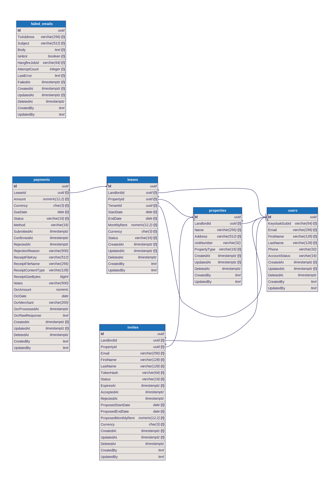

# Database Schema Review (M5.3)

| | |
|---|---|
| **Deliverable** | M5.3 — Database schema review |
| **Owner** | Backend Lead |
| **Date** | 2026-06-02 |
| **Scope** | ERD in crow's-foot notation · 3NF normalization analysis · migration strategy |
| **Database** | PostgreSQL 16 · EF Core 10 (code-first) |
| **Source of truth** | [`AppDbContextModelSnapshot.cs`](../../backend/MyProperty.Infrastructure/Persistence/Migrations/AppDbContextModelSnapshot.cs) + the `IEntityTypeConfiguration<T>` classes |

This document is the M5.3 review of the MyProperty relational schema. It is hand-derived from the EF Core model snapshot (the authoritative description of the current schema) and the per-entity configurations. If this document and the snapshot ever disagree, **the snapshot wins** — regenerate the artifacts (see [§9](#9-regenerating-the-artifacts)).

**Deliverable checklist**

- ✅ **ERD in crow's-foot notation** — [`schema.dbml`](./schema.dbml) (source) → [`schema.svg`](./schema.svg) (rendered), see [§2](#2-entity-relationship-diagram)
- ✅ **Normalized to 3NF** — analysis in [§5](#5-normalization-analysis-3nf)
- ✅ **Migration strategy documented** — [§7](#7-migration-strategy) (+ operations runbook in [`docs/operations/migrations.md`](../operations/migrations.md))

---

## 1. Overview

The schema has **six tables**. Five model the core rent-management domain (`users`, `properties`, `leases`, `payments`, `invites`); one is an operational dead-letter log (`failed_emails`).

```
users ─┬─< properties ─< leases ─< payments
       ├─< leases (as Landlord and as Tenant)
       └─< invites >── properties

failed_emails   (standalone — no relationships)
```

**Conventions that apply to every table:**

| Convention | Detail |
|---|---|
| **Surrogate keys** | Every table's PK is a single `uuid Id`, app-generated (`Guid.NewGuid()`). No natural keys are used as PKs. |
| **Audit + soft delete** | All entities inherit [`BaseEntity`](../../backend/MyProperty.Domain/Common/BaseEntity.cs): `CreatedAt`, `UpdatedAt`, `DeletedAt`, `CreatedBy`, `UpdatedBy`. A global EF query filter (`AppDbContext.ApplySoftDeleteFilter`) excludes rows where `DeletedAt IS NOT NULL`, so a "delete" is almost always a soft delete. |
| **Enums as strings** | .NET enums persist as `varchar(16)` via `HasConversion<string>()` — *not* native PG enum types, and currently without a DB `CHECK` constraint (see [§5f](#f-enums-stored-as-strings-without-a-db-check-constraint)). |
| **Money & currency** | Amounts are `numeric(12,2)`; currency is `char(3)` (ISO-4217, fixed length). |
| **FK delete behaviour** | Every foreign key is `ON DELETE RESTRICT` — there are no cascades. Combined with soft delete, rows are essentially never physically removed except by the orphan-invite cleanup job. |

There is **no `Role` column** on `users`: a user's role (Tenant / Landlord / Admin) is owned by Keycloak and carried in the JWT, not stored relationally (it was deliberately dropped — see the migration history in [§8](#8-schema-evolution)). The same `users` row can act as a **landlord** (`properties.LandlordId`, `leases.LandlordId`) and as a **tenant** (`leases.TenantId`).

---

## 2. Entity-Relationship Diagram

The ERD is authored in **DBML** ([`schema.dbml`](./schema.dbml)) and rendered to crow's-foot notation in [`schema.svg`](./schema.svg).



> If the image does not render in your viewer, open `schema.svg` directly, or paste `schema.dbml` into <https://dbdiagram.io> (New → Import) for an interactive crow's-foot view.

**Reading the diagram:** each box is a table; `(!)` marks a `NOT NULL` column; the `1`/`*` ends are the crow's-foot cardinality (one parent → many children). Note the **two edges from `leases` to `users`** — the same table is referenced twice, once as landlord and once as tenant.

### Relationship catalogue

| Parent (1) | Child (∞) | FK column | Optional? | On delete | Meaning |
|---|---|---|---|---|---|
| `users` | `properties` | `LandlordId` | required | RESTRICT | a landlord owns many properties |
| `users` | `leases` | `LandlordId` | required | RESTRICT | a landlord is party to many leases |
| `users` | `leases` | `TenantId` | required | RESTRICT | a tenant rents under many leases (over time) |
| `properties` | `leases` | `PropertyId` | required | RESTRICT | a property has many leases (over time) |
| `leases` | `payments` | `LeaseId` | required | RESTRICT | a lease accrues many payments |
| `users` | `invites` | `LandlordId` | required | RESTRICT | a landlord sends many invites |
| `properties` | `invites` | `PropertyId` | required | RESTRICT | an invite targets one property |
| `failed_emails` | — | — | — | — | standalone log; no FK (recipient may not be a user) |

All relationships are **non-identifying** (the FK is never part of the child's PK) and **mandatory** (FK columns are `NOT NULL`).

---

## 3. Common columns (`BaseEntity`)

Listed once here; every table below carries all five.

| Column | Type | Null | Notes |
|---|---|---|---|
| `CreatedAt` | `timestamptz` | no | set by `AuditingInterceptor`, never by handlers |
| `UpdatedAt` | `timestamptz` | no | set by `AuditingInterceptor` |
| `DeletedAt` | `timestamptz` | yes | `NULL` = active; non-null = soft-deleted (filtered out globally) |
| `CreatedBy` | `text` | yes | Keycloak `sub` of the acting principal (not a FK — see [§5e](#e-auditing-createdbyupdatedby-are-not-foreign-keys)) |
| `UpdatedBy` | `text` | yes | Keycloak `sub` of the acting principal |

---

## 4. Data dictionary

Only table-specific columns are listed (the five `BaseEntity` columns from §3 are implicit). `PK` = primary key, `FK` = foreign key, `U` = unique.

### `users`
| Column | Type | Null | Key | Notes |
|---|---|---|---|---|
| `Id` | `uuid` | no | PK | |
| `KeycloakSubId` | `varchar(64)` | no | U | Keycloak `sub` claim — links the row to the IdP identity |
| `Email` | `varchar(256)` | no | U | |
| `FirstName` | `varchar(128)` | no | | |
| `LastName` | `varchar(128)` | no | | |
| `Phone` | `varchar(32)` | yes | | |
| `AccountStatus` | `varchar(16)` | yes | | `TenantAccountStatus {Active, ReadOnly}`. `NULL` for landlords — tenant-only subtype attribute |

### `properties`
| Column | Type | Null | Key | Notes |
|---|---|---|---|---|
| `Id` | `uuid` | no | PK | |
| `LandlordId` | `uuid` | no | FK→`users` | owning landlord |
| `Name` | `varchar(256)` | no | | |
| `Address` | `varchar(512)` | no | | |
| `UnitNumber` | `varchar(32)` | yes | | |

### `leases`
| Column | Type | Null | Key | Notes |
|---|---|---|---|---|
| `Id` | `uuid` | no | PK | |
| `LandlordId` | `uuid` | no | FK→`users` | denormalised owner — lets landlord dashboards filter leases without a `properties` join |
| `PropertyId` | `uuid` | no | FK→`properties` | |
| `TenantId` | `uuid` | no | FK→`users` | the renting user |
| `StartDate` | `date` | no | | |
| `EndDate` | `date` | no | | |
| `MonthlyRent` | `numeric(12,2)` | no | | |
| `Currency` | `char(3)` | no | | ISO-4217 |
| `Status` | `varchar(16)` | no | | `LeaseStatus {Active, Expired, Terminated}` — domain-controlled (private setter, `Terminate()`) |

### `payments`
| Column | Type | Null | Key | Notes |
|---|---|---|---|---|
| `Id` | `uuid` | no | PK | |
| `LeaseId` | `uuid` | no | FK→`leases` | |
| `Amount` | `numeric(12,2)` | no | | |
| `Currency` | `char(3)` | no | | ISO-4217; point-in-time snapshot (see [§5a](#a-currency-duplicated-across-leases-payments-and-invites)) |
| `DueDate` | `date` | no | | |
| `Status` | `varchar(16)` | no | | `PaymentStatus {Outstanding, Pending, Confirmed, Rejected}` — server-enforced state machine |
| `Method` | `varchar(16)` | yes | | `PaymentMethod {ReceiptUpload, ManualRequest}`; `NULL` until the tenant submits |
| `SubmittedAt` / `ConfirmedAt` / `RejectedAt` | `timestamptz` | yes | | state-transition timestamps |
| `RejectionReason` | `varchar(500)` | yes | | |
| `ReceiptFileKey` | `varchar(512)` | yes | | storage key beneath `FileStorage:LocalRoot` |
| `ReceiptFileName` | `varchar(256)` | yes | | optional 1:1 receipt cluster |
| `ReceiptContentType` | `varchar(128)` | yes | | |
| `ReceiptSizeBytes` | `bigint` | yes | | |
| `Notes` | `varchar(500)` | yes | | |
| `OcrAmount` | `numeric` | yes | | ⚠ unbounded — inconsistent with `Amount numeric(12,2)` (see [§7 follow-ups](#known-schema-follow-ups)) |
| `OcrDate` | `date` | yes | | optional 1:1 OCR-result cluster |
| `OcrMerchant` | `varchar(200)` | yes | | |
| `OcrProcessedAt` | `timestamptz` | yes | | |
| `OcrRawResponse` | `text` | yes | | raw Anthropic vision response, stored opaquely for audit |

### `invites`
| Column | Type | Null | Key | Notes |
|---|---|---|---|---|
| `Id` | `uuid` | no | PK | |
| `LandlordId` | `uuid` | no | FK→`users` | |
| `PropertyId` | `uuid` | no | FK→`properties` | |
| `Email` | `varchar(256)` | no | | **proposed** tenant address — no `users` row exists yet |
| `FirstName` | `varchar(128)` | no | | proposed identity |
| `LastName` | `varchar(128)` | no | | |
| `TokenHash` | `varchar(64)` | no | U | SHA-256 hex of the single-use token; plaintext token is never persisted |
| `Status` | `varchar(16)` | no | | `InviteStatus {Pending, Accepted, Rejected, Expired}` |
| `ExpiresAt` | `timestamptz` | no | | |
| `AcceptedAt` / `RejectedAt` | `timestamptz` | yes | | |
| `ProposedStartDate` | `date` | no | | proposed lease terms (seed the `leases` row on accept) |
| `ProposedEndDate` | `date` | no | | |
| `ProposedMonthlyRent` | `numeric(12,2)` | no | | |
| `Currency` | `char(3)` | no | | |

### `failed_emails`
| Column | Type | Null | Key | Notes |
|---|---|---|---|---|
| `Id` | `uuid` | no | PK | |
| `ToAddress` | `varchar(256)` | no | | |
| `Subject` | `varchar(512)` | no | | |
| `Body` | `text` | no | | |
| `IsHtml` | `boolean` | no | | |
| `HangfireJobId` | `varchar(64)` | no | | the job that exhausted its retries |
| `AttemptCount` | `integer` | no | | |
| `LastError` | `text` | no | | |
| `FailedAt` | `timestamptz` | no | | |

---

## 5. Normalization analysis (3NF)

**Method.** A schema is in **Third Normal Form** when it is in 1NF and 2NF and every non-key attribute depends on *the key, the whole key, and nothing but the key* — i.e. there are no transitive dependencies (non-key → non-key). Below, each form is assessed, then the non-obvious cases are argued individually.

### 1NF — atomic values, no repeating groups ✅
Every column holds a single scalar value (`uuid`, `varchar`, `char`, `numeric`, `date`, `timestamptz`, `boolean`, `integer`). There are no arrays, delimited lists, or numbered repeating groups (e.g. no `payment1`/`payment2`). Every table has a primary key, so rows are individually addressable.

- *Conscious exception:* `payments.OcrRawResponse` stores a raw JSON/text blob from the vision API. It is treated as an **opaque atomic value** for audit/debugging — it is never queried by sub-field (the structured results live in the typed `OcrAmount`/`OcrDate`/`OcrMerchant` columns). This is acceptable; promoting it to relational columns would add nothing the typed columns don't already provide.

**Verdict: 1NF satisfied.**

### 2NF — no partial dependency on part of a composite key ✅
Every table's primary key is a **single column** (`uuid Id`). With a one-attribute key, partial dependencies are impossible by definition. The unique candidate keys that exist (`users.Email`, `users.KeycloakSubId`, `invites.TokenHash`) are also single-column.

**Verdict: 2NF satisfied trivially.**

### 3NF — no transitive dependencies ✅ (with documented design choices)
No table contains an attribute that depends on another non-key attribute. The cases that *look* like violations are examined below; each is either an intentional snapshot, a lifecycle-distinct capture, or a single-valued 1:1 attribute.

#### a) `Currency` duplicated across `leases`, `payments`, and `invites`
The sharpest 3NF question. If `payments.Currency` is *always* equal to its lease's currency, then `payments.Id → LeaseId → Currency` is a transitive dependency and the column is redundant.

- **Resolution — point-in-time snapshot.** `payments.Currency` (and `payments.Amount`, and the `invites.Proposed*` terms) are recorded as the values **in force when the row was created**, so a payment remains a correct financial record even if the parent lease is later edited or terminated. Under snapshot semantics the column is an *independent fact about the payment*, not a copy of a current lease attribute, so it does **not** violate 3NF.
- **Residual risk.** Nothing in the schema *enforces* or *documents* the snapshot intent, and in practice every payment is created from its lease, so the values always match today. A future "correct the lease currency" edit could surprise someone expecting payments to follow. **Recommendation:** state the snapshot semantics in `backend/CLAUDE.md` (so divergence reads as intended history), or — if currency is meant to be invariant per lease — drop `payments.Currency` and derive via join. Non-blocking.

#### b) `payments` receipt + OCR column clusters
`payments` carries a 4-column **receipt** cluster (`ReceiptFileKey/FileName/ContentType/SizeBytes`) and a 5-column **OCR** cluster (`OcrAmount/Date/Merchant/ProcessedAt/RawResponse`). Each value is single-valued per payment and functionally dependent on `payments.Id` (one receipt, one OCR result per payment) — no transitive dependency, so **3NF holds**. (The OCR fields are derived from the receipt, but the receipt is itself a 1:1 attribute of the payment, so the dependency chain collapses to `Id`.)

- **Design smell, not a normalization defect — NULL sprawl.** A `ManualRequest` payment has all nine columns `NULL`; a receipt awaiting OCR has the five OCR columns `NULL`. This is a textbook candidate for **vertical partitioning** into an optional 1:1 `payment_receipts` table (or separate `payment_receipt` + `payment_ocr`). Tracked as tech-debt #34. Optional; non-blocking for M5.3.

#### c) `invites` mirrors `users` (identity) and `leases` (proposed terms)
`invites.Email/FirstName/LastName` look like duplicates of `users`, and `invites.Proposed*` look like duplicates of `leases`. They are **not** redundant and introduce **no** transitive dependency:

- At invite time there is **no `users` row** (a tenant cannot self-register; the account is created by Keycloak only when the invite is accepted) and **no `leases` row** (the lease is created on accept). During the `Pending` window the invite is the *sole* record of the proposed identity and terms.
- After acceptance, `users` and `leases` rows are created *from* the invite, and the invite is retained as an immutable record of what was offered.

So `invites.Email` does not transitively depend on a `users` row — that row does not exist when the value is written. **3NF holds**; this is correct lifecycle modelling.

#### d) Single dual-role `users` table + nullable `AccountStatus`
`users` stores landlords and tenants in one table, and `AccountStatus` (tenant-only) is `NULL` for landlords. `AccountStatus` depends on `users.Id` (not on another non-key attribute), so it is **not** a transitive dependency — **3NF holds**.

- This is a single-table design for the role dimension, with the role itself **externalised to Keycloak**. A stricter relational model might split party/role or add a `roles` table, but role authority lives in the IdP by design (BE-3/BE-4) — storing it relationally would itself be the redundancy. Intentional and defensible.

#### e) Auditing `CreatedBy`/`UpdatedBy` are *not* foreign keys
These store the acting principal's Keycloak `sub` as `text`, deliberately **not** a FK to `users`. The actor may be a background job or a system process, and the audit trail must survive even if the referenced user is later soft-deleted. "Who last touched this row" depends on the row's `Id`, so there is **no** transitive dependency — **3NF holds**. Intentional decoupling.

#### f) Enums stored as strings without a DB `CHECK` constraint
Not a normalization question, but a domain-integrity observation surfaced by the review. Status/method columns are `varchar(16)` constrained only at the application layer (the .NET enum + `HasConversion<string>()`); there is no DB `CHECK` or native PG enum, so a writer outside the app could insert an invalid value. **Optional hardening:** add `CHECK` constraints (or PG enum types) for defence-in-depth. Does not affect 3NF.

### Verdict
**The schema is in 3NF.** Every apparent redundancy is an intentional point-in-time snapshot (§5a), a lifecycle-distinct capture (§5c), or a single-valued 1:1 attribute (§5b). Two **non-blocking** refinements are recommended and tracked as follow-ups (extract the receipt/OCR clusters; formalise currency-snapshot semantics), plus two optional integrity items (enum `CHECK`s; `OcrAmount` precision).

---

## 6. Indexing summary

All indexes are declared explicitly in the entity configurations. Indexes that exist *only* to back a foreign key are noted as such.

| Table | Index | Kind | Backs |
|---|---|---|---|
| `users` | `Email` | unique | identity lookup / dedupe |
| `users` | `KeycloakSubId` | unique | JWT `sub` → user resolution on every authenticated request |
| `properties` | `LandlordId` | b-tree | FK + landlord property list |
| `leases` | `(LandlordId, Status)` | b-tree | landlord dashboard (covers `LandlordId` FK) |
| `leases` | `(TenantId, Status)` | b-tree | tenant dashboard / active-lease lookup (covers `TenantId` FK) |
| `leases` | `(PropertyId, Status)` | b-tree | per-property lease list (covers `PropertyId` FK) |
| `leases` | `EndDate` | b-tree | expiring-soon recurring scan |
| `payments` | `(LeaseId, Status)` | b-tree | payment history / dashboard (covers `LeaseId` FK) |
| `payments` | `IX_payments_DueDate_Outstanding` | **partial** | overdue-scan job — `WHERE Status='Outstanding' AND DeletedAt IS NULL` |
| `invites` | `TokenHash` | unique | anonymous invite preview/accept by token |
| `invites` | `ExpiresAt` | b-tree | expiry / orphan-cleanup job |
| `invites` | `(LandlordId, Status)` | b-tree | landlord invite list (covers `LandlordId` FK) |
| `invites` | `PropertyId` | b-tree | FK index (EF auto-created) |
| `failed_emails` | `FailedAt` | b-tree | operator triage ordering |
| `failed_emails` | `HangfireJobId` | b-tree | correlate a DLQ row to its job |

The partial index on `payments.DueDate` is the one tuned result from the M3.4 SQL-optimization work: an unfiltered index on `DueDate` was *slower* than no index (~74 % of rows match `DueDate < today`, so the planner walked nearly the whole table), whereas the partial form covers only `Outstanding`/non-deleted rows (~4 % the size) and answers the job's filter from the index alone. Full analysis: [`docs/performance/m3-sql-optimization/`](../performance/m3-sql-optimization/).

---

## 7. Migration strategy

The schema is **code-first** with EF Core 10. This section covers the *schema-design* workflow; the **operations runbook** (image reference, env vars, exit codes, timeouts, rollback, CI build path) lives in [`docs/operations/migrations.md`](../operations/migrations.md).

**Authoring**
- Schema changes are C# migration classes generated with:
  ```
  dotnet ef migrations add <Name> -p MyProperty.Infrastructure -s MyProperty.Api
  ```
- Mapping lives in `Infrastructure/Persistence/Configurations/<Entity>Configuration.cs` (`IEntityTypeConfiguration<T>`); **no** fluent API in the `DbContext` itself. The generated `AppDbContextModelSnapshot.cs` is the authoritative model description and the basis for this review.

**Applying (deployed environments)**
- **Never** `Database.Migrate()` from `Program.cs` in production — in a rolling K8s deploy, parallel pods race for the migration lock and a winner can serve traffic against a half-migrated schema.
- Migrations are applied out-of-band by a **migration bundle** — a self-contained executable shipped as a *separate* Docker image, run once per deploy as a Helm `pre-upgrade`/`pre-install` `Job` **before** new API pods roll out.
- **Idempotent:** the bundle compares its embedded migration list against `__EFMigrationsHistory` and applies only what's missing, so Helm retries are safe.
- **Transaction-per-migration:** EF wraps each migration in a transaction; a mid-migration failure rolls back to the last known-good state. (Exception: any future `CREATE INDEX CONCURRENTLY` runs outside a transaction — see the ops doc.)
- **Forward-only:** no `down` migrations are shipped. To undo a change, write a new migration that reverses it. A break-glass manual `database update <Previous>` exists for emergencies (ops doc §10).
- **Pinned by SHA:** images are tagged with the immutable git short-SHA; Helm references the SHA so a deploy applies exactly the migration set that was tested.

**Local development**
```
dotnet ef database update -p backend/MyProperty.Infrastructure -s backend/MyProperty.Api
```

---

## 8. Schema evolution

The current schema is the result of seven migrations. The names alone document the most consequential design decisions (role externalised to Keycloak; invite token stored only as a hash).

| # | Migration | What it did |
|---|---|---|
| 1 | `20260501215843_InitialCreate` | Initial `users`, `properties`, `leases`, `payments`, `invites`. |
| 2 | `20260503142653_RenameUserKeycloakIdAndDropRole` | Renamed the user's IdP id → `KeycloakSubId` and **dropped the `Role` column** — role authority moved to Keycloak (basis for the single dual-role `users` table, §1/§5d). |
| 3 | `20260503191918_AddFailedEmails` | Added the `failed_emails` dead-letter table (email DLQ). |
| 4 | `20260504095019_AddOverduePaymentsPartialIndex` | Added the partial index `IX_payments_DueDate_Outstanding` (M3.4). |
| 5 | `20260504170924_RenameInviteTokenToTokenHash` | Renamed invite `Token` → `TokenHash` — store the SHA-256 hash, never the plaintext token (security hardening). |
| 6 | `20260508202452_AddReceiptContentTypeAndSize` | Added `ReceiptContentType` + `ReceiptSizeBytes` to `payments` (M3.9 file upload). |
| 7 | `20260508221203_AddPaymentOcrColumns` | Added the `Ocr*` columns to `payments` (M3.10 receipt OCR). |

---

## Known schema follow-ups

Non-blocking items surfaced by this review. None prevent M5.3 sign-off; each is a candidate for a future migration.

| Item | Source | Recommendation |
|---|---|---|
| Extract receipt + OCR clusters from `payments` | §5b / tech-debt #34 | Move to an optional 1:1 `payment_receipts` table to remove NULL sprawl. Requires a migration + data backfill. |
| Formalise `Currency` snapshot semantics | §5a | Document the point-in-time intent in `backend/CLAUDE.md`, or derive currency via join, or add a consistency `CHECK`/trigger. |
| `OcrAmount` precision | §4 / §5b | Change `numeric` → `numeric(12,2)` to match `Amount`. |
| Enum `CHECK` constraints | §5f | Add `CHECK` constraints or PG enum types for defence-in-depth against non-app writers. |
| Single-active-lease invariant | `backend/CLAUDE.md` ("For Later") | Add a partial unique index `Lease(TenantId) WHERE Status='Active' AND DeletedAt IS NULL` + domain enforcement; backfill duplicates first. |

---

## 9. Regenerating the artifacts

The `.dbml` is hand-maintained against the EF model snapshot. After any schema migration, update [`schema.dbml`](./schema.dbml) and re-render:

```bash
# Render the crow's-foot SVG (bundled WASM Graphviz — no system graphviz needed)
npx -y @softwaretechnik/dbml-renderer -i schema.dbml -o schema.svg

# Validate the DBML and cross-check the generated DDL against reality
npx -y -p @dbml/cli dbml2sql schema.dbml --postgres
```

Or paste `schema.dbml` into <https://dbdiagram.io> for an interactive view and PNG/PDF export.

> **Note:** the generated DDL is a *validation aid only*. The EF Core migrations remain the single source of truth for the physical schema — the DBML cannot express the partial-index filter or the soft-delete query filter.
